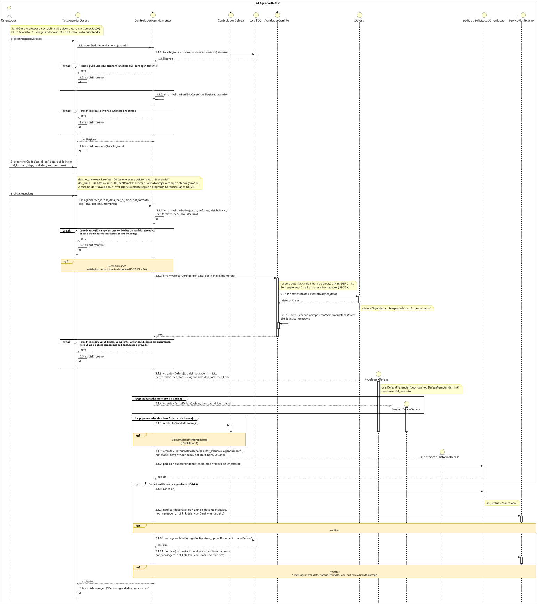
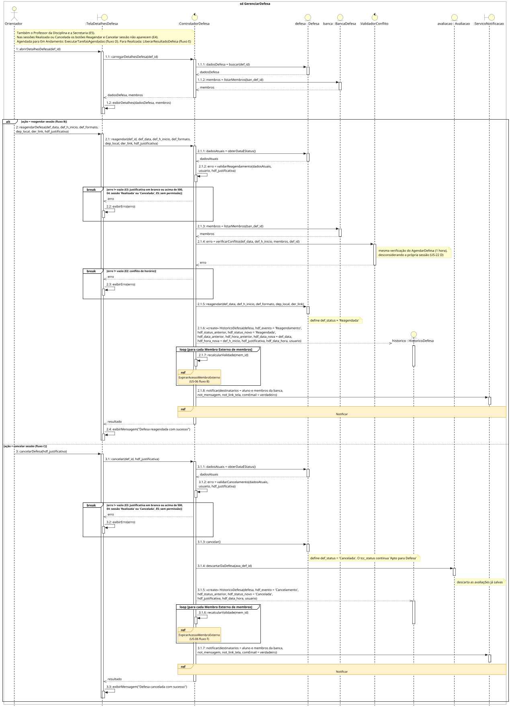
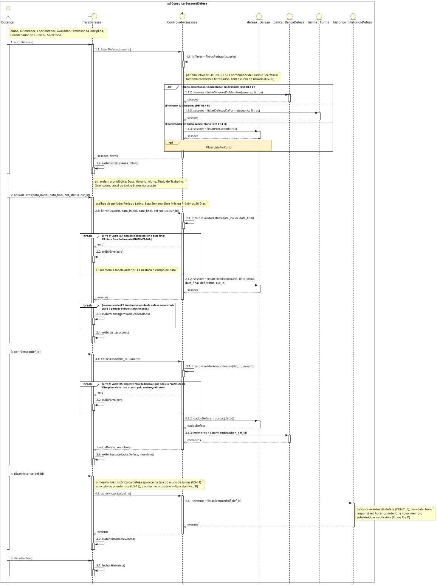
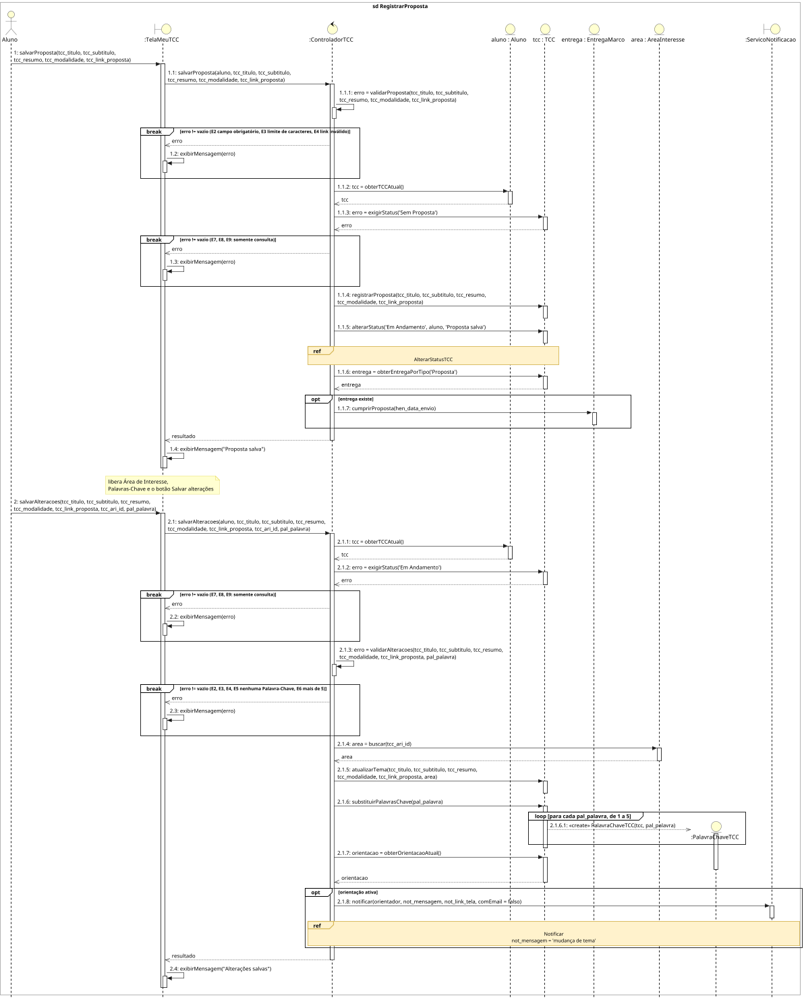
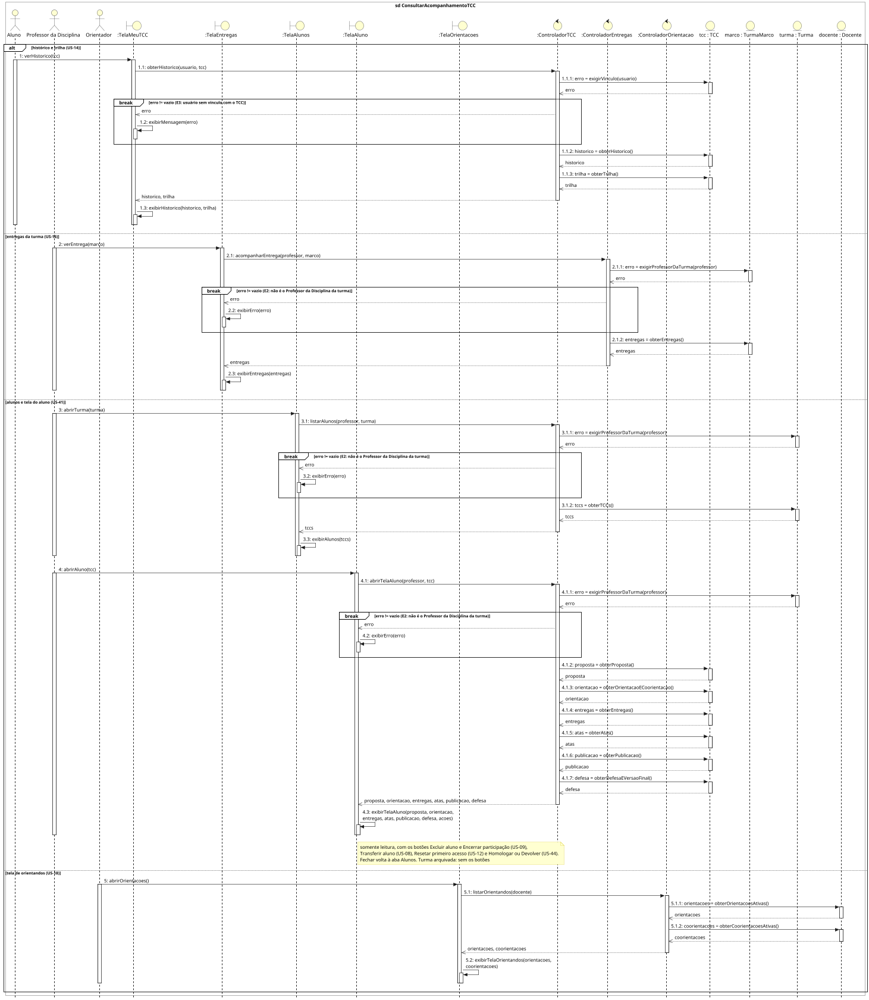
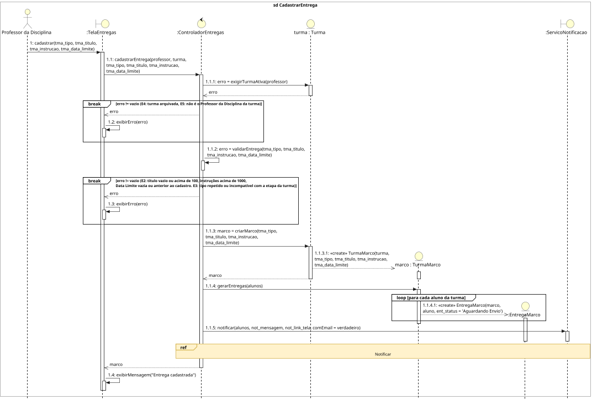
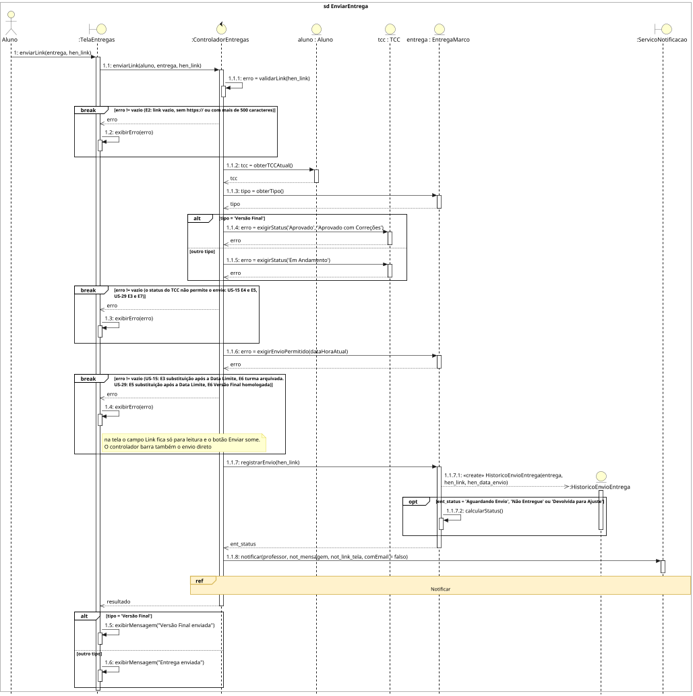
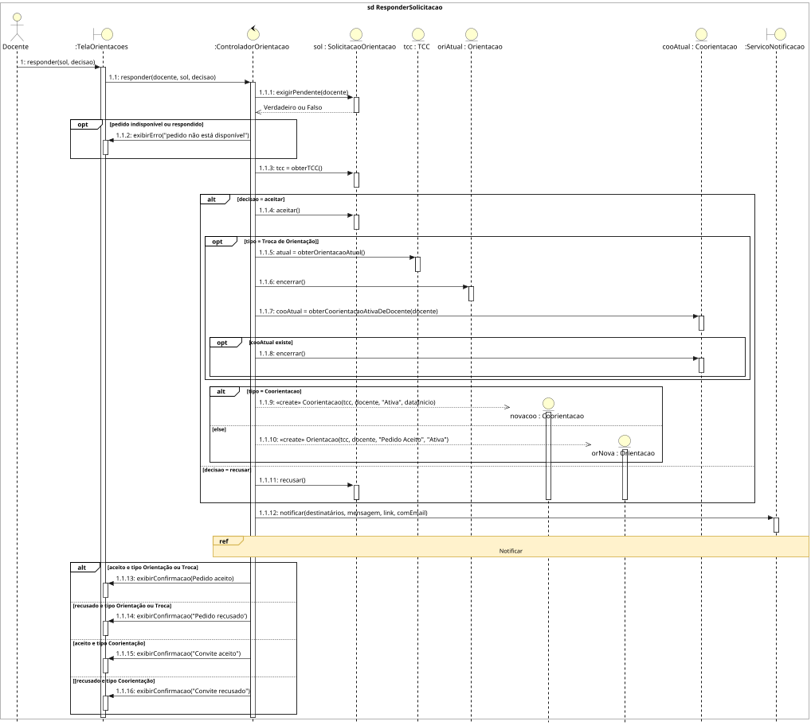

# SIGTCC: diagramas de sequência em PlantUML (versão 2)

36 diagramas, lidos do arquivo Diagramas--C_24_10.drawio (versão 2), na ordem das páginas. Cada diagrama traz o número e o nome das US que ele cobre.

## Índice

| # | Diagrama | US |
|---|---|---|
| 1 | [AgendarDefesa](#01-agendardefesa) | US-21 Agendar a defesa; US-22 Impedir agendamentos conflitantes; US-24 Notificar a banca e atualizar o status da sessão |
| 2 | [GerenciarBanca](#02-gerenciarbanca) | US-22 Impedir agendamentos conflitantes; US-23 Compor a banca |
| 3 | [GerenciarDefesa](#03-gerenciardefesa) | US-24 Notificar a banca e atualizar o status da sessão |
| 4 | [AvaliarCriterios](#04-avaliarcriterios) | US-25 Lançar as notas dos critérios oficiais; US-26 Enviar a imagem da assinatura |
| 5 | [RegistrarOuvintesAgenda](#05-registrarouvintesagenda) | US-30 Registrar ouvintes e gerar a agenda em PDF |
| 6 | [ConsultarSessoesDefesa](#06-consultarsessoesdefesa) | US-39 Filtrar listas e relatórios por curso; US-40 Ver a lista de sessões de defesa e filtrar por período |
| 7 | [RegistrarProposta](#07-registrarproposta) | US-13 Registrar a Proposta, cadastrar os dados do TCC e alterar o tema |
| 8 | [AlterarStatusTCC](#08-alterarstatustcc) | US-14 Atualizar o Status do TCC e consultar o histórico e a trilha |
| 9 | [ConsultarAcompanhamentoTCC](#09-consultaracompanhamentotcc) | US-14 Atualizar o Status do TCC e consultar o histórico e a trilha; US-16 Acompanhar as entregas dos alunos da turma; US-41 Ver os alunos da turma e a tela de cada aluno |
| 10 | [CadastrarEntrega](#10-cadastrarentrega) | US-43 Cadastrar as entregas da turma |
| 11 | [EnviarEntrega](#11-enviarentrega) | US-15 Enviar ou substituir o link de uma entrega; US-29 Enviar a Versão Final do TCC 2 |
| 12 | [SolicitarOrientacao](#12-solicitarorientacao) | US-17 Indicar, cancelar ou trocar o orientador; US-45 Registrar, substituir ou remover coorientadores |
| 13 | [ResponderSolicitacao](#13-respondersolicitacao) | US-18 Aceitar ou recusar pedido de orientação e consultar a tela de orientandos; US-36 Aceitar ou recusar o convite de coorientação e acompanhar o trabalho na tela de orientandos |
| 14 | [ExecutarTarefasAgendadas](#14-executartarefasagendadas) | US-06 Expirar o acesso de membros externos; US-15 Enviar ou substituir o link de uma entrega; US-24 Notificar a banca e atualizar o status da sessão |
| 15 | [PrimeiroAcessoELoginAluno](#15-primeiroacessoeloginaluno) | US-10 Criar a senha no primeiro acesso; US-11 Fazer login; US-12 Recuperar ou alterar a senha; US-37 Reenviar o link de ativação vencido |
| 16 | [PrimeiroAcessoELoginDocente](#16-primeiroacessoelogindocente) | US-10 Criar a senha no primeiro acesso; US-11 Fazer login; US-12 Recuperar ou alterar a senha; US-37 Reenviar o link de ativação vencido |
| 17 | [EditarPerfilENotificacoes](#17-editarperfilenotificacoes) | US-38 Editar o perfil e ver as notificações |
| 18 | [CadastrarConta](#18-cadastrarconta) | US-03 Cadastrar e alterar docentes e secretaria; US-05 Cadastrar e alterar membros externos |
| 19 | [AlterarConta](#19-alterarconta) | US-03 Cadastrar e alterar docentes e secretaria; US-05 Cadastrar e alterar membros externos |
| 20 | [InativarDocente](#20-inativardocente) | US-04 Inativar e reativar docentes e secretaria |
| 21 | [ProrrogarAcessoMembroExterno](#21-prorrogaracessomembroexterno) | US-50 Prorrogar o acesso de membro externo |
| 22 | [FiltrarListaPorCurso](#22-filtrarlistaporcurso) | US-39 Filtrar listas e relatórios por curso |
| 23 | [ConsultarAtividadesDocente](#23-consultaratividadesdocente) | US-31 Consultar e exportar o painel de atividades por docente |
| 24 | [ConsultarIndicadoresTCC](#24-consultarindicadorestcc) | US-32 Consultar e exportar o relatório de formação e evasão e o histórico de indicadores do NUCOMP; US-33 Consultar e exportar os relatórios de produção de TCCs e de artigos |
| 25 | [ConsultarListasAlunos](#25-consultarlistasalunos) | US-34 Consultar e exportar o relatório de aluno e orientador para apoio à matrícula; US-49 Consultar e exportar o relatório de turmas e alunos |
| 26 | [ConsultarDefesasRealizadas](#26-consultardefesasrealizadas) | US-35 Consultar e exportar o relatório de horas complementares de ouvintes; US-47 Consultar e exportar o relatório de participação de Membros Externos; US-48 Consultar e exportar a lista de defesas realizadas no período |
| 27 | [Notificar](#27-notificar) | sem US própria: chamado por todos os diagramas que notificam (ref Notificar) |
| 28 | [LiberarResultadoDefesa](#28-liberarresultadodefesa) | US-27 Liberar o resultado final; US-28 Gerar a Ata Final e a Folha de Aprovação |
| 29 | [HomologarVersaoFinal](#29-homologarversaofinal) | US-44 Homologar ou devolver para ajuste a Versão Final do TCC 2 |
| 30 | [ManterArtigo](#30-manterartigo) | US-20 Homologar ou recusar o aproveitamento do artigo; US-46 Registrar a publicação do artigo |
| 31 | [IndicarAptoParaDefesa](#31-indicaraptoparadefesa) | US-42 Indicar que o TCC está apto para defesa |
| 32 | [ManterAtaOrientacao](#32-manterataorientacao) | US-19 Registrar, consultar, editar e comentar atas de orientação |
| 33 | [GerenciarTurmas](#33-gerenciarturmas) | US-07 Gerenciar turmas de TCC |
| 34 | [ExpirarAcessoMembroExterno](#34-expiraracessomembroexterno) | US-06 Expirar o acesso de membros externos |
| 35 | [MatricularAluno](#35-matricularaluno) | US-08 Matricular alunos na turma |
| 36 | [RetirarAlunoDaTurma](#36-retiraralunodaturma) | US-08 Matricular alunos na turma; US-09 Excluir aluno da turma |

## US por diagrama

| US | Diagramas |
|---|---|
| US-03 Cadastrar e alterar docentes e secretaria | CadastrarConta, AlterarConta |
| US-04 Inativar e reativar docentes e secretaria | InativarDocente |
| US-05 Cadastrar e alterar membros externos | CadastrarConta, AlterarConta |
| US-06 Expirar o acesso de membros externos | ExpirarAcessoMembroExterno, ExecutarTarefasAgendadas |
| US-07 Gerenciar turmas de TCC | GerenciarTurmas |
| US-08 Matricular alunos na turma | MatricularAluno, RetirarAlunoDaTurma |
| US-09 Excluir aluno da turma | RetirarAlunoDaTurma |
| US-10 Criar a senha no primeiro acesso | PrimeiroAcessoELoginAluno, PrimeiroAcessoELoginDocente |
| US-11 Fazer login | PrimeiroAcessoELoginAluno, PrimeiroAcessoELoginDocente |
| US-12 Recuperar ou alterar a senha | PrimeiroAcessoELoginAluno, PrimeiroAcessoELoginDocente |
| US-13 Registrar a Proposta, cadastrar os dados do TCC e alterar o tema | RegistrarProposta |
| US-14 Atualizar o Status do TCC e consultar o histórico e a trilha | AlterarStatusTCC, ConsultarAcompanhamentoTCC |
| US-15 Enviar ou substituir o link de uma entrega | ExecutarTarefasAgendadas, EnviarEntrega |
| US-16 Acompanhar as entregas dos alunos da turma | ConsultarAcompanhamentoTCC |
| US-17 Indicar, cancelar ou trocar o orientador | SolicitarOrientacao |
| US-18 Aceitar ou recusar pedido de orientação e consultar a tela de orientandos | ResponderSolicitacao |
| US-19 Registrar, consultar, editar e comentar atas de orientação | ManterAtaOrientacao |
| US-20 Homologar ou recusar o aproveitamento do artigo | ManterArtigo |
| US-21 Agendar a defesa | AgendarDefesa |
| US-22 Impedir agendamentos conflitantes | AgendarDefesa, GerenciarBanca |
| US-23 Compor a banca | GerenciarBanca |
| US-24 Notificar a banca e atualizar o status da sessão | ExecutarTarefasAgendadas, AgendarDefesa, GerenciarDefesa |
| US-25 Lançar as notas dos critérios oficiais | AvaliarCriterios |
| US-26 Enviar a imagem da assinatura | AvaliarCriterios |
| US-27 Liberar o resultado final | LiberarResultadoDefesa |
| US-28 Gerar a Ata Final e a Folha de Aprovação | LiberarResultadoDefesa |
| US-29 Enviar a Versão Final do TCC 2 | EnviarEntrega |
| US-30 Registrar ouvintes e gerar a agenda em PDF | RegistrarOuvintesAgenda |
| US-31 Consultar e exportar o painel de atividades por docente | ConsultarAtividadesDocente |
| US-32 Consultar e exportar o relatório de formação e evasão e o histórico de indicadores do NUCOMP | ConsultarIndicadoresTCC |
| US-33 Consultar e exportar os relatórios de produção de TCCs e de artigos | ConsultarIndicadoresTCC |
| US-34 Consultar e exportar o relatório de aluno e orientador para apoio à matrícula | ConsultarListasAlunos |
| US-35 Consultar e exportar o relatório de horas complementares de ouvintes | ConsultarDefesasRealizadas |
| US-36 Aceitar ou recusar o convite de coorientação e acompanhar o trabalho na tela de orientandos | ResponderSolicitacao |
| US-37 Reenviar o link de ativação vencido | PrimeiroAcessoELoginAluno, PrimeiroAcessoELoginDocente |
| US-38 Editar o perfil e ver as notificações | EditarPerfilENotificacoes, Notificar |
| US-39 Filtrar listas e relatórios por curso | FiltrarListaPorCurso, ConsultarSessoesDefesa |
| US-40 Ver a lista de sessões de defesa e filtrar por período | ConsultarSessoesDefesa |
| US-41 Ver os alunos da turma e a tela de cada aluno | ConsultarAcompanhamentoTCC |
| US-42 Indicar que o TCC está apto para defesa | IndicarAptoParaDefesa |
| US-43 Cadastrar as entregas da turma | CadastrarEntrega |
| US-44 Homologar ou devolver para ajuste a Versão Final do TCC 2 | HomologarVersaoFinal |
| US-45 Registrar, substituir ou remover coorientadores | SolicitarOrientacao |
| US-46 Registrar a publicação do artigo | ManterArtigo |
| US-47 Consultar e exportar o relatório de participação de Membros Externos | ConsultarDefesasRealizadas |
| US-48 Consultar e exportar a lista de defesas realizadas no período | ConsultarDefesasRealizadas |
| US-49 Consultar e exportar o relatório de turmas e alunos | ConsultarListasAlunos |
| US-50 Prorrogar o acesso de membro externo | ProrrogarAcessoMembroExterno |

## 01 AgendarDefesa

- **US:**
  - US-21 Agendar a defesa
  - US-22 Impedir agendamentos conflitantes
  - US-24 Notificar a banca e atualizar o status da sessão

```plantuml
@startuml AgendarDefesa
scale 0.6
skinparam style strictuml
skinparam SequenceMessageAlignment left
skinparam BackgroundColor #FFFFFF
skinparam ResponseMessageBelowArrow true

' Preenchimento Amarelo Pastel (#FFFFD1) e Linhas Pretas
skinparam ActorBackgroundColor #FFFFD1
skinparam ActorBorderColor #000000

skinparam BoundaryBackgroundColor #FFFFD1
skinparam BoundaryBorderColor #000000

skinparam ControlBackgroundColor #FFFFD1
skinparam ControlBorderColor #000000

skinparam EntityBackgroundColor #FFFFD1
skinparam EntityBorderColor #000000

skinparam ParticipantBackgroundColor #FFFFD1
skinparam ParticipantBorderColor #000000

skinparam NoteBackgroundColor #FFFFD1
skinparam NoteBorderColor #D4C000
skinparam LifeLineBackgroundColor #FFFFFF
skinparam LifeLineBorderColor #000000

' Fragmentos (break, alt, opt, loop): tag branca, linha preta fina
skinparam SequenceGroupBackgroundColor #FFFFFF
skinparam SequenceGroupBorderColor #000000
skinparam SequenceGroupBorderThickness 1
skinparam SequenceGroupHeaderFontColor #000000

' Fragmento ref: amarelo #FFF2CC
skinparam SequenceReferenceBackgroundColor #FFF2CC
skinparam SequenceReferenceBorderColor #D6B656
skinparam SequenceReferenceHeaderBackgroundColor #FFF2CC

' Frame do diagrama (sd Nome): box ao redor de todas as linhas de vida
skinparam SequenceBoxBackgroundColor #FFFFFF
skinparam SequenceBoxBorderColor #000000
skinparam SequenceBoxFontColor #000000

' Linhas de vida (tracejadas) com 1.5 pt
<style>
lifeline {
  LineThickness 1.5
  LineColor #000000
}
</style>
box "<b>sd</b> AgendarDefesa" #FFFFFF
actor "Orientador" as Usuario order 10
boundary ":TelaAgendarDefesa" as Tela order 20
control ":ControladorAgendamento" as Ctrl order 30
control ":ControladorDefesa" as CtrlDef order 40
entity "tcc : TCC" as tcc order 50
control ":ValidadorConflito" as validador order 60
entity ":Defesa" as defesas order 70
entity "pedido : SolicitacaoOrientacao" as pedido order 110
boundary ":ServicoNotificacao" as servico order 120
entity "defesa : Defesa" as defesa order 80
entity "banca : BancaDefesa" as banca order 90
entity "historico : HistoricoDefesa" as historico order 100
end box

' Declaração das Linhas de Vida

note right of Usuario : Também o Professor da Disciplina (SI e Licenciatura em Computação).\nFluxo A: a lista TCC chega limitada ao TCC da turma ou do orientando

Usuario -> Tela ++ : 1: clicarAgendarDefesa()
Tela -> Ctrl ++ : 1.1: obterDadosAgendamento(usuario)
Ctrl -> tcc ++ : 1.1.1: tccsElegiveis = listarAptosSemSessaoAtiva(usuario)
tcc -->> Ctrl -- : tccsElegiveis
break tccsElegiveis vazio (E2: Nenhum TCC disponível para agendamento)
    Ctrl -->> Tela : erro
    Tela -> Tela ++ : 1.2: exibirErro(erro)
    deactivate Tela
end
Ctrl -> Ctrl ++ : 1.1.2: erro = validarPerfilNoCurso(tccsElegiveis, usuario)
deactivate Ctrl
break erro != vazio (E7: perfil não autorizado no curso)
    Ctrl -->> Tela : erro
    Tela -> Tela ++ : 1.3: exibirErro(erro)
    deactivate Tela
end
Ctrl -->> Tela -- : tccsElegiveis
Tela -> Tela ++ : 1.4: exibirFormulario(tccsElegiveis)
deactivate Tela
deactivate Tela

Usuario -> Tela ++ : 2: preencherDados(tcc_id, def_data, def_h_inicio,\ndef_formato, dep_local, der_link, membros)
note right of Tela : dep_local é texto livre (até 100 caracteres) se def_formato = 'Presencial'.\nder_link é URL https:// (até 500) se 'Remota'. Trocar o formato limpa o campo anterior (fluxo B).\nA escolha de 1º avaliador, 2º avaliador e suplente segue o diagrama GerenciarBanca (US-23)
deactivate Tela

Usuario -> Tela ++ : 3: clicarAgendar()
Tela -> Ctrl ++ : 3.1: agendar(tcc_id, def_data, def_h_inicio, def_formato,\ndep_local, der_link, membros)
Ctrl -> Ctrl ++ : 3.1.1: erro = validarDados(tcc_id, def_data, def_h_inicio,\ndef_formato, dep_local, der_link)
deactivate Ctrl
break erro != vazio (E3 campo em branco, E4 data ou horário retroativo,\nE5 local acima de 100 caracteres, E6 link inválido)
    Ctrl -->> Tela : erro
    Tela -> Tela ++ : 3.2: exibirErro(erro)
    deactivate Tela
end
ref over Ctrl, Tela : GerenciarBanca\nvalidação da composição da banca (US-23: E2 a E4)
Ctrl -> validador ++ : 3.1.2: erro = verificarConflito(def_data, def_h_inicio, membros)
note right of validador : reserva automática de 1 hora de duração (RBN-DEF-01.1).\nSem suplente, só os 3 titulares são checados (US-22 A)
validador -> defesas ++ : 3.1.2.1: defesasAtivas = listarAtivas(def_data)
defesas -->> validador -- : defesasAtivas
note right of defesas : ativas = 'Agendada', 'Reagendada' ou 'Em Andamento'
validador -> validador ++ : 3.1.2.2: erro = checarSobreposicaoMembros(defesasAtivas,\ndef_h_inicio, membros)
deactivate validador
validador -->> Ctrl -- : erro
break erro != vazio (US-22: E1 titular, E2 suplente, E3 vários, E4 sessão em andamento.\nPela US-23, é o E5 da composição da banca. Nada é gravado)
    Ctrl -->> Tela : erro
    Tela -> Tela ++ : 3.3: exibirErro(erro)
    deactivate Tela
end
create defesa
Ctrl -->> defesa ++ : 3.1.3: «create» Defesa(tcc, def_data, def_h_inicio,\ndef_formato, def_status = 'Agendada', dep_local, der_link)
note right of defesa : cria DefesaPresencial (dep_local) ou DefesaRemota (der_link)\nconforme def_formato
group loop <U+005B>para cada membro da banca<U+005D>
    create banca
    Ctrl -->> banca ++ : 3.1.4: «create» BancaDefesa(defesa, ban_usu_id, ban_papel)
end
group loop <U+005B>para cada Membro Externo da banca<U+005D>
    Ctrl -> CtrlDef ++ : 3.1.5: recalcularValidade(mem_id)
    ref over Ctrl, CtrlDef : ExpirarAcessoMembroExterno\n(US-06 fluxo A)
    deactivate CtrlDef
deactivate defesa
    deactivate banca
end
create historico
Ctrl -->> historico ++ : 3.1.6: «create» HistoricoDefesa(defesa, hdf_evento = 'Agendamento',\nhdf_status_novo = 'Agendada', hdf_data_hora, usuario)
Ctrl -> pedido ++ : 3.1.7: pedido = buscarPendente(tcc, sol_tipo = 'Troca de Orientação')
deactivate historico
pedido -->> Ctrl -- : pedido
opt possui pedido de troca pendente (US-24 A)
    Ctrl -> pedido ++ : 3.1.8: cancelar()
    deactivate pedido
    note right of pedido : sol_status = 'Cancelado'
    Ctrl -> servico ++ : 3.1.9: notificar(destinatarios = aluno e docente indicado,\nnot_mensagem, not_link_tela, comEmail = verdadeiro)
    ref over Ctrl, servico : Notificar
    deactivate servico
end
Ctrl -> tcc ++ : 3.1.10: entrega = obterEntregaPorTipo(tma_tipo = 'Documento para Defesa')
tcc -->> Ctrl -- : entrega
Ctrl -> servico ++ : 3.1.11: notificar(destinatarios = aluno e membros da banca,\nnot_mensagem, not_link_tela, comEmail = verdadeiro)
ref over Ctrl, servico : Notificar\nA mensagem traz data, horário, formato, local ou link e o link da entrega
deactivate servico
Ctrl -->> Tela -- : resultado
Tela -> Tela ++ : 3.4: exibirMensagem("Defesa agendada com sucesso")
deactivate Tela
deactivate Tela

@enduml
```

## 02 GerenciarBanca

- **US:**
  - US-22 Impedir agendamentos conflitantes
  - US-23 Compor a banca

```plantuml
@startuml GerenciarBanca
scale 0.6
skinparam style strictuml
skinparam SequenceMessageAlignment left
skinparam BackgroundColor #FFFFFF
skinparam ResponseMessageBelowArrow true

' Preenchimento Amarelo Pastel (#FFFFD1) e Linhas Pretas
skinparam ActorBackgroundColor #FFFFD1
skinparam ActorBorderColor #000000

skinparam BoundaryBackgroundColor #FFFFD1
skinparam BoundaryBorderColor #000000

skinparam ControlBackgroundColor #FFFFD1
skinparam ControlBorderColor #000000

skinparam EntityBackgroundColor #FFFFD1
skinparam EntityBorderColor #000000

skinparam ParticipantBackgroundColor #FFFFD1
skinparam ParticipantBorderColor #000000

skinparam NoteBackgroundColor #FFFFD1
skinparam NoteBorderColor #D4C000
skinparam LifeLineBackgroundColor #FFFFFF
skinparam LifeLineBorderColor #000000

' Fragmentos (break, alt, opt, loop): tag branca, linha preta fina
skinparam SequenceGroupBackgroundColor #FFFFFF
skinparam SequenceGroupBorderColor #000000
skinparam SequenceGroupBorderThickness 1
skinparam SequenceGroupHeaderFontColor #000000

' Fragmento ref: amarelo #FFF2CC
skinparam SequenceReferenceBackgroundColor #FFF2CC
skinparam SequenceReferenceBorderColor #D6B656
skinparam SequenceReferenceHeaderBackgroundColor #FFF2CC

' Frame do diagrama (sd Nome): box ao redor de todas as linhas de vida
skinparam SequenceBoxBackgroundColor #FFFFFF
skinparam SequenceBoxBorderColor #000000
skinparam SequenceBoxFontColor #000000

' Linhas de vida (tracejadas) com 1.5 pt
<style>
lifeline {
  LineThickness 1.5
  LineColor #000000
}
</style>
box "<b>sd</b> GerenciarBanca" #FFFFFF
actor "Orientador" as Usuario order 10
boundary ":TelaComposicaoBanca" as Tela order 20
control ":ControladorBanca" as Ctrl order 30
control ":ControladorDefesa" as CtrlDef order 40
entity "tcc : TCC" as tcc order 50
control ":ValidadorConflito" as validador order 70
entity "banca : BancaDefesa" as banca order 80
entity "avaliacao : Avaliacao" as avaliacao order 90
boundary ":ServicoNotificacao" as servico order 110
entity "externo : MembroExterno" as externo order 60
entity "historico : HistoricoDefesa" as historico order 100
end box

' Declaração das Linhas de Vida

note right of Usuario : Também o Professor da Disciplina. Só o Orientador aciona o suplente (E10)

Usuario -> Tela ++ : 1: abrirComposicaoBanca(tcc_id)
Tela -> Ctrl ++ : 1.1: carregarDadosBanca(tcc_id)
Ctrl -> tcc ++ : 1.1.1: dadosOrientacao = obterOrientadorECoorientadores()
tcc -->> Ctrl -- : dadosOrientacao
Ctrl -> Ctrl ++ : 1.1.2: listaElegiveis = filtrarCandidatosElegiveis(dadosOrientacao)
deactivate Ctrl
note right of Ctrl : orientador e coorientadores não aparecem como opção de 1º avaliador,\n2º avaliador e suplente
Ctrl -->> Tela -- : orientadorFixo, listaElegiveis
Tela -> Tela ++ : 1.2: exibirOpcoesBanca(orientadorFixo, listaElegiveis)
deactivate Tela
deactivate Tela

opt membro externo ausente da lista (fluxo B)
    Usuario -> Tela ++ : 2: cadastrarMembroExterno(usu_nome, usu_email,\nmem_titulacao, mem_instituicao)
    Tela -> Ctrl ++ : 2.1: cadastrarMembroExterno(usu_nome, usu_email,\nmem_titulacao, mem_instituicao)
    create externo
    Ctrl -->> externo ++ : 2.1.1: «create» MembroExterno(usu_nome, usu_email,\nusu_status = 'Aguardando Ativação', mem_titulacao, mem_instituicao)
    note right of externo : mesma regra do\nCadastrarConta (US-05)
    Ctrl -->> Tela -- : membro
    deactivate externo
    Tela -> Tela ++ : 2.2: selecionarNovoMembro(membro)
    deactivate Tela
    deactivate Tela
end

Usuario -> Tela ++ : 3: selecionarMembros(membros)
Tela -> Ctrl ++ : 3.1: validarComposicao(membros)
Ctrl -> Ctrl ++ : 3.1.1: erro = validarComposicao(membros, dadosOrientacao)
deactivate Ctrl
break erro != vazio (E2: avaliador titular não selecionado,\nE3: membro titular duplicado,\nE4: orientador ou coorientador indicado como avaliador)
    Ctrl -->> Tela : erro
    Tela -> Tela ++ : 3.2: exibirErro(erro)
    deactivate Tela
end
Ctrl -->> Tela -- : resultado
deactivate Tela

alt sessão 'Agendada' ou 'Reagendada' (alteração de membros, fluxo C)
    Usuario -> Tela ++ : 4: alterarBanca(def_id, membros, hdf_justificativa)
    Tela -> Ctrl ++ : 4.1: alterarBanca(def_id, membros, hdf_justificativa)
    Ctrl -> Ctrl ++ : 4.1.1: erro = validarAlteracao(def_id, membros,\nhdf_justificativa)
    deactivate Ctrl
    break erro != vazio (E6: justificativa em branco ou acima de 500 caracteres,\nE7: ausência do Orientador exige reagendar)
        Ctrl -->> Tela : erro
        Tela -> Tela ++ : 4.2: exibirErro(erro)
        deactivate Tela
    end
    Ctrl -> validador ++ : 4.1.2: erro = verificarConflito(def_id, membrosIncluidos)
    note right of validador : mesma verificação do AgendarDefesa (US-22 E),\ndesconsiderando a própria sessão
    validador -->> Ctrl -- : erro
    break erro != vazio (E5: conflito de agenda do novo membro)
        Ctrl -->> Tela : erro
        Tela -> Tela ++ : 4.3: exibirErro(erro)
        deactivate Tela
    end
    Ctrl -> banca ++ : 4.1.3: substituirMembros(ban_def_id, membros)
    banca -->> Ctrl -- : membrosRemovidos, membrosIncluidos
    Ctrl -> avaliacao ++ : 4.1.4: descartarDoAvaliador(ava_def_id, ava_usu_id)
    deactivate avaliacao
    note right of avaliacao : descarta as avaliações\ndo membro removido
    create historico
    Ctrl -->> historico ++ : 4.1.5: «create» HistoricoDefesa(def_id, hdf_evento = 'Alteração da Banca',\nhdf_membro_removido_id, hdf_membro_incluido_id,\nhdf_justificativa, hdf_data_hora, usuario)
    group loop <U+005B>para cada Membro Externo em membrosRemovidos e membrosIncluidos<U+005D>
        Ctrl -> CtrlDef ++ : 4.1.6: recalcularValidade(mem_id)
        ref over Ctrl, CtrlDef : ExpirarAcessoMembroExterno\n(US-06 fluxos A e G)
        deactivate CtrlDef
    deactivate historico
    end
    Ctrl -> servico ++ : 4.1.7: notificar(destinatarios = membrosRemovidos,\nmembrosIncluidos e aluno, not_mensagem, not_link_tela, comEmail = verdadeiro)
    ref over Ctrl, servico : Notificar
    deactivate servico
    Ctrl -->> Tela -- : resultado
    Tela -> Tela ++ : 4.4: exibirMensagem("Banca alterada com sucesso")
    deactivate Tela
    deactivate Tela
else sessão 'Em Andamento' (titular ausente, fluxo D)
    Usuario -> Tela ++ : 5: acionarSuplente(def_id, ban_usu_substituido_id,\nban_justificativa_substituicao)
    Tela -> Ctrl ++ : 5.1: acionarSuplente(def_id, ban_usu_substituido_id,\nban_justificativa_substituicao, usuario)
    Ctrl -> Ctrl ++ : 5.1.1: erro = validarAcionamento(def_id,\nban_justificativa_substituicao, usuario)
    deactivate Ctrl
    break erro != vazio (E8: sem suplente indicado,\nE9: justificativa em branco ou acima de 500,\nE10: quem aciona não é o Orientador)
        Ctrl -->> Tela : erro
        Tela -> Tela ++ : 5.2: exibirErro(erro)
        deactivate Tela
    end
    Ctrl -> banca ++ : 5.1.2: promoverSuplente(ban_def_id, ban_usu_substituido_id,\nban_justificativa_substituicao)
    note right of banca : o suplente assume o ban_papel do titular ausente
    banca -->> Ctrl -- : suplente
    Ctrl -> avaliacao ++ : 5.1.3: descartarDoAvaliador(ava_def_id, ban_usu_substituido_id)
    deactivate avaliacao
    Ctrl -->> historico ++ : 5.1.4: «create» HistoricoDefesa(def_id, hdf_evento = 'Acionamento do Suplente',\nhdf_membro_removido_id = ban_usu_substituido_id, hdf_membro_incluido_id,\nhdf_justificativa = ban_justificativa_substituicao, hdf_data_hora, usuario)
    Ctrl -->> Tela -- : resultado
    deactivate historico
    Tela -> Tela ++ : 5.3: exibirMensagem("Suplente acionado com sucesso")
    deactivate Tela
    deactivate Tela
end

@enduml
```

## 03 GerenciarDefesa

- **US:**
  - US-24 Notificar a banca e atualizar o status da sessão

```plantuml
@startuml GerenciarDefesa
scale 0.6
skinparam style strictuml
skinparam SequenceMessageAlignment left
skinparam BackgroundColor #FFFFFF
skinparam ResponseMessageBelowArrow true

' Preenchimento Amarelo Pastel (#FFFFD1) e Linhas Pretas
skinparam ActorBackgroundColor #FFFFD1
skinparam ActorBorderColor #000000

skinparam BoundaryBackgroundColor #FFFFD1
skinparam BoundaryBorderColor #000000

skinparam ControlBackgroundColor #FFFFD1
skinparam ControlBorderColor #000000

skinparam EntityBackgroundColor #FFFFD1
skinparam EntityBorderColor #000000

skinparam ParticipantBackgroundColor #FFFFD1
skinparam ParticipantBorderColor #000000

skinparam NoteBackgroundColor #FFFFD1
skinparam NoteBorderColor #D4C000
skinparam LifeLineBackgroundColor #FFFFFF
skinparam LifeLineBorderColor #000000

' Fragmentos (break, alt, opt, loop): tag branca, linha preta fina
skinparam SequenceGroupBackgroundColor #FFFFFF
skinparam SequenceGroupBorderColor #000000
skinparam SequenceGroupBorderThickness 1
skinparam SequenceGroupHeaderFontColor #000000

' Fragmento ref: amarelo #FFF2CC
skinparam SequenceReferenceBackgroundColor #FFF2CC
skinparam SequenceReferenceBorderColor #D6B656
skinparam SequenceReferenceHeaderBackgroundColor #FFF2CC

' Frame do diagrama (sd Nome): box ao redor de todas as linhas de vida
skinparam SequenceBoxBackgroundColor #FFFFFF
skinparam SequenceBoxBorderColor #000000
skinparam SequenceBoxFontColor #000000

' Linhas de vida (tracejadas) com 1.5 pt
<style>
lifeline {
  LineThickness 1.5
  LineColor #000000
}
</style>
box "<b>sd</b> GerenciarDefesa" #FFFFFF
actor "Orientador" as Usuario order 10
boundary ":TelaDetalhesDefesa" as Tela order 20
control ":ControladorDefesa" as Ctrl order 30
entity "defesa : Defesa" as defesa order 40
entity "banca : BancaDefesa" as banca order 50
control ":ValidadorConflito" as validador order 60
entity "avaliacao : Avaliacao" as avaliacao order 80
boundary ":ServicoNotificacao" as servico order 90
entity "historico : HistoricoDefesa" as historico order 70
end box

' Declaração das Linhas de Vida

note right of Usuario : Também o Professor da Disciplina e a Secretaria (E5).\nNas sessões Realizada ou Cancelada os botões Reagendar e Cancelar sessão não aparecem (E4).\nAgendada para Em Andamento: ExecutarTarefasAgendadas (fluxo D). Para Realizada: LiberarResultadoDefesa (fluxo E)

Usuario -> Tela ++ : 1: abrirDetalhesDefesa(def_id)
Tela -> Ctrl ++ : 1.1: carregarDetalhesDefesa(def_id)
Ctrl -> defesa ++ : 1.1.1: dadosDefesa = buscar(def_id)
defesa -->> Ctrl -- : dadosDefesa
Ctrl -> banca ++ : 1.1.2: membros = listarMembros(ban_def_id)
banca -->> Ctrl -- : membros
Ctrl -->> Tela -- : dadosDefesa, membros
Tela -> Tela ++ : 1.2: exibirDetalhes(dadosDefesa, membros)
deactivate Tela
deactivate Tela

alt ação = reagendar sessão (fluxo B)
    Usuario -> Tela ++ : 2: reagendarDefesa(def_data, def_h_inicio, def_formato,\ndep_local, der_link, hdf_justificativa)
    Tela -> Ctrl ++ : 2.1: reagendar(def_id, def_data, def_h_inicio, def_formato,\ndep_local, der_link, hdf_justificativa)
    Ctrl -> defesa ++ : 2.1.1: dadosAtuais = obterDataEStatus()
    defesa -->> Ctrl -- : dadosAtuais
    Ctrl -> Ctrl ++ : 2.1.2: erro = validarReagendamento(dadosAtuais,\nusuario, hdf_justificativa)
    deactivate Ctrl
    break erro != vazio (E3: justificativa em branco ou acima de 500,\nE4: sessão 'Realizada' ou 'Cancelada', E5: sem permissão)
        Ctrl -->> Tela : erro
        Tela -> Tela ++ : 2.2: exibirErro(erro)
        deactivate Tela
    end
    Ctrl -> banca ++ : 2.1.3: membros = listarMembros(ban_def_id)
    banca -->> Ctrl -- : membros
    Ctrl -> validador ++ : 2.1.4: erro = verificarConflito(def_data, def_h_inicio, membros, def_id)
    note right of validador : mesma verificação do AgendarDefesa (1 hora),\ndesconsiderando a própria sessão (US-22 D)
    validador -->> Ctrl -- : erro
    break erro != vazio (E2: conflito de horário)
        Ctrl -->> Tela : erro
        Tela -> Tela ++ : 2.3: exibirErro(erro)
        deactivate Tela
    end
    Ctrl -> defesa ++ : 2.1.5: reagendar(def_data, def_h_inicio, def_formato, dep_local, der_link)
    deactivate defesa
    note right of defesa : define def_status = 'Reagendada'
    create historico
    Ctrl -->> historico ++ : 2.1.6: «create» HistoricoDefesa(defesa, hdf_evento = 'Reagendamento',\nhdf_status_anterior, hdf_status_novo = 'Reagendada',\nhdf_data_anterior, hdf_hora_anterior, hdf_data_nova = def_data,\nhdf_hora_nova = def_h_inicio, hdf_justificativa, hdf_data_hora, usuario)
    group loop <U+005B>para cada Membro Externo de membros<U+005D>
        Ctrl -> Ctrl ++ : 2.1.7: recalcularValidade(mem_id)
        ref over Ctrl : ExpirarAcessoMembroExterno\n(US-06 fluxo B)
        deactivate Ctrl
    deactivate historico
    end
    Ctrl -> servico ++ : 2.1.8: notificar(destinatarios = aluno e membros da banca,\nnot_mensagem, not_link_tela, comEmail = verdadeiro)
    ref over Ctrl, servico : Notificar
    deactivate servico
    Ctrl -->> Tela -- : resultado
    Tela -> Tela ++ : 2.4: exibirMensagem("Defesa reagendada com sucesso")
    deactivate Tela
    deactivate Tela
else ação = cancelar sessão (fluxo C)
    Usuario -> Tela ++ : 3: cancelarDefesa(hdf_justificativa)
    Tela -> Ctrl ++ : 3.1: cancelar(def_id, hdf_justificativa)
    Ctrl -> defesa ++ : 3.1.1: dadosAtuais = obterDataEStatus()
    defesa -->> Ctrl -- : dadosAtuais
    Ctrl -> Ctrl ++ : 3.1.2: erro = validarCancelamento(dadosAtuais,\nusuario, hdf_justificativa)
    deactivate Ctrl
    break erro != vazio (E3: justificativa em branco ou acima de 500,\nE4: sessão 'Realizada' ou 'Cancelada', E5: sem permissão)
        Ctrl -->> Tela : erro
        Tela -> Tela ++ : 3.2: exibirErro(erro)
        deactivate Tela
    end
    Ctrl -> defesa ++ : 3.1.3: cancelar()
    deactivate defesa
    note right of defesa : define def_status = 'Cancelada'. O tcc_status continua 'Apto para Defesa'
    Ctrl -> avaliacao ++ : 3.1.4: descartarDaDefesa(ava_def_id)
    deactivate avaliacao
    note right of avaliacao : descarta as avaliações já salvas
    Ctrl -->> historico ++ : 3.1.5: «create» HistoricoDefesa(defesa, hdf_evento = 'Cancelamento',\nhdf_status_anterior, hdf_status_novo = 'Cancelada',\nhdf_justificativa, hdf_data_hora, usuario)
    group loop <U+005B>para cada Membro Externo de membros<U+005D>
        Ctrl -> Ctrl ++ : 3.1.6: recalcularValidade(mem_id)
        ref over Ctrl : ExpirarAcessoMembroExterno\n(US-06 fluxo F)
        deactivate Ctrl
    deactivate historico
    end
    Ctrl -> servico ++ : 3.1.7: notificar(destinatarios = aluno e membros da banca,\nnot_mensagem, not_link_tela, comEmail = verdadeiro)
    ref over Ctrl, servico : Notificar
    deactivate servico
    Ctrl -->> Tela -- : resultado
    Tela -> Tela ++ : 3.3: exibirMensagem("Defesa cancelada com sucesso")
    deactivate Tela
    deactivate Tela
end

@enduml
```

## 04 AvaliarCriterios

- **US:**
  - US-25 Lançar as notas dos critérios oficiais
  - US-26 Enviar a imagem da assinatura

```plantuml
@startuml AvaliarCriterios
scale 0.6
skinparam style strictuml
skinparam SequenceMessageAlignment left
skinparam BackgroundColor #FFFFFF
skinparam ResponseMessageBelowArrow true

' Preenchimento Amarelo Pastel (#FFFFD1) e Linhas Pretas
skinparam ActorBackgroundColor #FFFFD1
skinparam ActorBorderColor #000000

skinparam BoundaryBackgroundColor #FFFFD1
skinparam BoundaryBorderColor #000000

skinparam ControlBackgroundColor #FFFFD1
skinparam ControlBorderColor #000000

skinparam EntityBackgroundColor #FFFFD1
skinparam EntityBorderColor #000000

skinparam ParticipantBackgroundColor #FFFFD1
skinparam ParticipantBorderColor #000000

skinparam NoteBackgroundColor #FFFFD1
skinparam NoteBorderColor #D4C000
skinparam LifeLineBackgroundColor #FFFFFF
skinparam LifeLineBorderColor #000000

' Fragmentos (break, alt, opt, loop): tag branca, linha preta fina
skinparam SequenceGroupBackgroundColor #FFFFFF
skinparam SequenceGroupBorderColor #000000
skinparam SequenceGroupBorderThickness 1
skinparam SequenceGroupHeaderFontColor #000000

' Fragmento ref: amarelo #FFF2CC
skinparam SequenceReferenceBackgroundColor #FFF2CC
skinparam SequenceReferenceBorderColor #D6B656
skinparam SequenceReferenceHeaderBackgroundColor #FFF2CC

' Frame do diagrama (sd Nome): box ao redor de todas as linhas de vida
skinparam SequenceBoxBackgroundColor #FFFFFF
skinparam SequenceBoxBorderColor #000000
skinparam SequenceBoxFontColor #000000

' Linhas de vida (tracejadas) com 1.5 pt
<style>
lifeline {
  LineThickness 1.5
  LineColor #000000
}
</style>
box "<b>sd</b> AvaliarCriterios" #FFFFFF
actor "Avaliador" as Usuario order 10
boundary ":TelaAvaliacao" as Tela order 20
control ":ControladorAvaliacao" as Ctrl order 30
entity "defesa : Defesa" as defesa order 40
entity ":Criterio" as criterio order 50
entity "banca : BancaDefesa" as banca order 60
entity "avaliacao : Avaliacao" as avaliacao order 70
entity "docente : Docente" as docente order 80
entity "externo : MembroExterno" as externo order 90
control ":GeradorDocumentosPDF" as gerador order 100
end box

' Declaração das Linhas de Vida

note right of Usuario : Orientador, 1º e 2º Avaliador ou Suplente acionado (docente da UEA ou Membro Externo).\nSuplente: o formulário abre com as Partes Escrita e Oral liberadas (US-25 D)

Usuario -> Tela ++ : 1: abrirFormularioAvaliacao(def_id)
Tela -> Ctrl ++ : 1.1: carregarFormulario(def_id, usuario)
Ctrl -> banca ++ : 1.1.1: membroValido = verificarMembroEfetivo(ban_def_id, ban_usu_id)
banca -->> Ctrl -- : membroValido
break membroValido = falso (E5: acesso restrito aos membros da banca)
    Ctrl -->> Tela : erro
    Tela -> Tela ++ : 1.2: exibirErro(erro)
    deactivate Tela
end
Ctrl -> defesa ++ : 1.1.2: def_status = obterDataEStatus()
defesa -->> Ctrl -- : def_status
Ctrl -> criterio ++ : 1.1.3: criterios = listar()
criterio -->> Ctrl -- : criterios
Ctrl -> avaliacao ++ : 1.1.4: avaliacoesSalvas = listarDoAvaliador(ava_def_id, ava_usu_id)
avaliacao -->> Ctrl -- : avaliacoesSalvas
alt avaliador é Docente
    Ctrl -> docente ++ : 1.1.5: doc_assinatura_path = obterAssinatura()
    docente -->> Ctrl -- : doc_assinatura_path
else avaliador é Membro Externo
    Ctrl -> externo ++ : 1.1.6: mem_assinatura_path = obterAssinatura()
    externo -->> Ctrl -- : mem_assinatura_path
end
Ctrl -->> Tela -- : def_status, criterios, avaliacoesSalvas, assinaturaPerfil
Tela -> Tela ++ : 1.3: exibirFormulario(def_status, criterios,\navaliacoesSalvas, assinaturaPerfil)
deactivate Tela
note right of Tela : 'Agendada' ou 'Reagendada': só a Parte Escrita, como rascunho (US-25 B, US-26 E5).\n'Em Andamento': Parte Oral e envio liberados. 'Realizada': somente leitura (E6).\n'Cancelada' não aparece em Minhas bancas
deactivate Tela

alt ação = salvar rascunho da Parte Escrita (fluxo B)
    Usuario -> Tela ++ : 2: salvarRascunho(avaliacoes)
    note right of Tela : os 9 critérios e pesos são fixos. A nota fica na faixa do conceito:\nExemplar (8,0 a 10,0), Competente (6,0 a 7,9), Necessita de Trabalho (0,0 a 5,9)
    Tela -> Ctrl ++ : 2.1: salvarRascunho(def_id, avaliacoes)
    Ctrl -> Ctrl ++ : 2.1.1: erro = validarAvaliacoes(def_status, avaliacoes)
    deactivate Ctrl
    break erro != vazio (E2: nota fora da faixa do conceito,\nE7: observações acima de 500 caracteres)
        Ctrl -->> Tela : erro
        Tela -> Tela ++ : 2.2: exibirErro(erro)
        deactivate Tela
    end
    group loop <U+005B>para cada critério da Parte Escrita preenchido<U+005D>
        Ctrl -> avaliacao ++ : 2.1.2: salvar(ava_def_id, ava_usu_id, ava_cri_id,\nava_conceito, ava_nota, ava_observacoes, ava_data_hora)
        deactivate avaliacao
    end
    Ctrl -->> Tela -- : resultado
    Tela -> Tela ++ : 2.3: exibirMensagem("Rascunho salvo com sucesso")
    deactivate Tela
    deactivate Tela
else ação = enviar avaliação assinada
    Usuario -> Tela ++ : 3: enviarAvaliacaoAssinada(avaliacoes,\nassinatura, salvarNoPerfil)
    Tela -> Ctrl ++ : 3.1: enviarAvaliacao(def_id, avaliacoes,\nassinatura, salvarNoPerfil)
    Ctrl -> Ctrl ++ : 3.1.1: erro = validarAvaliacoes(def_status, avaliacoes)
    deactivate Ctrl
    break erro != vazio (E2: nota fora da faixa, E3: critério em branco,\nE7: observações acima de 500, US-26 E5: sessão fora de 'Em Andamento')
        Ctrl -->> Tela : erro
        Tela -> Tela ++ : 3.2: exibirErro(erro)
        deactivate Tela
    end
    Ctrl -> Ctrl ++ : 3.1.2: erro = validarAssinatura(assinatura, assinaturaPerfil)
    deactivate Ctrl
    break erro != vazio (E4: sem assinatura. US-26: E2 acima de 2 MB,\nE3 formato fora de PNG ou JPG)
        Ctrl -->> Tela : erro
        Tela -> Tela ++ : 3.3: exibirErro(erro)
        deactivate Tela
    end
    opt salvarNoPerfil = verdadeiro (US-26 B)
        alt avaliador é Docente
            Ctrl -> docente ++ : 3.1.3: atualizarAssinatura(doc_assinatura_path)
            deactivate docente
        else avaliador é Membro Externo
            Ctrl -> externo ++ : 3.1.4: atualizarAssinatura(mem_assinatura_path)
            deactivate externo
        end
    end
    group loop <U+005B>para cada um dos 9 critérios<U+005D>
        Ctrl -> avaliacao ++ : 3.1.5: salvar(ava_def_id, ava_usu_id, ava_cri_id,\nava_conceito, ava_nota, ava_observacoes, ava_data_hora)
        deactivate avaliacao
    end
    Ctrl -> banca ++ : 3.1.6: registrarEnvio(ban_assinatura_path, ban_data_envio)
    deactivate banca
    note right of banca : guarda a imagem e a data para a Ata Final e a Folha de Aprovação
    Ctrl -> Ctrl ++ : 3.1.7: notaAvaliador = calcularNotaAvaliador(avaliacoes, criterios)
    deactivate Ctrl
    note right of Ctrl : soma das notas multiplicadas pelos pesos (cri_peso) dividida por 10,\numa casa decimal com arredondamento comercial
    Ctrl -->> Tela -- : resultado
    Tela -> Tela ++ : 3.4: exibirMensagem("Avaliação enviada com sucesso")
    deactivate Tela
    deactivate Tela
else ação = reabrir minha avaliação (fluxo C)
    Usuario -> Tela ++ : 4: reabrirAvaliacao()
    note right of Tela : só com a sessão 'Em Andamento' e antes do Liberar Resultado.\nDepois da liberação os registros são imutáveis (US-27 E5)
    Tela -> Ctrl ++ : 4.1: reabrirAvaliacao(def_id, usuario)
    Ctrl -> banca ++ : 4.1.1: reabrirEnvio(ban_def_id, ban_usu_id)
    deactivate banca
    note right of banca : ban_data_envio volta a nulo (estado Rascunho).\nO reenvio recalcula a nota e a média (passo 3)
    Ctrl -->> Tela -- : avaliacoesSalvas
    Tela -> Tela ++ : 4.2: exibirFormulario(def_status, criterios,\navaliacoesSalvas, assinaturaPerfil)
    deactivate Tela
    deactivate Tela
else ação = baixar declaração de participação (fluxo F, sessão 'Realizada')
    Usuario -> Tela ++ : 5: baixarDeclaracao(def_id)
    Tela -> Ctrl ++ : 5.1: baixarDeclaracao(def_id, usuario)
    Ctrl -> gerador ++ : 5.1.1: arquivoPdfDeclaracao = gerarDeclaracao(def_id, ban_usu_id)
    note right of gerador : mesmo código de validação\nda liberação do resultado
    gerador -->> Ctrl -- : arquivoPdfDeclaracao
    Ctrl -->> Tela -- : arquivoPdfDeclaracao
    Tela -> Tela ++ : 5.2: baixarArquivo(arquivoPdfDeclaracao)
    deactivate Tela
    deactivate Tela
end

@enduml
```

## 05 RegistrarOuvintesAgenda

- **US:**
  - US-30 Registrar ouvintes e gerar a agenda em PDF

```plantuml
@startuml RegistrarOuvintesAgenda
scale 0.6
skinparam style strictuml
skinparam SequenceMessageAlignment left
skinparam BackgroundColor #FFFFFF
skinparam ResponseMessageBelowArrow true

' Preenchimento Amarelo Pastel (#FFFFD1) e Linhas Pretas
skinparam ActorBackgroundColor #FFFFD1
skinparam ActorBorderColor #000000

skinparam BoundaryBackgroundColor #FFFFD1
skinparam BoundaryBorderColor #000000

skinparam ControlBackgroundColor #FFFFD1
skinparam ControlBorderColor #000000

skinparam EntityBackgroundColor #FFFFD1
skinparam EntityBorderColor #000000

skinparam ParticipantBackgroundColor #FFFFD1
skinparam ParticipantBorderColor #000000

skinparam NoteBackgroundColor #FFFFD1
skinparam NoteBorderColor #D4C000
skinparam LifeLineBackgroundColor #FFFFFF
skinparam LifeLineBorderColor #000000

' Fragmentos (break, alt, opt, loop): tag branca, linha preta fina
skinparam SequenceGroupBackgroundColor #FFFFFF
skinparam SequenceGroupBorderColor #000000
skinparam SequenceGroupBorderThickness 1
skinparam SequenceGroupHeaderFontColor #000000

' Fragmento ref: amarelo #FFF2CC
skinparam SequenceReferenceBackgroundColor #FFF2CC
skinparam SequenceReferenceBorderColor #D6B656
skinparam SequenceReferenceHeaderBackgroundColor #FFF2CC

' Frame do diagrama (sd Nome): box ao redor de todas as linhas de vida
skinparam SequenceBoxBackgroundColor #FFFFFF
skinparam SequenceBoxBorderColor #000000
skinparam SequenceBoxFontColor #000000

' Linhas de vida (tracejadas) com 1.5 pt
<style>
lifeline {
  LineThickness 1.5
  LineColor #000000
}
</style>
box "<b>sd</b> RegistrarOuvintesAgenda" #FFFFFF
actor "Orientador" as Usuario order 10
boundary ":TelaDefesas" as Tela order 20
control ":ControladorEventosDefesa" as Ctrl order 30
entity "defesa : Defesa" as defesa order 40
entity ":Ouvinte" as ouvintes order 50
entity "tcc : TCC" as tcc order 70
control ":GeradorDocumentosPDF" as gerador order 80
entity "ouvinte : Ouvinte" as ouvinte order 60
end box

' Declaração das Linhas de Vida

note right of Usuario : Ouvintes e ocorrências: também o Professor da Disciplina (E9). A Secretaria só consulta\nos ouvintes (fluxo C). Agenda em PDF: também Coordenador de Curso e Secretaria (fluxo G)

Usuario -> Tela ++ : 1: abrirModalOuvintes(def_id)
Tela -> Ctrl ++ : 1.1: carregarOuvintesDefesa(def_id, usuario)
Ctrl -> defesa ++ : 1.1.1: dadosAtuais = obterDataEStatus()
defesa -->> Ctrl -- : dadosAtuais
Ctrl -> Ctrl ++ : 1.1.2: erro = validarAcesso(dadosAtuais, usuario)
deactivate Ctrl
break erro != vazio (E7: sessão 'Agendada' ou 'Cancelada', E9: sem permissão)
    Ctrl -->> Tela : erro
    Tela -> Tela ++ : 1.2: exibirErro(erro)
    deactivate Tela
end
Ctrl -> defesa ++ : 1.1.3: presencas = listarPresencas()
defesa -->> Ctrl -- : presencas
Ctrl -->> Tela -- : presencas
Tela -> Tela ++ : 1.3: exibirModalOuvintes(presencas)
deactivate Tela
deactivate Tela

Usuario -> Tela ++ : 2: salvarPresencaOuvintes(listaOuvintes)
note right of Tela : ouv_matricula tem exatamente 10 dígitos numéricos. ouv_nome tem até 150 caracteres,\nsó letras e espaços. A mesma matrícula não repete na sessão (a remoção por engano é o fluxo A).\nCada sessão assistida vale 2 horas complementares
Tela -> Ctrl ++ : 2.1: salvarPresencaOuvintes(def_id, listaOuvintes)
Ctrl -> Ctrl ++ : 2.1.1: erro = validarOuvintes(listaOuvintes, presencas)
deactivate Ctrl
break erro != vazio (E2: matrícula inválida, E3: matrícula repetida na sessão,\nE4: nome inválido ou vazio)
    Ctrl -->> Tela : erro
    Tela -> Tela ++ : 2.2: exibirErro(erro)
    deactivate Tela
end
group loop <U+005B>para cada aluno ouvinte da lista<U+005D>
    Ctrl -> ouvintes ++ : 2.1.2: ouvinte = buscarPorMatricula(ouv_matricula)
    ouvintes -->> Ctrl -- : ouvinte
    opt ouvinte não cadastrado
        create ouvinte
        Ctrl -->> ouvinte ++ : 2.1.3: «create» Ouvinte(ouv_matricula, ouv_nome)
    end
    Ctrl -> defesa ++ : 2.1.4: registrarPresenca(ouvinte)
    deactivate defesa
        deactivate ouvinte
end
Ctrl -->> Tela -- : resultado
Tela -> Tela ++ : 2.3: exibirMensagem("Ouvintes salvos com sucesso")
deactivate Tela
deactivate Tela

Usuario -> Tela ++ : 3: salvarOcorrencias(def_ocorrencias)
Tela -> Ctrl ++ : 3.1: salvarOcorrencias(def_id, def_ocorrencias)
Ctrl -> defesa ++ : 3.1.1: dadosAtuais = obterDataEStatus()
defesa -->> Ctrl -- : dadosAtuais
break def_status = 'Realizada' (E6: ocorrências congeladas após a liberação do resultado)
    Ctrl -->> Tela : erro
    Tela -> Tela ++ : 3.2: exibirErro(erro)
    deactivate Tela
end
Ctrl -> Ctrl ++ : 3.1.2: erro = validarLimiteTexto(def_ocorrencias, 2000)
deactivate Ctrl
break erro != vazio (E5: acima de 2.000 caracteres)
    Ctrl -->> Tela : erro
    Tela -> Tela ++ : 3.3: exibirErro(erro)
    deactivate Tela
end
Ctrl -> defesa ++ : 3.1.3: atualizarOcorrencias(def_ocorrencias)
deactivate defesa
Ctrl -->> Tela -- : resultado
Tela -> Tela ++ : 3.4: exibirMensagem("Ocorrências salvas com sucesso")
deactivate Tela
deactivate Tela

Usuario -> Tela ++ : 4: gerarAgendaDefesas(periodo, cur_id)
Tela -> Ctrl ++ : 4.1: gerarAgendaDefesas(periodo, cur_id)
Ctrl -> defesa ++ : 4.1.1: defesasAgendadas = listarAgendadas(periodo, cur_id)
note right of defesa : só sessões 'Agendada' ou 'Reagendada' do período,\nagrupadas por data
defesa -->> Ctrl -- : defesasAgendadas
break defesasAgendadas vazio (E8: nenhuma defesa no período)
    Ctrl -->> Tela : erro
    Tela -> Tela ++ : 4.2: exibirErro(erro)
    deactivate Tela
end
Ctrl -> tcc ++ : 4.1.2: dadosTCCs = obterDadosTrabalhos(lista_tcc_id)
tcc -->> Ctrl -- : dadosTCCs
Ctrl -> gerador ++ : 4.1.3: arquivoPdfAgenda = gerarAgendaPDF(defesasAgendadas, dadosTCCs)
gerador -->> Ctrl -- : arquivoPdfAgenda
Ctrl -->> Tela -- : arquivoPdfAgenda
Tela -> Tela ++ : 4.3: baixarArquivo(arquivoPdfAgenda)
deactivate Tela
deactivate Tela

Usuario -> Tela ++ : 5: baixarDeclaracao(def_id)
note right of Tela : segunda via (fluxo E): o docente titular ou o Membro Externo da banca,\nem Minhas bancas, na linha da defesa 'Realizada'
Tela -> Ctrl ++ : 5.1: baixarDeclaracao(def_id, usuario)
Ctrl -> gerador ++ : 5.1.1: arquivoPdfDeclaracao = gerarDeclaracao(def_id, ban_usu_id)
note right of gerador : mesmo código de validação\nda sessão
gerador -->> Ctrl -- : arquivoPdfDeclaracao
Ctrl -->> Tela -- : arquivoPdfDeclaracao
Tela -> Tela ++ : 5.2: baixarArquivo(arquivoPdfDeclaracao)
deactivate Tela
deactivate Tela

@enduml
```

## 06 ConsultarSessoesDefesa

- **US:**
  - US-39 Filtrar listas e relatórios por curso
  - US-40 Ver a lista de sessões de defesa e filtrar por período

```plantuml
@startuml ConsultarSessoesDefesa
scale 0.6
skinparam style strictuml
skinparam SequenceMessageAlignment left
skinparam BackgroundColor #FFFFFF
skinparam ResponseMessageBelowArrow true

' Preenchimento Amarelo Pastel (#FFFFD1) e Linhas Pretas
skinparam ActorBackgroundColor #FFFFD1
skinparam ActorBorderColor #000000

skinparam BoundaryBackgroundColor #FFFFD1
skinparam BoundaryBorderColor #000000

skinparam ControlBackgroundColor #FFFFD1
skinparam ControlBorderColor #000000

skinparam EntityBackgroundColor #FFFFD1
skinparam EntityBorderColor #000000

skinparam ParticipantBackgroundColor #FFFFD1
skinparam ParticipantBorderColor #000000

skinparam NoteBackgroundColor #FFFFD1
skinparam NoteBorderColor #D4C000
skinparam LifeLineBackgroundColor #FFFFFF
skinparam LifeLineBorderColor #000000

' Fragmentos (break, alt, opt, loop): tag branca, linha preta fina
skinparam SequenceGroupBackgroundColor #FFFFFF
skinparam SequenceGroupBorderColor #000000
skinparam SequenceGroupBorderThickness 1
skinparam SequenceGroupHeaderFontColor #000000

' Fragmento ref: amarelo #FFF2CC
skinparam SequenceReferenceBackgroundColor #FFF2CC
skinparam SequenceReferenceBorderColor #D6B656
skinparam SequenceReferenceHeaderBackgroundColor #FFF2CC

' Frame do diagrama (sd Nome): box ao redor de todas as linhas de vida
skinparam SequenceBoxBackgroundColor #FFFFFF
skinparam SequenceBoxBorderColor #000000
skinparam SequenceBoxFontColor #000000

' Linhas de vida (tracejadas) com 1.5 pt
<style>
lifeline {
  LineThickness 1.5
  LineColor #000000
}
</style>
box "<b>sd</b> ConsultarSessoesDefesa" #FFFFFF
actor "Docente" as Usuario order 10
boundary ":TelaDefesas" as Tela order 20
control ":ControladorSessoes" as Ctrl order 30
entity "defesa : Defesa" as defesa order 40
entity "banca : BancaDefesa" as banca order 50
entity "turma : Turma" as turma order 60
entity "historico : HistoricoDefesa" as historico order 70
end box

' Declaração das Linhas de Vida

note right of Usuario : Aluno, Orientador, Coorientador, Avaliador, Professor da Disciplina,\nCoordenador de Curso ou Secretaria

Usuario -> Tela ++ : 1: abrirDefesas()
activate Usuario
Tela -> Ctrl ++ : 1.1: listarDefesas(usuario)
Ctrl -> Ctrl ++ : 1.1.1: filtros = filtrosPadrao(usuario)
deactivate Ctrl
note right of Ctrl : período letivo atual (DEF-01.5). Coordenador de Curso e Secretaria\ntambém recebem o filtro Curso, com o curso do usuário (US-39)
alt Aluno, Orientador, Coorientador ou Avaliador (DEF-01.4 a)
    Ctrl -> banca ++ : 1.1.2: sessoes = listarSessoesDoMembro(usuario, filtros)
    banca -->> Ctrl -- : sessoes
else Professor da Disciplina (DEF-01.4 b)
    Ctrl -> turma ++ : 1.1.3: sessoes = listarDefesasDaTurma(usuario, filtros)
    turma -->> Ctrl -- : sessoes
else Coordenador de Curso ou Secretaria (DEF-01.4 c)
    Ctrl -> defesa ++ : 1.1.4: sessoes = listarPorCurso(filtros)
    defesa -->> Ctrl -- : sessoes
    ref over Ctrl, defesa : FiltrarListaPorCurso
end
Ctrl -->> Tela -- : sessoes, filtros
Tela -> Tela ++ : 1.2: exibirLista(sessoes, filtros)
deactivate Tela
note right of Tela : em ordem cronológica: Data, Horário, Aluno, Título do Trabalho,\nOrientador, Local ou Link e Status da sessão
||10||
deactivate Tela
deactivate Usuario

Usuario -> Tela ++ : 2: aplicarFiltros(data_inicial, data_final, def_status, cur_id)
activate Usuario
note right of Tela : atalhos de período: Período Letivo, Esta Semana, Este Mês ou Próximos 30 Dias
Tela -> Ctrl ++ : 2.1: filtrar(usuario, data_inicial, data_final, def_status, cur_id)
Ctrl -> Ctrl ++ : 2.1.1: erro = validarFiltros(data_inicial, data_final)
deactivate Ctrl
break erro != vazio (E3: data inicial posterior à data final,\nE4: data fora do formato DD/MM/AAAA)
    Ctrl -->> Tela : erro
    Tela -> Tela ++ : 2.2: exibirErro(erro)
    deactivate Tela
    note right of Tela : E3 mantém a tabela anterior. E4 destaca o campo de data
end
Ctrl -> defesa ++ : 2.1.2: sessoes = listarFiltradas(usuario, data_inicial,\ndata_final, def_status, cur_id)
defesa -->> Ctrl -- : sessoes
Ctrl -->> Tela -- : sessoes
break sessoes vazio (E2: Nenhuma sessão de defesa encontrada\npara o período e filtros selecionados)
    Tela -> Tela ++ : 2.3: exibirMensagemVazia(cabecalhos)
    deactivate Tela
end
Tela -> Tela ++ : 2.4: exibirLista(sessoes)
deactivate Tela
||10||
deactivate Tela
deactivate Usuario

Usuario -> Tela ++ : 3: abrirSessao(def_id)
activate Usuario
Tela -> Ctrl ++ : 3.1: obterSessao(def_id, usuario)
Ctrl -> Ctrl ++ : 3.1.1: erro = validarAcessoSessao(def_id, usuario)
deactivate Ctrl
break erro != vazio (E5: docente fora da banca e que não é o Professor da\nDisciplina da turma, acesso pelo endereço direto)
    Ctrl -->> Tela : erro
    Tela -> Tela ++ : 3.2: exibirErro(erro)
    deactivate Tela
end
Ctrl -> defesa ++ : 3.1.2: dadosDefesa = buscar(def_id)
defesa -->> Ctrl -- : dadosDefesa
Ctrl -> banca ++ : 3.1.3: membros = listarMembros(ban_def_id)
banca -->> Ctrl -- : membros
Ctrl -->> Tela -- : dadosDefesa, membros
Tela -> Tela ++ : 3.3: exibirSessao(dadosDefesa, membros)
deactivate Tela
||10||
deactivate Tela
deactivate Usuario

Usuario -> Tela ++ : 4: clicarHistorico(def_id)
activate Usuario
note right of Tela : o mesmo link Histórico da defesa aparece na tela do aluno da turma (US-41)\ne na tela de orientandos (US-18), e ao fechar o usuário volta a ela (fluxo B)
Tela -> Ctrl ++ : 4.1: obterHistorico(def_id)
Ctrl -> historico ++ : 4.1.1: eventos = listarEventos(hdf_def_id)
note right of historico : todos os eventos da defesa (DEF-01.6), com data, hora,\nresponsável, horários anterior e novo, membro\nsubstituído e justificativa (fluxos C e D)
historico -->> Ctrl -- : eventos
Ctrl -->> Tela -- : eventos
Tela -> Tela ++ : 4.2: exibirHistorico(eventos)
deactivate Tela
||10||
deactivate Tela
deactivate Usuario

Usuario -> Tela ++ : 5: clicarFechar()
activate Usuario
Tela -> Tela ++ : 5.1: fecharHistorico()
deactivate Tela
||10||
deactivate Tela
deactivate Usuario

@enduml
```

## 07 RegistrarProposta

- **US:**
  - US-13 Registrar a Proposta, cadastrar os dados do TCC e alterar o tema

```plantuml
@startuml RegistrarProposta
scale 0.6
skinparam style strictuml
skinparam SequenceMessageAlignment left
skinparam BackgroundColor #FFFFFF
skinparam ResponseMessageBelowArrow true

' Preenchimento Amarelo Pastel (#FFFFD1) e Linhas Pretas
skinparam ActorBackgroundColor #FFFFD1
skinparam ActorBorderColor #000000

skinparam BoundaryBackgroundColor #FFFFD1
skinparam BoundaryBorderColor #000000

skinparam ControlBackgroundColor #FFFFD1
skinparam ControlBorderColor #000000

skinparam EntityBackgroundColor #FFFFD1
skinparam EntityBorderColor #000000

skinparam ParticipantBackgroundColor #FFFFD1
skinparam ParticipantBorderColor #000000

skinparam NoteBackgroundColor #FFFFD1
skinparam NoteBorderColor #D4C000
skinparam LifeLineBackgroundColor #FFFFFF
skinparam LifeLineBorderColor #000000

' Fragmentos (break, alt, opt, loop): tag branca, linha preta fina
skinparam SequenceGroupBackgroundColor #FFFFFF
skinparam SequenceGroupBorderColor #000000
skinparam SequenceGroupBorderThickness 1
skinparam SequenceGroupHeaderFontColor #000000

' Fragmento ref: amarelo #FFF2CC
skinparam SequenceReferenceBackgroundColor #FFF2CC
skinparam SequenceReferenceBorderColor #D6B656
skinparam SequenceReferenceHeaderBackgroundColor #FFF2CC

' Frame do diagrama (sd Nome): box ao redor de todas as linhas de vida
skinparam SequenceBoxBackgroundColor #FFFFFF
skinparam SequenceBoxBorderColor #000000
skinparam SequenceBoxFontColor #000000

' Linhas de vida (tracejadas) com 1.5 pt
<style>
lifeline {
  LineThickness 1.5
  LineColor #000000
}
</style>
box "<b>sd</b> RegistrarProposta" #FFFFFF
actor "Aluno" as Aluno order 10
boundary ":TelaMeuTCC" as Tela order 20
control ":ControladorTCC" as Ctrl order 30
entity "aluno : Aluno" as aluno order 40
entity "tcc : TCC" as tcc order 50
entity "entrega : EntregaMarco" as entrega order 60
entity "area : AreaInteresse" as area order 70
boundary ":ServicoNotificacao" as Notif order 90
entity ":PalavraChaveTCC" as pc order 80
end box

' Declaração das Linhas de Vida

' Salvar a Proposta
Aluno -> Tela ++ : 1: salvarProposta(tcc_titulo, tcc_subtitulo,\ntcc_resumo, tcc_modalidade, tcc_link_proposta)
Tela -> Ctrl ++ : 1.1: salvarProposta(aluno, tcc_titulo, tcc_subtitulo,\ntcc_resumo, tcc_modalidade, tcc_link_proposta)

Ctrl -> Ctrl ++ : 1.1.1: erro = validarProposta(tcc_titulo, tcc_subtitulo,\ntcc_resumo, tcc_modalidade, tcc_link_proposta)
deactivate Ctrl
break erro != vazio (E2 campo obrigatório, E3 limite de caracteres, E4 link inválido)
    Ctrl -->> Tela : erro
    Tela -> Tela ++ : 1.2: exibirMensagem(erro)
    deactivate Tela
end

Ctrl -> aluno ++ : 1.1.2: tcc = obterTCCAtual()
aluno -->> Ctrl -- : tcc

Ctrl -> tcc ++ : 1.1.3: erro = exigirStatus('Sem Proposta')
tcc -->> Ctrl -- : erro
break erro != vazio (E7, E8, E9: somente consulta)
    Ctrl -->> Tela : erro
    Tela -> Tela ++ : 1.3: exibirMensagem(erro)
    deactivate Tela
end

Ctrl -> tcc ++ : 1.1.4: registrarProposta(tcc_titulo, tcc_subtitulo, tcc_resumo,\ntcc_modalidade, tcc_link_proposta)
deactivate tcc
Ctrl -> tcc ++ : 1.1.5: alterarStatus('Em Andamento', aluno, 'Proposta salva')
ref over Ctrl, tcc : AlterarStatusTCC
deactivate tcc

Ctrl -> tcc ++ : 1.1.6: entrega = obterEntregaPorTipo('Proposta')
tcc -->> Ctrl -- : entrega
opt entrega existe
    Ctrl -> entrega ++ : 1.1.7: cumprirProposta(hen_data_envio)
    deactivate entrega
end

Ctrl -->> Tela -- : resultado
Tela -> Tela ++ : 1.4: exibirMensagem("Proposta salva")
deactivate Tela
deactivate Tela
note over Tela : libera Área de Interesse,\nPalavras-Chave e o botão Salvar alterações

' Salvar alterações do tema
Aluno -> Tela ++ : 2: salvarAlteracoes(tcc_titulo, tcc_subtitulo, tcc_resumo,\ntcc_modalidade, tcc_link_proposta, tcc_ari_id, pal_palavra)
Tela -> Ctrl ++ : 2.1: salvarAlteracoes(aluno, tcc_titulo, tcc_subtitulo, tcc_resumo,\ntcc_modalidade, tcc_link_proposta, tcc_ari_id, pal_palavra)

Ctrl -> aluno ++ : 2.1.1: tcc = obterTCCAtual()
aluno -->> Ctrl -- : tcc

Ctrl -> tcc ++ : 2.1.2: erro = exigirStatus('Em Andamento')
tcc -->> Ctrl -- : erro
break erro != vazio (E7, E8, E9: somente consulta)
    Ctrl -->> Tela : erro
    Tela -> Tela ++ : 2.2: exibirMensagem(erro)
    deactivate Tela
end

Ctrl -> Ctrl ++ : 2.1.3: erro = validarAlteracoes(tcc_titulo, tcc_subtitulo, tcc_resumo,\ntcc_modalidade, tcc_link_proposta, pal_palavra)
deactivate Ctrl
break erro != vazio (E2, E3, E4, E5 nenhuma Palavra-Chave, E6 mais de 5)
    Ctrl -->> Tela : erro
    Tela -> Tela ++ : 2.3: exibirMensagem(erro)
    deactivate Tela
end

Ctrl -> area ++ : 2.1.4: area = buscar(tcc_ari_id)
area -->> Ctrl -- : area

Ctrl -> tcc ++ : 2.1.5: atualizarTema(tcc_titulo, tcc_subtitulo, tcc_resumo,\ntcc_modalidade, tcc_link_proposta, area)
deactivate tcc
Ctrl -> tcc ++ : 2.1.6: substituirPalavrasChave(pal_palavra)
group loop <U+005B>para cada pal_palavra, de 1 a 5<U+005D>
    create pc
    tcc -->> pc ++ : 2.1.6.1: «create» PalavraChaveTCC(tcc, pal_palavra)
end
deactivate tcc

Ctrl -> tcc ++ : 2.1.7: orientacao = obterOrientacaoAtual()
    deactivate pc
tcc -->> Ctrl -- : orientacao
opt orientação ativa
    Ctrl -> Notif ++ : 2.1.8: notificar(orientador, not_mensagem, not_link_tela, comEmail = falso)
    ref over Ctrl, Notif : Notificar\nnot_mensagem = 'mudança de tema'
    deactivate Notif
end

Ctrl -->> Tela -- : resultado
Tela -> Tela ++ : 2.4: exibirMensagem("Alterações salvas")
deactivate Tela
deactivate Tela

@enduml
```

## 08 AlterarStatusTCC

- **US:**
  - US-14 Atualizar o Status do TCC e consultar o histórico e a trilha

```plantuml
@startuml AlterarStatusTCC
scale 0.6
skinparam style strictuml
skinparam SequenceMessageAlignment left
skinparam BackgroundColor #FFFFFF
skinparam ResponseMessageBelowArrow true

' Preenchimento Amarelo Pastel (#FFFFD1) e Linhas Pretas
skinparam ActorBackgroundColor #FFFFD1
skinparam ActorBorderColor #000000

skinparam BoundaryBackgroundColor #FFFFD1
skinparam BoundaryBorderColor #000000

skinparam ControlBackgroundColor #FFFFD1
skinparam ControlBorderColor #000000

skinparam EntityBackgroundColor #FFFFD1
skinparam EntityBorderColor #000000

skinparam ParticipantBackgroundColor #FFFFD1
skinparam ParticipantBorderColor #000000

skinparam NoteBackgroundColor #FFFFD1
skinparam NoteBorderColor #D4C000
skinparam LifeLineBackgroundColor #FFFFFF
skinparam LifeLineBorderColor #000000

' Fragmentos (break, alt, opt, loop): tag branca, linha preta fina
skinparam SequenceGroupBackgroundColor #FFFFFF
skinparam SequenceGroupBorderColor #000000
skinparam SequenceGroupBorderThickness 1
skinparam SequenceGroupHeaderFontColor #000000

' Fragmento ref: amarelo #FFF2CC
skinparam SequenceReferenceBackgroundColor #FFF2CC
skinparam SequenceReferenceBorderColor #D6B656
skinparam SequenceReferenceHeaderBackgroundColor #FFF2CC

' Frame do diagrama (sd Nome): box ao redor de todas as linhas de vida
skinparam SequenceBoxBackgroundColor #FFFFFF
skinparam SequenceBoxBorderColor #000000
skinparam SequenceBoxFontColor #000000

' Linhas de vida (tracejadas) com 1.5 pt
<style>
lifeline {
  LineThickness 1.5
  LineColor #000000
}
</style>
box "<b>sd</b> AlterarStatusTCC" #FFFFFF
actor "Chamador" as Chamador order 10
entity "tcc : TCC" as tcc order 20
entity ":HistoricoStatusTCC" as hst order 30
end box

' Declaração das Linhas de Vida

note over Chamador, tcc
  quem aciona: ControladorMatricula,
  ControladorTCC, ControladorOrientacao,
  ControladorResultado, ControladorEntregas
end note

Chamador -> tcc ++ : 1: alterarStatus(hst_status_novo,\nusuario, hst_gatilho)
tcc -> tcc ++ : 1.1: hst_status_anterior = obterStatus()
deactivate tcc
tcc -> tcc ++ : 1.2: erro = validarTransicao(hst_status_novo,\nhst_gatilho)
deactivate tcc

break erro != vazio (transição inválida)
    note right of tcc : o status e o histórico não mudam. O erro volta a quem chamou
    tcc -->> Chamador : erro
end

tcc -> tcc ++ : 1.3: definirStatus(hst_status_novo)
deactivate tcc
create hst
tcc -->> hst ++ : 1.3.1: «create» HistoricoStatusTCC(tcc,\nturma, hst_status_anterior, hst_status_novo,\nhst_gatilho, hst_data_hora, usuario)
deactivate tcc

deactivate hst
@enduml
```

## 09 ConsultarAcompanhamentoTCC

- **US:**
  - US-14 Atualizar o Status do TCC e consultar o histórico e a trilha
  - US-16 Acompanhar as entregas dos alunos da turma
  - US-41 Ver os alunos da turma e a tela de cada aluno

```plantuml
@startuml ConsultarAcompanhamentoTCC
scale 0.6
skinparam style strictuml
skinparam SequenceMessageAlignment left
skinparam BackgroundColor #FFFFFF
skinparam ResponseMessageBelowArrow true

' Preenchimento Amarelo Pastel (#FFFFD1) e Linhas Pretas
skinparam ActorBackgroundColor #FFFFD1
skinparam ActorBorderColor #000000

skinparam BoundaryBackgroundColor #FFFFD1
skinparam BoundaryBorderColor #000000

skinparam ControlBackgroundColor #FFFFD1
skinparam ControlBorderColor #000000

skinparam EntityBackgroundColor #FFFFD1
skinparam EntityBorderColor #000000

skinparam ParticipantBackgroundColor #FFFFD1
skinparam ParticipantBorderColor #000000

skinparam NoteBackgroundColor #FFFFD1
skinparam NoteBorderColor #D4C000
skinparam LifeLineBackgroundColor #FFFFFF
skinparam LifeLineBorderColor #000000

' Fragmentos (break, alt, opt, loop): tag branca, linha preta fina
skinparam SequenceGroupBackgroundColor #FFFFFF
skinparam SequenceGroupBorderColor #000000
skinparam SequenceGroupBorderThickness 1
skinparam SequenceGroupHeaderFontColor #000000

' Fragmento ref: amarelo #FFF2CC
skinparam SequenceReferenceBackgroundColor #FFF2CC
skinparam SequenceReferenceBorderColor #D6B656
skinparam SequenceReferenceHeaderBackgroundColor #FFF2CC

' Frame do diagrama (sd Nome): box ao redor de todas as linhas de vida
skinparam SequenceBoxBackgroundColor #FFFFFF
skinparam SequenceBoxBorderColor #000000
skinparam SequenceBoxFontColor #000000

' Linhas de vida (tracejadas) com 1.5 pt
<style>
lifeline {
  LineThickness 1.5
  LineColor #000000
}
</style>
box "<b>sd</b> ConsultarAcompanhamentoTCC" #FFFFFF
actor "Aluno" as Aluno
actor "Professor da Disciplina" as Prof
actor "Orientador" as Orient
boundary ":TelaMeuTCC" as TelaTCC
boundary ":TelaEntregas" as TelaEnt
boundary ":TelaAlunos" as TelaAlunos
boundary ":TelaAluno" as TelaAluno
boundary ":TelaOrientacoes" as TelaOri
control ":ControladorTCC" as CtrlTCC
control ":ControladorEntregas" as CtrlEnt
control ":ControladorOrientacao" as CtrlOri
entity "tcc : TCC" as tcc
entity "marco : TurmaMarco" as marco
entity "turma : Turma" as turma
entity "docente : Docente" as docente
end box

' Declaração das Linhas de Vida

alt histórico e trilha (US-14)
    Aluno -> TelaTCC ++ : 1: verHistorico(tcc)
activate Aluno
    TelaTCC -> CtrlTCC ++ : 1.1: obterHistorico(usuario, tcc)
    CtrlTCC -> tcc ++ : 1.1.1: erro = exigirVinculo(usuario)
    tcc -->> CtrlTCC -- : erro
    break erro != vazio (E3: usuário sem vínculo com o TCC)
        CtrlTCC -->> TelaTCC : erro
        TelaTCC -> TelaTCC ++ : 1.2: exibirMensagem(erro)
        deactivate TelaTCC
    end
    CtrlTCC -> tcc ++ : 1.1.2: historico = obterHistorico()
    tcc -->> CtrlTCC -- : historico
    CtrlTCC -> tcc ++ : 1.1.3: trilha = obterTrilha()
    tcc -->> CtrlTCC -- : trilha
    CtrlTCC -->> TelaTCC -- : historico, trilha
    TelaTCC -> TelaTCC ++ : 1.3: exibirHistorico(historico, trilha)
    deactivate TelaTCC
||10||
    deactivate TelaTCC
deactivate Aluno
else entregas da turma (US-16)
    Prof -> TelaEnt ++ : 2: verEntrega(marco)
activate Prof
    TelaEnt -> CtrlEnt ++ : 2.1: acompanharEntrega(professor, marco)
    CtrlEnt -> marco ++ : 2.1.1: erro = exigirProfessorDaTurma(professor)
    marco -->> CtrlEnt -- : erro
    break erro != vazio (E2: não é o Professor da Disciplina da turma)
        CtrlEnt -->> TelaEnt : erro
        TelaEnt -> TelaEnt ++ : 2.2: exibirErro(erro)
        deactivate TelaEnt
    end
    CtrlEnt -> marco ++ : 2.1.2: entregas = obterEntregas()
    marco -->> CtrlEnt -- : entregas
    CtrlEnt -->> TelaEnt -- : entregas
    TelaEnt -> TelaEnt ++ : 2.3: exibirEntregas(entregas)
    deactivate TelaEnt
||10||
    deactivate TelaEnt
deactivate Prof
else alunos e tela do aluno (US-41)
    Prof -> TelaAlunos ++ : 3: abrirTurma(turma)
activate Prof
    TelaAlunos -> CtrlTCC ++ : 3.1: listarAlunos(professor, turma)
    CtrlTCC -> turma ++ : 3.1.1: erro = exigirProfessorDaTurma(professor)
    turma -->> CtrlTCC -- : erro
    break erro != vazio (E2: não é o Professor da Disciplina da turma)
        CtrlTCC -->> TelaAlunos : erro
        TelaAlunos -> TelaAlunos ++ : 3.2: exibirErro(erro)
        deactivate TelaAlunos
    end
    CtrlTCC -> turma ++ : 3.1.2: tccs = obterTCCs()
    turma -->> CtrlTCC -- : tccs
    CtrlTCC -->> TelaAlunos -- : tccs
    TelaAlunos -> TelaAlunos ++ : 3.3: exibirAlunos(tccs)
    deactivate TelaAlunos
||10||
    deactivate TelaAlunos
deactivate Prof

    Prof -> TelaAluno ++ : 4: abrirAluno(tcc)
activate Prof
    TelaAluno -> CtrlTCC ++ : 4.1: abrirTelaAluno(professor, tcc)
    CtrlTCC -> turma ++ : 4.1.1: erro = exigirProfessorDaTurma(professor)
    turma -->> CtrlTCC -- : erro
    break erro != vazio (E2: não é o Professor da Disciplina da turma)
        CtrlTCC -->> TelaAluno : erro
        TelaAluno -> TelaAluno ++ : 4.2: exibirErro(erro)
        deactivate TelaAluno
    end
    CtrlTCC -> tcc ++ : 4.1.2: proposta = obterProposta()
    tcc -->> CtrlTCC -- : proposta
    CtrlTCC -> tcc ++ : 4.1.3: orientacao = obterOrientacaoECoorientacao()
    tcc -->> CtrlTCC -- : orientacao
    CtrlTCC -> tcc ++ : 4.1.4: entregas = obterEntregas()
    tcc -->> CtrlTCC -- : entregas
    CtrlTCC -> tcc ++ : 4.1.5: atas = obterAtas()
    tcc -->> CtrlTCC -- : atas
    CtrlTCC -> tcc ++ : 4.1.6: publicacao = obterPublicacao()
    tcc -->> CtrlTCC -- : publicacao
    CtrlTCC -> tcc ++ : 4.1.7: defesa = obterDefesaEVersaoFinal()
    tcc -->> CtrlTCC -- : defesa
    CtrlTCC -->> TelaAluno -- : proposta, orientacao, entregas, atas, publicacao, defesa
    TelaAluno -> TelaAluno ++ : 4.3: exibirTelaAluno(proposta, orientacao,\nentregas, atas, publicacao, defesa, acoes)
    deactivate TelaAluno
    note right of TelaAluno : somente leitura, com os botões Excluir aluno e Encerrar participação (US-09),\nTransferir aluno (US-08), Resetar primeiro acesso (US-12) e Homologar ou Devolver (US-44).\nFechar volta à aba Alunos. Turma arquivada: sem os botões
||10||
    deactivate TelaAluno
deactivate Prof
else tela de orientandos (US-18)
    Orient -> TelaOri ++ : 5: abrirOrientacoes()
activate Orient
    TelaOri -> CtrlOri ++ : 5.1: listarOrientandos(docente)
    CtrlOri -> docente ++ : 5.1.1: orientacoes = obterOrientacoesAtivas()
    docente -->> CtrlOri -- : orientacoes
    CtrlOri -> docente ++ : 5.1.2: coorientacoes = obterCoorientacoesAtivas()
    docente -->> CtrlOri -- : coorientacoes
    CtrlOri -->> TelaOri -- : orientacoes, coorientacoes
    TelaOri -> TelaOri ++ : 5.2: exibirTelaOrientandos(orientacoes,\ncoorientacoes)
    deactivate TelaOri
||10||
    deactivate TelaOri
deactivate Orient
end

@enduml
```

## 10 CadastrarEntrega

- **US:**
  - US-43 Cadastrar as entregas da turma

```plantuml
@startuml CadastrarEntrega
scale 0.6
skinparam style strictuml
skinparam SequenceMessageAlignment left
skinparam BackgroundColor #FFFFFF
skinparam ResponseMessageBelowArrow true

' Preenchimento Amarelo Pastel (#FFFFD1) e Linhas Pretas
skinparam ActorBackgroundColor #FFFFD1
skinparam ActorBorderColor #000000

skinparam BoundaryBackgroundColor #FFFFD1
skinparam BoundaryBorderColor #000000

skinparam ControlBackgroundColor #FFFFD1
skinparam ControlBorderColor #000000

skinparam EntityBackgroundColor #FFFFD1
skinparam EntityBorderColor #000000

skinparam ParticipantBackgroundColor #FFFFD1
skinparam ParticipantBorderColor #000000

skinparam NoteBackgroundColor #FFFFD1
skinparam NoteBorderColor #D4C000
skinparam LifeLineBackgroundColor #FFFFFF
skinparam LifeLineBorderColor #000000

' Fragmentos (break, alt, opt, loop): tag branca, linha preta fina
skinparam SequenceGroupBackgroundColor #FFFFFF
skinparam SequenceGroupBorderColor #000000
skinparam SequenceGroupBorderThickness 1
skinparam SequenceGroupHeaderFontColor #000000

' Fragmento ref: amarelo #FFF2CC
skinparam SequenceReferenceBackgroundColor #FFF2CC
skinparam SequenceReferenceBorderColor #D6B656
skinparam SequenceReferenceHeaderBackgroundColor #FFF2CC

' Frame do diagrama (sd Nome): box ao redor de todas as linhas de vida
skinparam SequenceBoxBackgroundColor #FFFFFF
skinparam SequenceBoxBorderColor #000000
skinparam SequenceBoxFontColor #000000

' Linhas de vida (tracejadas) com 1.5 pt
<style>
lifeline {
  LineThickness 1.5
  LineColor #000000
}
</style>
box "<b>sd</b> CadastrarEntrega" #FFFFFF
actor "Professor da Disciplina" as Prof order 10
boundary ":TelaEntregas" as Tela order 20
control ":ControladorEntregas" as Ctrl order 30
entity "turma : Turma" as turma order 40
boundary ":ServicoNotificacao" as Notif order 70
entity "marco : TurmaMarco" as marco order 50
entity ":EntregaMarco" as em order 60
end box

' Declaração das Linhas de Vida

Prof -> Tela ++ : 1: cadastrar(tma_tipo, tma_titulo,\ntma_instrucao, tma_data_limite)
Tela -> Ctrl ++ : 1.1: cadastrarEntrega(professor, turma,\ntma_tipo, tma_titulo, tma_instrucao,\ntma_data_limite)

Ctrl -> turma ++ : 1.1.1: erro = exigirTurmaAtiva(professor)
turma -->> Ctrl -- : erro
break erro != vazio (E4: turma arquivada, E5: não é o Professor da Disciplina da turma)
    Ctrl -->> Tela : erro
    Tela -> Tela ++ : 1.2: exibirErro(erro)
    deactivate Tela
end

Ctrl -> Ctrl ++ : 1.1.2: erro = validarEntrega(tma_tipo, tma_titulo,\ntma_instrucao, tma_data_limite)
deactivate Ctrl
break erro != vazio (E2: título vazio ou acima de 100, instruções acima de 1000,\nData Limite vazia ou anterior ao cadastro. E3: tipo repetido ou incompatível com a etapa da turma)
    Ctrl -->> Tela : erro
    Tela -> Tela ++ : 1.3: exibirErro(erro)
    deactivate Tela
end

Ctrl -> turma ++ : 1.1.3: marco = criarMarco(tma_tipo,\ntma_titulo, tma_instrucao,\ntma_data_limite)
create marco
turma -->> marco ++ : 1.1.3.1: «create» TurmaMarco(turma,\ntma_tipo, tma_titulo, tma_instrucao,\ntma_data_limite)
turma -->> Ctrl -- : marco
deactivate marco

Ctrl -> marco ++ : 1.1.4: gerarEntregas(alunos)
group loop <U+005B>para cada aluno da turma<U+005D>
    create em
    marco -->> em ++ : 1.1.4.1: «create» EntregaMarco(marco,\naluno, ent_status = 'Aguardando Envio')
end
deactivate marco

Ctrl -> Notif ++ : 1.1.5: notificar(alunos, not_mensagem, not_link_tela, comEmail = verdadeiro)
ref over Ctrl, Notif : Notificar
deactivate Notif
    deactivate em

Ctrl -->> Tela -- : marco
Tela -> Tela ++ : 1.4: exibirMensagem("Entrega cadastrada")
deactivate Tela
deactivate Tela

@enduml
```

## 11 EnviarEntrega

- **US:**
  - US-15 Enviar ou substituir o link de uma entrega
  - US-29 Enviar a Versão Final do TCC 2

```plantuml
@startuml EnviarEntrega
scale 0.6
skinparam style strictuml
skinparam SequenceMessageAlignment left
skinparam BackgroundColor #FFFFFF
skinparam ResponseMessageBelowArrow true

' Preenchimento Amarelo Pastel (#FFFFD1) e Linhas Pretas
skinparam ActorBackgroundColor #FFFFD1
skinparam ActorBorderColor #000000

skinparam BoundaryBackgroundColor #FFFFD1
skinparam BoundaryBorderColor #000000

skinparam ControlBackgroundColor #FFFFD1
skinparam ControlBorderColor #000000

skinparam EntityBackgroundColor #FFFFD1
skinparam EntityBorderColor #000000

skinparam ParticipantBackgroundColor #FFFFD1
skinparam ParticipantBorderColor #000000

skinparam NoteBackgroundColor #FFFFD1
skinparam NoteBorderColor #D4C000
skinparam LifeLineBackgroundColor #FFFFFF
skinparam LifeLineBorderColor #000000

' Fragmentos (break, alt, opt, loop): tag branca, linha preta fina
skinparam SequenceGroupBackgroundColor #FFFFFF
skinparam SequenceGroupBorderColor #000000
skinparam SequenceGroupBorderThickness 1
skinparam SequenceGroupHeaderFontColor #000000

' Fragmento ref: amarelo #FFF2CC
skinparam SequenceReferenceBackgroundColor #FFF2CC
skinparam SequenceReferenceBorderColor #D6B656
skinparam SequenceReferenceHeaderBackgroundColor #FFF2CC

' Frame do diagrama (sd Nome): box ao redor de todas as linhas de vida
skinparam SequenceBoxBackgroundColor #FFFFFF
skinparam SequenceBoxBorderColor #000000
skinparam SequenceBoxFontColor #000000

' Linhas de vida (tracejadas) com 1.5 pt
<style>
lifeline {
  LineThickness 1.5
  LineColor #000000
}
</style>
box "<b>sd</b> EnviarEntrega" #FFFFFF
actor "Aluno" as Aluno order 10
boundary ":TelaEntregas" as Tela order 20
control ":ControladorEntregas" as Ctrl order 30
entity "aluno : Aluno" as aluno order 40
entity "tcc : TCC" as tcc order 50
entity "entrega : EntregaMarco" as entrega order 60
boundary ":ServicoNotificacao" as Notif order 80
entity ":HistoricoEnvioEntrega" as hen order 70
end box

' Declaração das Linhas de Vida

Aluno -> Tela ++ : 1: enviarLink(entrega, hen_link)
Tela -> Ctrl ++ : 1.1: enviarLink(aluno, entrega, hen_link)
Ctrl -> Ctrl ++ : 1.1.1: erro = validarLink(hen_link)
deactivate Ctrl
break erro != vazio (E2: link vazio, sem https:// ou com mais de 500 caracteres)
    Ctrl -->> Tela : erro
    Tela -> Tela ++ : 1.2: exibirErro(erro)
    deactivate Tela
end
Ctrl -> aluno ++ : 1.1.2: tcc = obterTCCAtual()
aluno -->> Ctrl -- : tcc
Ctrl -> entrega ++ : 1.1.3: tipo = obterTipo()
entrega -->> Ctrl -- : tipo
alt tipo = 'Versão Final'
    Ctrl -> tcc ++ : 1.1.4: erro = exigirStatus('Aprovado', 'Aprovado com Correções')
    tcc -->> Ctrl -- : erro
else outro tipo
    Ctrl -> tcc ++ : 1.1.5: erro = exigirStatus('Em Andamento')
    tcc -->> Ctrl -- : erro
end
break erro != vazio (o status do TCC não permite o envio: US-15 E4 e E5,\nUS-29 E3 e E7)
    Ctrl -->> Tela : erro
    Tela -> Tela ++ : 1.3: exibirErro(erro)
    deactivate Tela
end
Ctrl -> entrega ++ : 1.1.6: erro = exigirEnvioPermitido(dataHoraAtual)
entrega -->> Ctrl -- : erro
break erro != vazio (US-15: E3 substituição após a Data Limite, E6 turma arquivada.\nUS-29: E5 substituição após a Data Limite, E6 Versão Final homologada)
    Ctrl -->> Tela : erro
    Tela -> Tela ++ : 1.4: exibirErro(erro)
    deactivate Tela
    note right of Tela : na tela o campo Link fica só para leitura e o botão Enviar some.\nO controlador barra também o envio direto
end
Ctrl -> entrega ++ : 1.1.7: registrarEnvio(hen_link)
create hen
entrega -->> hen ++ : 1.1.7.1: «create» HistoricoEnvioEntrega(entrega,\nhen_link, hen_data_envio)
opt ent_status = 'Aguardando Envio', 'Não Entregue' ou 'Devolvida para Ajuste'
    entrega -> entrega ++ : 1.1.7.2: calcularStatus()
    deactivate entrega
deactivate hen
end
entrega -->> Ctrl -- : ent_status
Ctrl -> Notif ++ : 1.1.8: notificar(professor, not_mensagem, not_link_tela, comEmail = falso)
ref over Ctrl, Notif : Notificar
deactivate Notif
Ctrl -->> Tela -- : resultado
alt tipo = 'Versão Final'
    Tela -> Tela ++ : 1.5: exibirMensagem("Versão Final enviada")
    deactivate Tela
else outro tipo
    Tela -> Tela ++ : 1.6: exibirMensagem("Entrega enviada")
    deactivate Tela
end
deactivate Tela

@enduml
```

## 12 SolicitarOrientacao

- **US:**
  - US-17 Indicar, cancelar ou trocar o orientador
  - US-45 Registrar, substituir ou remover coorientadores

```plantuml
@startuml SolicitarOrientacao
scale 0.6
skinparam style strictuml
skinparam SequenceMessageAlignment left
skinparam BackgroundColor #FFFFFF
skinparam ResponseMessageBelowArrow true

' Preenchimento Amarelo Pastel (#FFFFD1) e Linhas Pretas
skinparam ActorBackgroundColor #FFFFD1
skinparam ActorBorderColor #000000

skinparam BoundaryBackgroundColor #FFFFD1
skinparam BoundaryBorderColor #000000

skinparam ControlBackgroundColor #FFFFD1
skinparam ControlBorderColor #000000

skinparam EntityBackgroundColor #FFFFD1
skinparam EntityBorderColor #000000

skinparam ParticipantBackgroundColor #FFFFD1
skinparam ParticipantBorderColor #000000

skinparam NoteBackgroundColor #FFFFD1
skinparam NoteBorderColor #D4C000
skinparam LifeLineBackgroundColor #FFFFFF
skinparam LifeLineBorderColor #000000

' Fragmentos (break, alt, opt, loop): tag branca, linha preta fina
skinparam SequenceGroupBackgroundColor #FFFFFF
skinparam SequenceGroupBorderColor #000000
skinparam SequenceGroupBorderThickness 1
skinparam SequenceGroupHeaderFontColor #000000

' Fragmento ref: amarelo #FFF2CC
skinparam SequenceReferenceBackgroundColor #FFF2CC
skinparam SequenceReferenceBorderColor #D6B656
skinparam SequenceReferenceHeaderBackgroundColor #FFF2CC

' Frame do diagrama (sd Nome): box ao redor de todas as linhas de vida
skinparam SequenceBoxBackgroundColor #FFFFFF
skinparam SequenceBoxBorderColor #000000
skinparam SequenceBoxFontColor #000000

' Linhas de vida (tracejadas) com 1.5 pt
<style>
lifeline {
  LineThickness 1.5
  LineColor #000000
}
</style>
box "<b>sd</b> SolicitarOrientacao" #FFFFFF
actor "Aluno" as Usuario order 10
boundary ":TelaMeuTCC" as Tela order 20
control ":ControladorOrientacao" as Ctrl order 30
entity "aluno : Aluno" as aluno order 40
entity "tcc : TCC" as tcc order 50
entity "externos : CoorientadorExterno" as externos order 60
entity "anterior : Coorientacao" as anterior order 70
entity "pendente : SolicitacaoOrientacao" as pendente order 80
boundary ":ServicoNotificacao" as servico order 130
entity "sol : SolicitacaoOrientacao" as sol order 90
entity "cext : CoorientadorExterno" as cext order 100
entity "coo : Coorientacao" as coo order 110
end box

' Declaração das Linhas de Vida

note right of Usuario : US-17 e US-45. tipo: Orientação, Troca de Orientação ou Coorientação\n(docente do NUCOMP), ou Coorientação (Externo ao NUCOMP)

Usuario -> Tela ++ : 1: registrarVinculo(tipo, docente, nome, email, instituicao)
Tela -> Ctrl ++ : 1.1: registrarVinculo(aluno, tipo, docente, nome, email, instituicao)
Ctrl -> aluno ++ : 1.1.1: tcc = obterTCCAtual()
aluno -->> Ctrl -- : tcc
Ctrl -> tcc ++ : 1.1.2: erro = podeRegistrar(tipo)
tcc -->> Ctrl -- : erro
break erro != vazio (US-17: E3 troca bloqueada, E4 Desistente, Reprovado ou Jubilado, E5 turma arquivada.\nUS-45: E2 coorientador antes do orientador, E6 e E7, como E4 e E5)
    Ctrl -->> Tela : erro
    Tela -> Tela ++ : 1.2: exibirErro(erro)
    deactivate Tela
end
alt docente do NUCOMP (Orientação, Troca de Orientação ou Coorientação)
    create sol
    Ctrl -->> sol ++ : 1.1.3: «create» SolicitacaoOrientacao(tcc, docente, tipo)
    note right of sol : sol_status = 'Aguardando Resposta' (Orientação e Troca)\nou 'Aguardando Aceite' (Coorientação)
    alt tipo = Orientação ou Troca de Orientação
        Ctrl -> servico ++ : 1.1.4: notificar(destinatarios = docente, not_mensagem,\nnot_link_tela, comEmail = verdadeiro)
        ref over Ctrl, servico : Notificar
        deactivate servico
    deactivate sol
    else tipo = Coorientação
        Ctrl -> servico ++ : 1.1.5: notificar(destinatarios = docente (convite), not_mensagem,\nnot_link_tela, comEmail = verdadeiro)
        ref over Ctrl, servico : Notificar
        deactivate servico
        Ctrl -> servico ++ : 1.1.6: notificar(destinatarios = Orientador, not_mensagem,\nnot_link_tela, comEmail = falso)
        ref over Ctrl, servico : Notificar
        deactivate servico
    end
else Coorientador Externo ao NUCOMP
    Ctrl -> externos ++ : 1.1.7: erro = validarCampos(nome, email, instituicao)
    externos -->> Ctrl -- : erro
    break erro != vazio (US-45 E4: campo inválido)
        Ctrl -->> Tela : erro
        Tela -> Tela ++ : 1.3: exibirErro(erro)
        deactivate Tela
    end
    opt e-mail informado
        Ctrl -> externos ++ : 1.1.8: cext = buscarPorEmail(email)
        externos -->> Ctrl -- : cext
        Ctrl -> tcc ++ : 1.1.9: erro = exigirNaoRegistrado(cext)
        tcc -->> Ctrl -- : erro
        break erro != vazio (US-45 E3: e-mail já registrado como coorientador)
            Ctrl -->> Tela : erro
            Tela -> Tela ++ : 1.4: exibirErro(erro)
            deactivate Tela
        end
    end
    opt coorientador externo não encontrado
        create cext
        Ctrl -->> cext ++ : 1.1.10: «create» CoorientadorExterno(nome, email, instituicao)
    end
    create coo
    Ctrl -->> coo ++ : 1.1.11: «create» Coorientacao(tcc, cext, coo_status = 'Ativa', coo_data_inicio)
    Ctrl -> servico ++ : 1.1.12: notificar(destinatarios = Orientador, not_mensagem,\nnot_link_tela, comEmail = falso)
    ref over Ctrl, servico : Notificar
    deactivate servico
        deactivate cext
    deactivate coo
end
Ctrl -->> Tela -- : vinculos
opt tipo = Orientação ou Troca de Orientação
    Tela -> Tela ++ : 1.5: exibirMensagem("Pedido enviado a [nome do docente]. Aguardando resposta")
    deactivate Tela
end
Tela -> Tela ++ : 1.6: exibirOrientacao(vinculos)
deactivate Tela
deactivate Tela

Usuario -> Tela ++ : 2: desfazerVinculo(vinculo)
Tela -> Ctrl ++ : 2.1: desfazerVinculo(aluno, vinculo)
Ctrl -> tcc ++ : 2.1.1: erro = podeDesfazer(vinculo)
tcc -->> Ctrl -- : erro
break erro != vazio (US-45: E5 sessão de defesa Agendada, Reagendada ou Em Andamento,\nE6 e E7, como no registro. US-17 E5 no cancelamento do pedido)
    Ctrl -->> Tela : erro
    Tela -> Tela ++ : 2.2: exibirErro(erro)
    deactivate Tela
end
alt vínculo é solicitação pendente (pedido de orientação, de troca ou convite)
    Ctrl -> pendente ++ : 2.1.2: cancelar()
    deactivate pendente
    note right of pendente : sol_status = 'Cancelado'. O docente não pode mais responder (US-18 e US-36).\nA lista Indicar orientador volta a ficar livre (US-17, fluxo C)
else vínculo é coorientação Ativa
    Ctrl -> anterior ++ : 2.1.3: encerrar()
    deactivate anterior
    note right of anterior : coo_status = 'Encerrada', coo_data_fim. O vínculo vai para o histórico\ne o coorientador do NUCOMP perde o acesso ao trabalho
    Ctrl -> servico ++ : 2.1.4: notificar(destinatarios = Orientador e, se for do NUCOMP,\no docente removido, not_mensagem, not_link_tela, comEmail = falso)
    ref over Ctrl, servico : Notificar
    deactivate servico
end
Ctrl -->> Tela -- : vinculos
Tela -> Tela ++ : 2.3: exibirOrientacao(vinculos)
deactivate Tela
deactivate Tela

Usuario -> Tela ++ : 3: substituirVinculo(vinculo, tipo, docente, nome, email, instituicao)
Tela -> Ctrl ++ : 3.1: substituirVinculo(aluno, vinculo, tipo, docente, nome, email, instituicao)
Ctrl -> tcc ++ : 3.1.1: erro = podeSubstituir(vinculo)
tcc -->> Ctrl -- : erro
break erro != vazio (US-45: E5, E6 e E7, como na remoção)
    Ctrl -->> Tela : erro
    Tela -> Tela ++ : 3.2: exibirErro(erro)
    deactivate Tela
end
Ctrl -> anterior ++ : 3.1.2: substituir()
deactivate anterior
note right of anterior : coo_status = 'Substituída', coo_data_fim.\nO vínculo anterior fica no histórico (US-45, fluxo D)
Ctrl -> servico ++ : 3.1.3: notificar(destinatarios = Orientador e, se for do NUCOMP,\no docente substituído, not_mensagem, not_link_tela, comEmail = falso)
ref over Ctrl, servico : Notificar
deactivate servico
ref over Ctrl, tcc : registrarVinculo (passos 1.1.2 a 1.1.12)
Ctrl -->> Tela -- : vinculos
Tela -> Tela ++ : 3.3: exibirOrientacao(vinculos)
deactivate Tela
deactivate Tela

@enduml
```

## 13 ResponderSolicitacao

- **US:**
  - US-18 Aceitar ou recusar pedido de orientação e consultar a tela de orientandos
  - US-36 Aceitar ou recusar o convite de coorientação e acompanhar o trabalho na tela de orientandos

```plantuml
@startuml ResponderSolicitacao
scale 0.6
skinparam style strictuml
skinparam SequenceMessageAlignment left
skinparam BackgroundColor #FFFFFF
skinparam ResponseMessageBelowArrow true

' Preenchimento Amarelo Pastel (#FFFFD1) e Linhas Pretas
skinparam ActorBackgroundColor #FFFFD1
skinparam ActorBorderColor #000000

skinparam BoundaryBackgroundColor #FFFFD1
skinparam BoundaryBorderColor #000000

skinparam ControlBackgroundColor #FFFFD1
skinparam ControlBorderColor #000000

skinparam EntityBackgroundColor #FFFFD1
skinparam EntityBorderColor #000000

skinparam ParticipantBackgroundColor #FFFFD1
skinparam ParticipantBorderColor #000000

skinparam NoteBackgroundColor #FFFFD1
skinparam NoteBorderColor #D4C000
skinparam LifeLineBackgroundColor #FFFFFF
skinparam LifeLineBorderColor #000000

' Fragmentos (break, alt, opt, loop): tag branca, linha preta fina
skinparam SequenceGroupBackgroundColor #FFFFFF
skinparam SequenceGroupBorderColor #000000
skinparam SequenceGroupBorderThickness 1
skinparam SequenceGroupHeaderFontColor #000000

' Fragmento ref: amarelo #FFF2CC
skinparam SequenceReferenceBackgroundColor #FFF2CC
skinparam SequenceReferenceBorderColor #D6B656
skinparam SequenceReferenceHeaderBackgroundColor #FFF2CC

' Frame do diagrama (sd Nome): box ao redor de todas as linhas de vida
skinparam SequenceBoxBackgroundColor #FFFFFF
skinparam SequenceBoxBorderColor #000000
skinparam SequenceBoxFontColor #000000

' Linhas de vida (tracejadas) com 1.5 pt
<style>
lifeline {
  LineThickness 1.5
  LineColor #000000
}
</style>
box "<b>sd</b> ResponderSolicitacao" #FFFFFF
actor "Docente" as Usuario order 10
boundary ":TelaOrientacoes" as Tela order 20
control ":ControladorOrientacao" as Ctrl order 30
entity "sol : SolicitacaoOrientacao" as sol order 40
entity "tcc : TCC" as tcc order 50
entity "oriAtual : Orientacao" as oriAtual order 60
entity "cooAtual : Coorientacao" as cooAtual order 90
boundary ":ServicoNotificacao" as servico order 100
entity "novacoo : Coorientacao" as novacoo order 70
entity "orNova : Orientacao" as orNova order 80
end box

' Declaração das Linhas de Vida

Usuario -> Tela ++ : 1: responder(sol, decisao)
Tela -> Ctrl ++ : 1.1: responder(docente, sol, decisao)
Ctrl -> sol ++ : 1.1.1: exigirPendente(docente)
sol -->> Ctrl -- : Verdadeiro ou Falso
opt pedido indisponível ou respondido
    Ctrl -> Tela ++ : 1.1.2: exibirErro("pedido não está disponível")
    deactivate Tela
end
Ctrl -> sol ++ : 1.1.3: tcc = obterTCC()
deactivate sol
alt decisao = aceitar
    Ctrl -> sol ++ : 1.1.4: aceitar()
    deactivate sol
    opt tipo = Troca de Orientação]
        Ctrl -> tcc ++ : 1.1.5: atual = obterOrientacaoAtual()
        deactivate tcc
        Ctrl -> oriAtual ++ : 1.1.6: encerrar()
        deactivate oriAtual
        Ctrl -> cooAtual ++ : 1.1.7: cooAtual = obterCoorientacaoAtivaDeDocente(docente)
        deactivate cooAtual
        opt cooAtual existe
            Ctrl -> cooAtual ++ : 1.1.8: encerrar()
            deactivate cooAtual
        end
    end
    alt tipo = Coorientacao
        create novacoo
        Ctrl -->> novacoo ++ : 1.1.9: «create» Coorientacao(tcc, docente, "Ativa", dataInicio)
    else else
        create orNova
        Ctrl -->> orNova ++ : 1.1.10: «create» Orientacao(tcc, docente, "Pedido Aceito", "Ativa")
    end
else decisao = recusar
    Ctrl -> sol ++ : 1.1.11: recusar()
    deactivate sol
        deactivate novacoo
        deactivate orNova
end
Ctrl -> servico ++ : 1.1.12: notificar(destinatários, mensagem, link, comEmail)
ref over Ctrl, servico : Notificar
deactivate servico
alt aceito e tipo Orientação ou Troca
    Ctrl -> Tela ++ : 1.1.13: exibirConfirmacao(Pedido aceito)
    deactivate Tela
else recusado e tipo Orientação ou Troca
    Ctrl -> Tela ++ : 1.1.14: exibirConfirmacao("Pedido recusado')
    deactivate Tela
else aceito e tipo Coorientação
    Ctrl -> Tela ++ : 1.1.15: exibirConfirmacao("Convite aceito")
    deactivate Tela
else <U+005B>recusado e tipo Coorientação
    Ctrl -> Tela ++ : 1.1.16: exibirConfirmacao("Convite recusado")
    deactivate Tela
end
deactivate Ctrl
deactivate Tela

@enduml
```

## 14 ExecutarTarefasAgendadas

- **US:**
  - US-06 Expirar o acesso de membros externos
  - US-15 Enviar ou substituir o link de uma entrega
  - US-24 Notificar a banca e atualizar o status da sessão

```plantuml
@startuml ExecutarTarefasAgendadas
scale 0.6
skinparam style strictuml
skinparam SequenceMessageAlignment left
skinparam BackgroundColor #FFFFFF
skinparam ResponseMessageBelowArrow true

' Preenchimento Amarelo Pastel (#FFFFD1) e Linhas Pretas
skinparam ActorBackgroundColor #FFFFD1
skinparam ActorBorderColor #000000

skinparam BoundaryBackgroundColor #FFFFD1
skinparam BoundaryBorderColor #000000

skinparam ControlBackgroundColor #FFFFD1
skinparam ControlBorderColor #000000

skinparam EntityBackgroundColor #FFFFD1
skinparam EntityBorderColor #000000

skinparam ParticipantBackgroundColor #FFFFD1
skinparam ParticipantBorderColor #000000

skinparam NoteBackgroundColor #FFFFD1
skinparam NoteBorderColor #D4C000
skinparam LifeLineBackgroundColor #FFFFFF
skinparam LifeLineBorderColor #000000

' Fragmentos (break, alt, opt, loop): tag branca, linha preta fina
skinparam SequenceGroupBackgroundColor #FFFFFF
skinparam SequenceGroupBorderColor #000000
skinparam SequenceGroupBorderThickness 1
skinparam SequenceGroupHeaderFontColor #000000

' Fragmento ref: amarelo #FFF2CC
skinparam SequenceReferenceBackgroundColor #FFF2CC
skinparam SequenceReferenceBorderColor #D6B656
skinparam SequenceReferenceHeaderBackgroundColor #FFF2CC

' Frame do diagrama (sd Nome): box ao redor de todas as linhas de vida
skinparam SequenceBoxBackgroundColor #FFFFFF
skinparam SequenceBoxBorderColor #000000
skinparam SequenceBoxFontColor #000000

' Linhas de vida (tracejadas) com 1.5 pt
<style>
lifeline {
  LineThickness 1.5
  LineColor #000000
}
</style>
box "<b>sd</b> ExecutarTarefasAgendadas" #FFFFFF
actor "Tempo" as Tempo order 10
control ":ControladorTarefas" as Ctrl order 20
entity ":EntregaMarco" as entrega order 30
boundary ":ServicoNotificacao" as Notif order 40
entity ":Defesa" as defesa order 50
control ":ControladorUsuario" as CtrlUsu order 70
entity ":HistoricoDefesa" as hdf order 60
end box

' Declaração das Linhas de Vida

Tempo -> Ctrl ++ : 1: executar(dataHoraAtual)
group loop <U+005B>ent_status = 'Aguardando Envio' com Data Limite vencida<U+005D>
    Ctrl -> entrega ++ : 1.1: marcarNaoEntregue()
    deactivate entrega
end
group loop <U+005B>ent_status = 'Aguardando Envio', turma 'Ativa', faltam 7 dias, 48 h ou 24 h<U+005D>
    Ctrl -> Notif ++ : 1.2: notificar(aluno, not_mensagem, not_link_tela, comEmail = verdadeiro)
    ref over Ctrl, Notif : Notificar
    deactivate Notif
end
group loop <U+005B>def_status = 'Agendada' ou 'Reagendada' e data e hora atingidas<U+005D>
    Ctrl -> defesa ++ : 1.3: iniciar()
    deactivate defesa
    create hdf
    Ctrl -->> hdf ++ : 1.4: «create» HistoricoDefesa(defesa, hdf_evento = 'Início Automático',\nhdf_status_anterior, hdf_status_novo = 'Em Andamento',\nhdf_data_hora, usuario = nulo)
end
Ctrl -> CtrlUsu ++ : 1.5: expirarContasVencidas(dataAtual)
ref over Ctrl, CtrlUsu : ExpirarAcessoMembroExterno\nmem_validade_ate vencida
deactivate CtrlUsu
    deactivate hdf

@enduml
```

## 15 PrimeiroAcessoELoginAluno

- **US:**
  - US-10 Criar a senha no primeiro acesso
  - US-11 Fazer login
  - US-12 Recuperar ou alterar a senha
  - US-37 Reenviar o link de ativação vencido

```plantuml
@startuml PrimeiroAcessoELoginAluno
scale 0.6
skinparam style strictuml
skinparam SequenceMessageAlignment left
skinparam BackgroundColor #FFFFFF
skinparam ResponseMessageBelowArrow true

' Preenchimento Amarelo Pastel (#FFFFD1) e Linhas Pretas
skinparam ActorBackgroundColor #FFFFD1
skinparam ActorBorderColor #000000

skinparam BoundaryBackgroundColor #FFFFD1
skinparam BoundaryBorderColor #000000

skinparam ControlBackgroundColor #FFFFD1
skinparam ControlBorderColor #000000

skinparam EntityBackgroundColor #FFFFD1
skinparam EntityBorderColor #000000

skinparam ParticipantBackgroundColor #FFFFD1
skinparam ParticipantBorderColor #000000

skinparam NoteBackgroundColor #FFFFD1
skinparam NoteBorderColor #D4C000
skinparam LifeLineBackgroundColor #FFFFFF
skinparam LifeLineBorderColor #000000

' Fragmentos (break, alt, opt, loop): tag branca, linha preta fina
skinparam SequenceGroupBackgroundColor #FFFFFF
skinparam SequenceGroupBorderColor #000000
skinparam SequenceGroupBorderThickness 1
skinparam SequenceGroupHeaderFontColor #000000

' Fragmento ref: amarelo #FFF2CC
skinparam SequenceReferenceBackgroundColor #FFF2CC
skinparam SequenceReferenceBorderColor #D6B656
skinparam SequenceReferenceHeaderBackgroundColor #FFF2CC

' Frame do diagrama (sd Nome): box ao redor de todas as linhas de vida
skinparam SequenceBoxBackgroundColor #FFFFFF
skinparam SequenceBoxBorderColor #000000
skinparam SequenceBoxFontColor #000000

' Linhas de vida (tracejadas) com 1.5 pt
<style>
lifeline {
  LineThickness 1.5
  LineColor #000000
}
</style>
box "<b>sd</b> PrimeiroAcessoELoginAluno" #FFFFFF
actor "Visitante" as Visitante
boundary ":TelaAcesso" as Tela
control ":ControladorAutenticacao" as Ctrl
entity "aluno : Aluno" as aluno
boundary ":ServidorEmail" as Email
actor "Professor da Disciplina" as Prof
boundary ":TelaAlunoDaTurma" as TelaAluno
end box

' Declaração das Linhas de Vida

Visitante -> Tela ++ : 1: clicarPrimeiroAcesso(perfil)
note right of Tela : o Visitante escolhe o botão Aluno (US-10)
Tela -> Tela ++ : 1.1: exibirFormulario(perfil)
deactivate Tela
deactivate Tela

Visitante -> Tela ++ : 2: enviar(alu_matricula, usu_email)
Tela -> Ctrl ++ : 2.1: solicitarPrimeiroAcesso(alu_matricula, usu_email)
Ctrl -> Ctrl ++ : 2.1.1: erro = validarFormato(alu_matricula, usu_email)
deactivate Ctrl
break erro != vazio (E3 e-mail fora do domínio, E4 matrícula fora do formato)
    Ctrl -->> Tela : erro
    Tela -> Tela ++ : 2.2: exibirErro(erro)
    deactivate Tela
end
Ctrl -> aluno ++ : 2.1.2: erro = verificarContaParaAtivacao(alu_matricula, usu_email)
aluno -->> Ctrl -- : erro
break erro != vazio (E1 conta não encontrada, E2 conta já ativa,\nE5 e-mail em uso, E7 conta Inativa ou Expirada)
    Ctrl -->> Tela : erro
    Tela -> Tela ++ : 2.3: exibirErro(erro)
    deactivate Tela
end
Ctrl -> aluno ++ : 2.1.3: vincularEmail(usu_email)
deactivate aluno
Ctrl -> aluno ++ : 2.1.4: token = atualizarLinkGeradoEm(usu_link_gerado_em)
aluno -->> Ctrl -- : token
Ctrl -> Email ++ : 2.1.5: erro = enviarLink(usu_email, token)
Email -->> Ctrl -- : erro
break erro != vazio (E8: falha no envio)
    Ctrl -->> Tela : erro
    Tela -> Tela ++ : 2.4: exibirErro(erro)
    deactivate Tela
end
Ctrl -->> Tela -- : resultado
Tela -> Tela ++ : 2.5: exibirMensagem("Enviamos um link de ativação para o seu e-mail")
deactivate Tela
deactivate Tela

Visitante -> Tela ++ : 3: abrirLink(token)
Tela -> Ctrl ++ : 3.1: validarToken(token)
note right of Ctrl : decodifica o token e confere usu_link_gerado_em e usu_status do usuário
Ctrl -->> Tela -- : situacao
Tela -> Tela ++ : 3.2: exibirTela(situacao)
deactivate Tela
deactivate Tela

alt link vencido (E9, US-37)
    Visitante -> Tela ++ : 4: reenviarLink(token)
    Tela -> Ctrl ++ : 4.1: reenviarLink(token)
    Ctrl -> aluno ++ : 4.1.1: erro = exigirEmailCadastrado()
    aluno -->> Ctrl -- : erro
    break erro != vazio (E3, US-37: conta resetada, sem e-mail)
        Ctrl -->> Tela : erro
        Tela -> Tela ++ : 4.2: exibirErro(erro)
        deactivate Tela
        note right of Tela : "Refaça o primeiro acesso para receber um novo link."
    end
    Ctrl -> aluno ++ : 4.1.2: novoToken = atualizarLinkGeradoEm(usu_link_gerado_em)
    aluno -->> Ctrl -- : novoToken
    Ctrl -> Email ++ : 4.1.3: erro = enviarLink(aluno.usu_email, novoToken)
    Email -->> Ctrl -- : erro
    break erro != vazio (E4, US-37: falha no envio)
        Ctrl -->> Tela : erro
        Tela -> Tela ++ : 4.3: exibirErro(erro)
        deactivate Tela
    end
    Ctrl -->> Tela -- : resultado
    Tela -> Tela ++ : 4.4: exibirMensagem("Enviamos um novo link para o seu e-mail")
    deactivate Tela
    deactivate Tela
else link válido
    Visitante -> Tela ++ : 5: ativarConta(senha, confirmacao)
    Tela -> Ctrl ++ : 5.1: ativarConta(token, senha, confirmacao)
    Ctrl -> Ctrl ++ : 5.1.1: erro = validarSenha(senha, confirmacao)
    deactivate Ctrl
    break erro != vazio (E11 senha fora da regra, E12 confirmação diferente)
        Ctrl -->> Tela : erro
        Tela -> Tela ++ : 5.2: exibirErro(erro)
        deactivate Tela
    end
    Ctrl -> aluno ++ : 5.1.2: definirSenha(usu_senha)
    deactivate aluno
    Ctrl -> aluno ++ : 5.1.3: ativar()
    deactivate aluno
    Ctrl -> aluno ++ : 5.1.4: atualizarLinkGeradoEm(usu_link_gerado_em = nulo)
    deactivate aluno
    Ctrl -->> Tela -- : resultado
    Tela -> Tela ++ : 5.3: exibirMensagem("Conta ativada")
    deactivate Tela
    deactivate Tela
else link substituído (E10), conta já ativa (E2) ou Inativa/Expirada (E7)
    note over Tela : só exibe a mensagem de exibirTela(situacao)
end

Visitante -> Tela ++ : 6: entrar(credencial, senha)
Tela -> Ctrl ++ : 6.1: autenticar(credencial, senha)
Ctrl -> Ctrl ++ : 6.1.1: erro = validarPreenchimento(credencial, senha)
deactivate Ctrl
break erro != vazio (E1: campo vazio, US-11)
    Ctrl -->> Tela : erro
    Tela -> Tela ++ : 6.2: exibirErro(erro)
    deactivate Tela
end
Ctrl -> aluno ++ : 6.1.2: erro = verificarConta(credencial)
aluno -->> Ctrl -- : erro
break erro != vazio (E2 conta não encontrada, E3 conta bloqueada,\nE4 Aguardando Ativação, US-11)
    Ctrl -->> Tela : erro
    Tela -> Tela ++ : 6.3: exibirErro(erro)
    deactivate Tela
end
Ctrl -> aluno ++ : 6.1.3: erro = conferirSenha(senha)
aluno -->> Ctrl -- : erro
break erro != vazio (E2: senha incorreta, US-11)
    Ctrl -> aluno ++ : 6.1.4: registrarTentativaFalha()
    deactivate aluno
    opt 3ª tentativa incorreta seguida (E3)
        Ctrl -> aluno ++ : 6.1.5: bloquear(minutos = 15)
        deactivate aluno
    end
    Ctrl -->> Tela : erro
    Tela -> Tela ++ : 6.4: exibirErro(erro)
    deactivate Tela
end
Ctrl -> aluno ++ : 6.1.6: erro = exigirStatusAtiva()
aluno -->> Ctrl -- : erro
break erro != vazio (E5 Inativa, E6 Expirada, US-11)
    Ctrl -->> Tela : erro
    Tela -> Tela ++ : 6.5: exibirErro(erro)
    deactivate Tela
end
Ctrl -> aluno ++ : 6.1.7: zerarTentativas()
deactivate aluno
Ctrl -> Ctrl ++ : 6.1.8: criarSessao(perfil)
deactivate Ctrl
Ctrl -->> Tela -- : resultado
Tela -> Tela ++ : 6.6: exibirMensagem(resultado)
deactivate Tela
note right of Tela : abre a tela inicial do perfil (US-11, passo 6)
deactivate Tela

Visitante -> Tela ++ : 7: sair()
note right of Tela : usuário autenticado, pelo ícone da conta (US-11, fluxo D)
Tela -> Ctrl ++ : 7.1: encerrarSessao()
Ctrl -->> Tela -- : resultado
Tela -> Tela ++ : 7.2: exibirTelaLogin()
deactivate Tela
deactivate Tela

alt alterar a senha logado (US-12, fluxo principal)
    Visitante -> Tela ++ : 8: alterarSenha(senha_atual, nova_senha, confirmacao)
    note right of Tela : usuário autenticado, em Meu perfil, botão Alterar senha
    Tela -> Ctrl ++ : 8.1: alterarSenha(senha_atual, nova_senha, confirmacao)
    Ctrl -> aluno ++ : 8.1.1: erro = conferirSenha(senha_atual)
    aluno -->> Ctrl -- : erro
    break erro != vazio (E2: senha atual incorreta)
        Ctrl -->> Tela : erro
        Tela -> Tela ++ : 8.2: exibirErro(erro)
        deactivate Tela
    end
    Ctrl -> Ctrl ++ : 8.1.2: erro = validarSenha(nova_senha, confirmacao)
    deactivate Ctrl
    break erro != vazio (E3 senha fora da regra, E4 confirmação diferente)
        Ctrl -->> Tela : erro
        Tela -> Tela ++ : 8.3: exibirErro(erro)
        deactivate Tela
    end
    Ctrl -> aluno ++ : 8.1.3: definirSenha(usu_senha = nova_senha)
    deactivate aluno
    Ctrl -> Ctrl ++ : 8.1.4: encerrarOutrasSessoes()
    deactivate Ctrl
    Ctrl -->> Tela -- : resultado
    Tela -> Tela ++ : 8.4: exibirMensagem("Senha alterada com sucesso")
    deactivate Tela
    note right of Tela : a sessão atual é mantida
    deactivate Tela
else esqueci minha senha (US-12, fluxo A)
    Visitante -> Tela ++ : 9: esqueciSenha(usu_email)
    note right of Tela : na tela de login, sem autenticação
    Tela -> Ctrl ++ : 9.1: solicitarRedefinicao(usu_email)
    Ctrl -> Ctrl ++ : 9.1.1: erro = validarFormato(usu_email)
    deactivate Ctrl
    break erro != vazio (E7: e-mail inválido)
        Ctrl -->> Tela : erro
        Tela -> Tela ++ : 9.2: exibirErro(erro)
        deactivate Tela
    end
    Ctrl -> aluno ++ : 9.1.2: token = gerarLinkRedefinicao(usu_email)
    aluno -->> Ctrl -- : token
    note right of Ctrl : só gera o link se a conta está Ativa (E6).\nA mensagem é a mesma nos dois casos
    opt conta Ativa
        Ctrl -> Email ++ : 9.1.3: enviarLink(usu_email, token)
        Email -->> Ctrl -- : resultado
    end
    Ctrl -->> Tela -- : resultado
    Tela -> Tela ++ : 9.3: exibirMensagem("Se a conta existir, enviaremos um link para o e-mail cadastrado")
    deactivate Tela
    deactivate Tela

    Visitante -> Tela ++ : 10: abrirLinkRedefinicao(token)
    note right of Tela : link válido por 24 horas
    Tela -> Ctrl ++ : 10.1: validarLinkRedefinicao(token)
    Ctrl -> aluno ++ : 10.1.1: erro = exigirLinkValido(token)
    aluno -->> Ctrl -- : erro
    break erro != vazio (E5 link vencido, usado ou substituído, E8 conta inativada antes da redefinição)
        Ctrl -->> Tela : erro
        Tela -> Tela ++ : 10.2: exibirErro(erro)
        deactivate Tela
    end
    Ctrl -->> Tela -- : resultado
    Tela -> Tela ++ : 10.3: exibirTelaRedefinirSenha()
    deactivate Tela
    deactivate Tela

    Visitante -> Tela ++ : 11: redefinirSenha(token, nova_senha, confirmacao)
    Tela -> Ctrl ++ : 11.1: redefinirSenha(token, nova_senha, confirmacao)
    Ctrl -> Ctrl ++ : 11.1.1: erro = validarSenha(nova_senha, confirmacao)
    deactivate Ctrl
    break erro != vazio (E3 senha fora da regra, E4 confirmação diferente)
        Ctrl -->> Tela : erro
        Tela -> Tela ++ : 11.2: exibirErro(erro)
        deactivate Tela
    end
    Ctrl -> aluno ++ : 11.1.2: definirSenha(usu_senha = nova_senha)
    deactivate aluno
    Ctrl -> aluno ++ : 11.1.3: atualizarLinkGeradoEm(usu_link_gerado_em = nulo)
    deactivate aluno
    Ctrl -> Ctrl ++ : 11.1.4: encerrarTodasSessoes()
    deactivate Ctrl
    Ctrl -->> Tela -- : resultado
    Tela -> Tela ++ : 11.3: exibirMensagem("Senha alterada com sucesso")
    deactivate Tela
    note right of Tela : o usuário volta para a tela de login
    deactivate Tela

else reset do primeiro acesso pelo Professor (US-12, fluxo B)
    Prof -> TelaAluno ++ : 12: resetarPrimeiroAcesso(alu_id)
    note right of TelaAluno : tela do aluno (US-41). O botão só aparece\npara o Professor de turma não arquivada do aluno,\ncom conta Ativa ou Aguardando Ativação (E9)
    TelaAluno -> Ctrl ++ : 12.1: resetarPrimeiroAcesso(alu_id)
    Ctrl -> aluno ++ : 12.1.1: erro = exigirResetPermitido(professor)
    aluno -->> Ctrl -- : erro
    break erro != vazio (E9: reset não permitido)
        Ctrl -->> TelaAluno : erro
        TelaAluno -> TelaAluno ++ : 12.2: exibirErro(erro)
        deactivate TelaAluno
    end
    Ctrl -->> TelaAluno -- : resultado
    TelaAluno -> TelaAluno ++ : 12.3: exibirConfirmacao()
    deactivate TelaAluno
    deactivate TelaAluno

    Prof -> TelaAluno ++ : 13: confirmarReset()
    TelaAluno -> Ctrl ++ : 13.1: confirmarReset(alu_id)
    Ctrl -> aluno ++ : 13.1.1: limparEmailESenha(usu_email = nulo, usu_senha = nulo)
    deactivate aluno
    Ctrl -> aluno ++ : 13.1.2: atualizarLinkGeradoEm(usu_link_gerado_em = nulo)
    deactivate aluno
    Ctrl -> aluno ++ : 13.1.3: definirStatus(usu_status = 'Aguardando Ativação')
    deactivate aluno
    Ctrl -->> TelaAluno -- : resultado
    TelaAluno -> TelaAluno ++ : 13.2: exibirMensagem("Primeiro acesso resetado.\nO aluno já pode refazer o primeiro acesso.")
    deactivate TelaAluno
    deactivate TelaAluno
end

@enduml
```

## 16 PrimeiroAcessoELoginDocente

- **US:**
  - US-10 Criar a senha no primeiro acesso
  - US-11 Fazer login
  - US-12 Recuperar ou alterar a senha
  - US-37 Reenviar o link de ativação vencido

```plantuml
@startuml PrimeiroAcessoELoginDocente
scale 0.6
skinparam style strictuml
skinparam SequenceMessageAlignment left
skinparam BackgroundColor #FFFFFF
skinparam ResponseMessageBelowArrow true

' Preenchimento Amarelo Pastel (#FFFFD1) e Linhas Pretas
skinparam ActorBackgroundColor #FFFFD1
skinparam ActorBorderColor #000000

skinparam BoundaryBackgroundColor #FFFFD1
skinparam BoundaryBorderColor #000000

skinparam ControlBackgroundColor #FFFFD1
skinparam ControlBorderColor #000000

skinparam EntityBackgroundColor #FFFFD1
skinparam EntityBorderColor #000000

skinparam ParticipantBackgroundColor #FFFFD1
skinparam ParticipantBorderColor #000000

skinparam NoteBackgroundColor #FFFFD1
skinparam NoteBorderColor #D4C000
skinparam LifeLineBackgroundColor #FFFFFF
skinparam LifeLineBorderColor #000000

' Fragmentos (break, alt, opt, loop): tag branca, linha preta fina
skinparam SequenceGroupBackgroundColor #FFFFFF
skinparam SequenceGroupBorderColor #000000
skinparam SequenceGroupBorderThickness 1
skinparam SequenceGroupHeaderFontColor #000000

' Fragmento ref: amarelo #FFF2CC
skinparam SequenceReferenceBackgroundColor #FFF2CC
skinparam SequenceReferenceBorderColor #D6B656
skinparam SequenceReferenceHeaderBackgroundColor #FFF2CC

' Frame do diagrama (sd Nome): box ao redor de todas as linhas de vida
skinparam SequenceBoxBackgroundColor #FFFFFF
skinparam SequenceBoxBorderColor #000000
skinparam SequenceBoxFontColor #000000

' Linhas de vida (tracejadas) com 1.5 pt
<style>
lifeline {
  LineThickness 1.5
  LineColor #000000
}
</style>
box "<b>sd</b> PrimeiroAcessoELoginDocente" #FFFFFF
actor "Visitante" as Visitante
boundary ":TelaAcesso" as Tela
control ":ControladorAutenticacao" as Ctrl
entity "usuario : Usuario" as usuario
boundary ":ServidorEmail" as Email
end box

' Declaração das Linhas de Vida

Visitante -> Tela ++ : 1: clicarPrimeiroAcesso(perfil)
note right of Tela : o Visitante escolhe o botão Docente, Secretaria\nou Membro Externo (US-10, fluxo A)
Tela -> Tela ++ : 1.1: exibirFormulario(perfil)
deactivate Tela
deactivate Tela

Visitante -> Tela ++ : 2: enviar(usu_email)
Tela -> Ctrl ++ : 2.1: solicitarPrimeiroAcesso(usu_email)
Ctrl -> Ctrl ++ : 2.1.1: erro = validarFormato(usu_email)
deactivate Ctrl
break erro != vazio (E6: e-mail inválido)
    Ctrl -->> Tela : erro
    Tela -> Tela ++ : 2.2: exibirErro(erro)
    deactivate Tela
end
Ctrl -> usuario ++ : 2.1.2: erro = verificarContaParaAtivacao(usu_email)
usuario -->> Ctrl -- : erro
break erro != vazio (E1 conta não encontrada, E2 conta já ativa,\nE7 conta Inativa ou Expirada)
    Ctrl -->> Tela : erro
    Tela -> Tela ++ : 2.3: exibirErro(erro)
    deactivate Tela
end
Ctrl -> usuario ++ : 2.1.3: token = atualizarLinkGeradoEm(usu_link_gerado_em)
usuario -->> Ctrl -- : token
Ctrl -> Email ++ : 2.1.4: erro = enviarLink(usu_email, token)
Email -->> Ctrl -- : erro
break erro != vazio (E8: falha no envio)
    Ctrl -->> Tela : erro
    Tela -> Tela ++ : 2.4: exibirErro(erro)
    deactivate Tela
end
Ctrl -->> Tela -- : resultado
Tela -> Tela ++ : 2.5: exibirMensagem("Enviamos um link de ativação para o seu e-mail")
deactivate Tela
deactivate Tela

Visitante -> Tela ++ : 3: abrirLink(token)
Tela -> Ctrl ++ : 3.1: validarToken(token)
note right of Ctrl : decodifica o token e confere usu_link_gerado_em e usu_status do usuário
Ctrl -->> Tela -- : situacao
Tela -> Tela ++ : 3.2: exibirTela(situacao)
deactivate Tela
deactivate Tela

alt link vencido (E9, US-37)
    Visitante -> Tela ++ : 4: reenviarLink(token)
    Tela -> Ctrl ++ : 4.1: reenviarLink(token)
    Ctrl -> usuario ++ : 4.1.1: erro = exigirEmailCadastrado()
    usuario -->> Ctrl -- : erro
    break erro != vazio (E3, US-37: conta resetada, sem e-mail)
        Ctrl -->> Tela : erro
        Tela -> Tela ++ : 4.2: exibirErro(erro)
        deactivate Tela
        note right of Tela : "Refaça o primeiro acesso para receber um novo link."
    end
    Ctrl -> usuario ++ : 4.1.2: novoToken = atualizarLinkGeradoEm(usu_link_gerado_em)
    usuario -->> Ctrl -- : novoToken
    Ctrl -> Email ++ : 4.1.3: erro = enviarLink(usuario.usu_email, novoToken)
    Email -->> Ctrl -- : erro
    break erro != vazio (E4, US-37: falha no envio)
        Ctrl -->> Tela : erro
        Tela -> Tela ++ : 4.3: exibirErro(erro)
        deactivate Tela
    end
    Ctrl -->> Tela -- : resultado
    Tela -> Tela ++ : 4.4: exibirMensagem("Enviamos um novo link para o seu e-mail")
    deactivate Tela
    deactivate Tela
else link válido
    Visitante -> Tela ++ : 5: ativarConta(senha, confirmacao)
    Tela -> Ctrl ++ : 5.1: ativarConta(token, senha, confirmacao)
    Ctrl -> Ctrl ++ : 5.1.1: erro = validarSenha(senha, confirmacao)
    deactivate Ctrl
    break erro != vazio (E11 senha fora da regra, E12 confirmação diferente)
        Ctrl -->> Tela : erro
        Tela -> Tela ++ : 5.2: exibirErro(erro)
        deactivate Tela
    end
    Ctrl -> usuario ++ : 5.1.2: definirSenha(usu_senha)
    deactivate usuario
    Ctrl -> usuario ++ : 5.1.3: ativar()
    deactivate usuario
    Ctrl -> usuario ++ : 5.1.4: atualizarLinkGeradoEm(usu_link_gerado_em = nulo)
    deactivate usuario
    Ctrl -->> Tela -- : resultado
    Tela -> Tela ++ : 5.3: exibirMensagem("Conta ativada")
    deactivate Tela
    deactivate Tela
else link substituído (E10), conta já ativa (E2) ou Inativa/Expirada (E7)
    note over Tela : só exibe a mensagem de exibirTela(situacao)
end

Visitante -> Tela ++ : 6: entrar(credencial, senha)
Tela -> Ctrl ++ : 6.1: autenticar(credencial, senha)
Ctrl -> Ctrl ++ : 6.1.1: erro = validarPreenchimento(credencial, senha)
deactivate Ctrl
break erro != vazio (E1: campo vazio, US-11)
    Ctrl -->> Tela : erro
    Tela -> Tela ++ : 6.2: exibirErro(erro)
    deactivate Tela
end
Ctrl -> usuario ++ : 6.1.2: erro = verificarConta(credencial)
usuario -->> Ctrl -- : erro
break erro != vazio (E2 conta não encontrada, E3 conta bloqueada,\nE4 Aguardando Ativação, US-11)
    Ctrl -->> Tela : erro
    Tela -> Tela ++ : 6.3: exibirErro(erro)
    deactivate Tela
end
Ctrl -> usuario ++ : 6.1.3: erro = conferirSenha(senha)
usuario -->> Ctrl -- : erro
break erro != vazio (E2: senha incorreta, US-11)
    Ctrl -> usuario ++ : 6.1.4: registrarTentativaFalha()
    deactivate usuario
    opt 3ª tentativa incorreta seguida (E3)
        Ctrl -> usuario ++ : 6.1.5: bloquear(minutos = 15)
        deactivate usuario
    end
    Ctrl -->> Tela : erro
    Tela -> Tela ++ : 6.4: exibirErro(erro)
    deactivate Tela
end
Ctrl -> usuario ++ : 6.1.6: erro = exigirStatusAtiva()
usuario -->> Ctrl -- : erro
break erro != vazio (E5 Inativa, E6 Expirada, US-11)
    Ctrl -->> Tela : erro
    Tela -> Tela ++ : 6.5: exibirErro(erro)
    deactivate Tela
end
Ctrl -> usuario ++ : 6.1.7: zerarTentativas()
deactivate usuario
Ctrl -> Ctrl ++ : 6.1.8: criarSessao(perfil)
deactivate Ctrl
Ctrl -->> Tela -- : resultado
Tela -> Tela ++ : 6.6: exibirMensagem(resultado)
deactivate Tela
note right of Tela : abre a tela inicial do perfil (US-11, passo 6)
deactivate Tela

Visitante -> Tela ++ : 7: sair()
note right of Tela : usuário autenticado, pelo ícone da conta (US-11, fluxo D)
Tela -> Ctrl ++ : 7.1: encerrarSessao()
Ctrl -->> Tela -- : resultado
Tela -> Tela ++ : 7.2: exibirTelaLogin()
deactivate Tela
deactivate Tela

alt alterar a senha logado (US-12, fluxo principal)
    Visitante -> Tela ++ : 8: alterarSenha(senha_atual, nova_senha, confirmacao)
    note right of Tela : usuário autenticado, em Meu perfil, botão Alterar senha
    Tela -> Ctrl ++ : 8.1: alterarSenha(senha_atual, nova_senha, confirmacao)
    Ctrl -> usuario ++ : 8.1.1: erro = conferirSenha(senha_atual)
    usuario -->> Ctrl -- : erro
    break erro != vazio (E2: senha atual incorreta)
        Ctrl -->> Tela : erro
        Tela -> Tela ++ : 8.2: exibirErro(erro)
        deactivate Tela
    end
    Ctrl -> Ctrl ++ : 8.1.2: erro = validarSenha(nova_senha, confirmacao)
    deactivate Ctrl
    break erro != vazio (E3 senha fora da regra, E4 confirmação diferente)
        Ctrl -->> Tela : erro
        Tela -> Tela ++ : 8.3: exibirErro(erro)
        deactivate Tela
    end
    Ctrl -> usuario ++ : 8.1.3: definirSenha(usu_senha = nova_senha)
    deactivate usuario
    Ctrl -> Ctrl ++ : 8.1.4: encerrarOutrasSessoes()
    deactivate Ctrl
    Ctrl -->> Tela -- : resultado
    Tela -> Tela ++ : 8.4: exibirMensagem("Senha alterada com sucesso")
    deactivate Tela
    note right of Tela : a sessão atual é mantida
    deactivate Tela
else esqueci minha senha (US-12, fluxo A)
    Visitante -> Tela ++ : 9: esqueciSenha(usu_email)
    note right of Tela : na tela de login, sem autenticação
    Tela -> Ctrl ++ : 9.1: solicitarRedefinicao(usu_email)
    Ctrl -> Ctrl ++ : 9.1.1: erro = validarFormato(usu_email)
    deactivate Ctrl
    break erro != vazio (E7: e-mail inválido)
        Ctrl -->> Tela : erro
        Tela -> Tela ++ : 9.2: exibirErro(erro)
        deactivate Tela
    end
    Ctrl -> usuario ++ : 9.1.2: token = gerarLinkRedefinicao(usu_email)
    usuario -->> Ctrl -- : token
    note right of Ctrl : só gera o link se a conta está Ativa (E6).\nA mensagem é a mesma nos dois casos
    opt conta Ativa
        Ctrl -> Email ++ : 9.1.3: enviarLink(usu_email, token)
        Email -->> Ctrl -- : resultado
    end
    Ctrl -->> Tela -- : resultado
    Tela -> Tela ++ : 9.3: exibirMensagem("Se a conta existir, enviaremos um link para o e-mail cadastrado")
    deactivate Tela
    deactivate Tela

    Visitante -> Tela ++ : 10: abrirLinkRedefinicao(token)
    note right of Tela : link válido por 24 horas
    Tela -> Ctrl ++ : 10.1: validarLinkRedefinicao(token)
    Ctrl -> usuario ++ : 10.1.1: erro = exigirLinkValido(token)
    usuario -->> Ctrl -- : erro
    break erro != vazio (E5 link vencido, usado ou substituído, E8 conta inativada antes da redefinição)
        Ctrl -->> Tela : erro
        Tela -> Tela ++ : 10.2: exibirErro(erro)
        deactivate Tela
    end
    Ctrl -->> Tela -- : resultado
    Tela -> Tela ++ : 10.3: exibirTelaRedefinirSenha()
    deactivate Tela
    deactivate Tela

    Visitante -> Tela ++ : 11: redefinirSenha(token, nova_senha, confirmacao)
    Tela -> Ctrl ++ : 11.1: redefinirSenha(token, nova_senha, confirmacao)
    Ctrl -> Ctrl ++ : 11.1.1: erro = validarSenha(nova_senha, confirmacao)
    deactivate Ctrl
    break erro != vazio (E3 senha fora da regra, E4 confirmação diferente)
        Ctrl -->> Tela : erro
        Tela -> Tela ++ : 11.2: exibirErro(erro)
        deactivate Tela
    end
    Ctrl -> usuario ++ : 11.1.2: definirSenha(usu_senha = nova_senha)
    deactivate usuario
    Ctrl -> usuario ++ : 11.1.3: atualizarLinkGeradoEm(usu_link_gerado_em = nulo)
    deactivate usuario
    Ctrl -> Ctrl ++ : 11.1.4: encerrarTodasSessoes()
    deactivate Ctrl
    Ctrl -->> Tela -- : resultado
    Tela -> Tela ++ : 11.3: exibirMensagem("Senha alterada com sucesso")
    deactivate Tela
    note right of Tela : o usuário volta para a tela de login
    deactivate Tela
end

@enduml
```

## 17 EditarPerfilENotificacoes

- **US:**
  - US-38 Editar o perfil e ver as notificações

```plantuml
@startuml EditarPerfilENotificacoes
scale 0.6
skinparam style strictuml
skinparam SequenceMessageAlignment left
skinparam BackgroundColor #FFFFFF
skinparam ResponseMessageBelowArrow true

' Preenchimento Amarelo Pastel (#FFFFD1) e Linhas Pretas
skinparam ActorBackgroundColor #FFFFD1
skinparam ActorBorderColor #000000

skinparam BoundaryBackgroundColor #FFFFD1
skinparam BoundaryBorderColor #000000

skinparam ControlBackgroundColor #FFFFD1
skinparam ControlBorderColor #000000

skinparam EntityBackgroundColor #FFFFD1
skinparam EntityBorderColor #000000

skinparam ParticipantBackgroundColor #FFFFD1
skinparam ParticipantBorderColor #000000

skinparam NoteBackgroundColor #FFFFD1
skinparam NoteBorderColor #D4C000
skinparam LifeLineBackgroundColor #FFFFFF
skinparam LifeLineBorderColor #000000

' Fragmentos (break, alt, opt, loop): tag branca, linha preta fina
skinparam SequenceGroupBackgroundColor #FFFFFF
skinparam SequenceGroupBorderColor #000000
skinparam SequenceGroupBorderThickness 1
skinparam SequenceGroupHeaderFontColor #000000

' Fragmento ref: amarelo #FFF2CC
skinparam SequenceReferenceBackgroundColor #FFF2CC
skinparam SequenceReferenceBorderColor #D6B656
skinparam SequenceReferenceHeaderBackgroundColor #FFF2CC

' Frame do diagrama (sd Nome): box ao redor de todas as linhas de vida
skinparam SequenceBoxBackgroundColor #FFFFFF
skinparam SequenceBoxBorderColor #000000
skinparam SequenceBoxFontColor #000000

' Linhas de vida (tracejadas) com 1.5 pt
<style>
lifeline {
  LineThickness 1.5
  LineColor #000000
}
</style>
box "<b>sd</b> EditarPerfilENotificacoes" #FFFFFF
actor "Usuário" as Usuario
boundary ":TelaMeuPerfil" as Tela
boundary ":TelaNotificacoes" as TelaNot
control ":ControladorUsuario" as Ctrl
control ":ControladorNotificacao" as CtrlNot
entity "usuario : Usuario" as usuario
entity "notificacao : Notificacao" as notificacao
boundary ":ServidorEmail" as Email
end box

' Declaração das Linhas de Vida

note over Usuario, Tela : Aluno, Docente, Secretaria ou Membro Externo.\nCada perfil edita só o que lhe é permitido:\nAluno, o E-mail; Docente, a Imagem de Assinatura; Membro Externo, E-mail,\nTitulação, Instituição e Imagem de Assinatura; Secretaria, nenhum campo

Usuario -> Tela ++ : 1: abrirMeuPerfil()
Tela -> Ctrl ++ : 1.1: obterPerfil(usuario)
Ctrl -> usuario ++ : 1.1.1: perfil = obterDados()
usuario -->> Ctrl -- : perfil
Ctrl -->> Tela -- : perfil
Tela -> Tela ++ : 1.2: exibirPerfil(perfil)
deactivate Tela
note right of Tela : Secretaria: Nome, E-mail e Curso somente para leitura, sem o botão Salvar\n(fluxo C, alterações pelo Coordenador, US-03)
deactivate Tela

alt salvar imagem de assinatura (Docente, fluxo principal, e Membro Externo, fluxo B)
    Usuario -> Tela ++ : 2: salvarPerfil(doc_assinatura_path)
    note right of Tela : o Membro Externo grava mem_assinatura_path e também edita usu_email, mem_titulacao e mem_instituicao
    Tela -> Ctrl ++ : 2.1: salvarPerfil(usuario, doc_assinatura_path)
    Ctrl -> Ctrl ++ : 2.1.1: erro = validarImagem(doc_assinatura_path)
    deactivate Ctrl
    break erro != vazio (E2: imagem fora de PNG ou JPG, ou acima de 2 MB)
        Ctrl -->> Tela : erro
        Tela -> Tela ++ : 2.2: exibirErro(erro)
        deactivate Tela
    end
    Ctrl -> usuario ++ : 2.1.2: atualizarPerfil(doc_assinatura_path)
    deactivate usuario
    Ctrl -->> Tela -- : resultado
    Tela -> Tela ++ : 2.3: exibirMensagem("Perfil atualizado")
    deactivate Tela
    deactivate Tela
else trocar e-mail (Aluno, fluxo A, e Membro Externo, fluxo B)
    Usuario -> Tela ++ : 3: salvarEmail(usu_email)
    Tela -> Ctrl ++ : 3.1: trocarEmail(usuario, usu_email)
    Ctrl -> Ctrl ++ : 3.1.1: erro = validarEmail(usu_email, perfil)
    deactivate Ctrl
    break erro != vazio (E3: e-mail inválido ou, para o Aluno, fora de @uea.edu.br)
        Ctrl -->> Tela : erro
        Tela -> Tela ++ : 3.2: exibirErro(erro)
        deactivate Tela
    end
    Ctrl -> usuario ++ : 3.1.2: erro = exigirEmailLivre(usu_email)
    usuario -->> Ctrl -- : erro
    break erro != vazio (E4: e-mail já vinculado a outra conta)
        Ctrl -->> Tela : erro
        Tela -> Tela ++ : 3.3: exibirErro(erro)
        deactivate Tela
    end
    Ctrl -> usuario ++ : 3.1.3: token = gerarLinkConfirmacao(usu_email)
    usuario -->> Ctrl -- : token
    Ctrl -> Email ++ : 3.1.4: erro = enviarLink(usu_email, token)
    Email -->> Ctrl -- : erro
    break erro != vazio (E9: falha no envio)
        Ctrl -->> Tela : erro
        Tela -> Tela ++ : 3.4: exibirErro(erro)
        deactivate Tela
    end
    Ctrl -->> Tela -- : resultado
    Tela -> Tela ++ : 3.5: exibirMensagem("Enviamos um link de confirmação para o novo e-mail.")
    deactivate Tela
    note right of Tela : o link vale 24 horas. Até a confirmação, o e-mail antigo continua valendo
    deactivate Tela

    Usuario -> Tela ++ : 4: confirmarNovoEmail(token)
    Tela -> Ctrl ++ : 4.1: confirmarNovoEmail(token)
    Ctrl -> usuario ++ : 4.1.1: erro = validarToken(token)
    usuario -->> Ctrl -- : erro
    break erro != vazio (E7: link vencido, já usado ou de um e-mail que já mudou)
        Ctrl -->> Tela : erro
        Tela -> Tela ++ : 4.2: exibirErro(erro)
        deactivate Tela
    end
    Ctrl -> usuario ++ : 4.1.2: erro = trocarEmail(usu_email)
    usuario -->> Ctrl -- : erro
    break erro != vazio (E8: e-mail ocupado na confirmação)
        Ctrl -->> Tela : erro
        Tela -> Tela ++ : 4.3: exibirErro(erro)
        deactivate Tela
    end
    Ctrl -->> Tela -- : resultado
    Tela -> Tela ++ : 4.4: exibirMensagem("E-mail atualizado.")
    deactivate Tela
    deactivate Tela
else ver notificações (fluxo D)
    Usuario -> TelaNot ++ : 5: abrirNotificacoes()
    TelaNot -> CtrlNot ++ : 5.1: listar(usuario, pagina)
    CtrlNot -> notificacao ++ : 5.1.1: lista = listarPorUsuario(usuario, pagina)
    notificacao -->> CtrlNot -- : lista
    break lista = vazio (E6: "Você não tem notificações")
        CtrlNot -->> TelaNot : erro
        TelaNot -> TelaNot ++ : 5.2: exibirMensagem(erro)
        deactivate TelaNot
    end
    CtrlNot -> notificacao ++ : 5.1.2: naoLidas = contarNaoLidas(usuario)
    notificacao -->> CtrlNot -- : naoLidas
    CtrlNot -->> TelaNot -- : lista, naoLidas
    TelaNot -> TelaNot ++ : 5.3: exibirNotificacoes(lista, naoLidas)
    deactivate TelaNot
    note right of TelaNot : da mais recente para a mais antiga, 20 por página
    deactivate TelaNot

    Usuario -> TelaNot ++ : 6: abrirNotificacao(not_id)
    TelaNot -> CtrlNot ++ : 6.1: abrirNotificacao(not_id)
    CtrlNot -> notificacao ++ : 6.1.1: marcarComoLida()
    deactivate notificacao
    CtrlNot -> notificacao ++ : 6.1.2: erro = exigirItemDisponivel()
    notificacao -->> CtrlNot -- : erro
    break erro != vazio (E5: item indisponível)
        CtrlNot -->> TelaNot : erro
        TelaNot -> TelaNot ++ : 6.2: exibirErro(erro)
        deactivate TelaNot
        note right of TelaNot : a notificação já foi marcada como lida.\n"Este item não está mais disponível"
    end
    CtrlNot -->> TelaNot -- : not_link_tela
    TelaNot -> TelaNot ++ : 6.3: abrirTelaRelacionada(not_link_tela)
    deactivate TelaNot
    deactivate TelaNot

    Usuario -> TelaNot ++ : 7: marcarComoLidas()
    TelaNot -> CtrlNot ++ : 7.1: marcarTodasComoLidas(usuario)
    CtrlNot -> notificacao ++ : 7.1.1: marcarTodasComoLidas(usuario)
    deactivate notificacao
    CtrlNot -->> TelaNot -- : naoLidas = 0
    TelaNot -> TelaNot ++ : 7.2: exibirContador(naoLidas)
    deactivate TelaNot
    deactivate TelaNot
end

@enduml
```

## 18 CadastrarConta

- **US:**
  - US-03 Cadastrar e alterar docentes e secretaria
  - US-05 Cadastrar e alterar membros externos

```plantuml
@startuml CadastrarConta
scale 0.6
skinparam style strictuml
skinparam SequenceMessageAlignment left
skinparam BackgroundColor #FFFFFF
skinparam ResponseMessageBelowArrow true

' Preenchimento Amarelo Pastel (#FFFFD1) e Linhas Pretas
skinparam ActorBackgroundColor #FFFFD1
skinparam ActorBorderColor #000000

skinparam BoundaryBackgroundColor #FFFFD1
skinparam BoundaryBorderColor #000000

skinparam ControlBackgroundColor #FFFFD1
skinparam ControlBorderColor #000000

skinparam EntityBackgroundColor #FFFFD1
skinparam EntityBorderColor #000000

skinparam ParticipantBackgroundColor #FFFFD1
skinparam ParticipantBorderColor #000000

skinparam NoteBackgroundColor #FFFFD1
skinparam NoteBorderColor #D4C000
skinparam LifeLineBackgroundColor #FFFFFF
skinparam LifeLineBorderColor #000000

' Fragmentos (break, alt, opt, loop): tag branca, linha preta fina
skinparam SequenceGroupBackgroundColor #FFFFFF
skinparam SequenceGroupBorderColor #000000
skinparam SequenceGroupBorderThickness 1
skinparam SequenceGroupHeaderFontColor #000000

' Fragmento ref: amarelo #FFF2CC
skinparam SequenceReferenceBackgroundColor #FFF2CC
skinparam SequenceReferenceBorderColor #D6B656
skinparam SequenceReferenceHeaderBackgroundColor #FFF2CC

' Frame do diagrama (sd Nome): box ao redor de todas as linhas de vida
skinparam SequenceBoxBackgroundColor #FFFFFF
skinparam SequenceBoxBorderColor #000000
skinparam SequenceBoxFontColor #000000

' Linhas de vida (tracejadas) com 1.5 pt
<style>
lifeline {
  LineThickness 1.5
  LineColor #000000
}
</style>
box "<b>sd</b> CadastrarConta" #FFFFFF
actor "Coordenador de Curso" as Usuario order 10
boundary ":TelaCadastroConta" as Tela order 20
control ":ControladorUsuario" as Ctrl order 30
entity "coordenador : Coordenador" as coordenador order 50
entity "secretaria : Secretaria" as secretaria order 60
entity "docente : Docente" as docente order 40
entity "membro : MembroExterno" as membro order 70
end box

' Declaração das Linhas de Vida

note over Usuario, Tela : Docente: Secretaria ou Coordenador (US-03). Secretaria: só o Coordenador (US-03).\nMembro Externo: Orientador, Professor da Disciplina, Secretaria ou Coordenador (US-05).\nAlterar conta: diagrama AlterarConta

alt cadastrar docente (US-03, fluxo principal)
    Usuario -> Tela ++ : 1: salvarDocente(usu_nome, usu_email, doc_titulacao,\ndoc_cur_id, cor_cur_id)
    Tela -> Ctrl ++ : 1.1: cadastrarDocente(usuario, usu_nome, usu_email,\ndoc_titulacao, doc_cur_id, cor_cur_id)
    Ctrl -> Ctrl ++ : 1.1.1: erro = validarDocente(usu_nome, usu_email,\ndoc_titulacao, doc_cur_id, cor_cur_id)
    deactivate Ctrl
    break erro != vazio (E2 campo obrigatório, E3 nome fora da regra,\nE4 e-mail fora do padrão, E6 opção fora das listas)
        Ctrl -->> Tela : erro
        Tela -> Tela ++ : 1.2: exibirErro(erro)
        deactivate Tela
    end
    Ctrl -> Ctrl ++ : 1.1.2: erro = validarEmailUnico(usu_email)
    deactivate Ctrl
    break erro != vazio (E5: e-mail já cadastrado)
        Ctrl -->> Tela : erro
        Tela -> Tela ++ : 1.3: exibirErro(erro)
        deactivate Tela
    end
    Ctrl -> Ctrl ++ : 1.1.3: erro = validarCursoDoUsuario(doc_cur_id, usuario)
    deactivate Ctrl
    break erro != vazio (E9: curso diferente do curso do usuário)
        Ctrl -->> Tela : erro
        Tela -> Tela ++ : 1.4: exibirErro(erro)
        deactivate Tela
        note right of Tela : "Você só pode cadastrar e alterar dados do seu curso"
    end
    opt papel Coordenador de Curso marcado
        Ctrl -> coordenador ++ : 1.1.4: erro = validarCursoSemCoordenador(cor_cur_id)
        coordenador -->> Ctrl -- : erro
        break erro != vazio (E7: curso já possui Coordenador)
            Ctrl -->> Tela : erro
            Tela -> Tela ++ : 1.5: exibirErro(erro)
            deactivate Tela
        end
    end
    create docente
    Ctrl -->> docente ++ : 1.1.5: «create» Docente(usu_nome, usu_email,\nusu_status = 'Aguardando Ativação', doc_titulacao, doc_cur_id)
    opt papel Coordenador de Curso marcado
        Ctrl -->> coordenador ++ : 1.1.6: «create» Coordenador(cor_cur_id, cor_doc_id)
    end
    break falha ao gravar (E11)
        Ctrl -->> Tela : erro
    deactivate docente
        deactivate coordenador
        Tela -> Tela ++ : 1.6: exibirErro(erro)
        deactivate Tela
    end
    Ctrl -->> Tela -- : resultado
    Tela -> Tela ++ : 1.7: exibirMensagem("Docente cadastrado com sucesso")
    deactivate Tela
    deactivate Tela
else cadastrar Secretaria (US-03, fluxo H)
    Usuario -> Tela ++ : 2: salvarSecretaria(usu_nome, usu_email, sec_cur_id)
    Tela -> Ctrl ++ : 2.1: cadastrarSecretaria(usuario, usu_nome,\nusu_email, sec_cur_id)
    Ctrl -> Ctrl ++ : 2.1.1: erro = validarPermissao(usuario)
    deactivate Ctrl
    break erro != vazio (E10: usuário não é o Coordenador)
        Ctrl -->> Tela : erro
        Tela -> Tela ++ : 2.2: exibirErro(erro)
        deactivate Tela
    end
    Ctrl -> Ctrl ++ : 2.1.2: erro = validarSecretaria(usu_nome, usu_email, sec_cur_id)
    deactivate Ctrl
    break erro != vazio (E2 campo obrigatório, E3 nome fora da regra, E4 e-mail fora do padrão)
        Ctrl -->> Tela : erro
        Tela -> Tela ++ : 2.3: exibirErro(erro)
        deactivate Tela
    end
    Ctrl -> Ctrl ++ : 2.1.3: erro = validarEmailUnico(usu_email)
    deactivate Ctrl
    break erro != vazio (E5: e-mail já cadastrado)
        Ctrl -->> Tela : erro
        Tela -> Tela ++ : 2.4: exibirErro(erro)
        deactivate Tela
    end
    Ctrl -> Ctrl ++ : 2.1.4: erro = validarCursoDoUsuario(sec_cur_id, usuario)
    deactivate Ctrl
    break erro != vazio (E9: curso diferente do curso do usuário)
        Ctrl -->> Tela : erro
        Tela -> Tela ++ : 2.5: exibirErro(erro)
        deactivate Tela
    end
    Ctrl -> secretaria ++ : 2.1.5: erro = validarCursoSemSecretaria(sec_cur_id)
    secretaria -->> Ctrl -- : erro
    break erro != vazio (E8: curso já possui Secretaria vinculada)
        Ctrl -->> Tela : erro
        Tela -> Tela ++ : 2.6: exibirErro(erro)
        deactivate Tela
    end
    Ctrl -->> secretaria ++ : 2.1.6: «create» Secretaria(usu_nome, usu_email,\nusu_status = 'Aguardando Ativação', sec_cur_id)
    break falha ao gravar (E11)
        Ctrl -->> Tela : erro
    deactivate secretaria
        Tela -> Tela ++ : 2.7: exibirErro(erro)
        deactivate Tela
    end
    Ctrl -->> Tela -- : resultado
    Tela -> Tela ++ : 2.8: exibirMensagem("Secretaria cadastrada com sucesso")
    deactivate Tela
    deactivate Tela
else cadastrar Membro Externo (US-05, fluxo principal)
    Usuario -> Tela ++ : 3: salvarMembroExterno(usu_nome, usu_email,\nmem_titulacao, mem_instituicao)
    Tela -> Ctrl ++ : 3.1: cadastrarMembroExterno(usuario, usu_nome, usu_email,\nmem_titulacao, mem_instituicao)
    Ctrl -> Ctrl ++ : 3.1.1: erro = validarMembroExterno(usu_nome, usu_email,\nmem_titulacao, mem_instituicao)
    deactivate Ctrl
    break erro != vazio (E2 campo obrigatório, E3 e-mail inválido, E5 nome fora da regra,\nE6 instituição fora da regra, E7 titulação fora da lista)
        Ctrl -->> Tela : erro
        Tela -> Tela ++ : 3.2: exibirErro(erro)
        deactivate Tela
    end
    Ctrl -> Ctrl ++ : 3.1.2: erro = validarEmailUnico(usu_email)
    deactivate Ctrl
    break erro != vazio (E4: e-mail já cadastrado)
        Ctrl -->> Tela : erro
        Tela -> Tela ++ : 3.3: exibirErro(erro)
        deactivate Tela
    end
    create membro
    Ctrl -->> membro ++ : 3.1.3: «create» MembroExterno(usu_nome, usu_email,\nusu_status = 'Aguardando Ativação', mem_titulacao,\nmem_instituicao, mem_validade_ate)
    note right of membro : mem_validade_ate = data do cadastro + 30 dias corridos (US-06, fluxo E).\nAceita e-mail de qualquer domínio (US-05, passo 5)
    break falha ao gravar (E9)
        Ctrl -->> Tela : erro
    deactivate membro
        Tela -> Tela ++ : 3.4: exibirErro(erro)
        deactivate Tela
    end
    Ctrl -->> Tela -- : resultado
    Tela -> Tela ++ : 3.5: exibirMensagem("Membro externo cadastrado com sucesso")
    deactivate Tela
    deactivate Tela
end

@enduml
```

## 19 AlterarConta

- **US:**
  - US-03 Cadastrar e alterar docentes e secretaria
  - US-05 Cadastrar e alterar membros externos

```plantuml
@startuml AlterarConta
scale 0.6
skinparam style strictuml
skinparam SequenceMessageAlignment left
skinparam BackgroundColor #FFFFFF
skinparam ResponseMessageBelowArrow true

' Preenchimento Amarelo Pastel (#FFFFD1) e Linhas Pretas
skinparam ActorBackgroundColor #FFFFD1
skinparam ActorBorderColor #000000

skinparam BoundaryBackgroundColor #FFFFD1
skinparam BoundaryBorderColor #000000

skinparam ControlBackgroundColor #FFFFD1
skinparam ControlBorderColor #000000

skinparam EntityBackgroundColor #FFFFD1
skinparam EntityBorderColor #000000

skinparam ParticipantBackgroundColor #FFFFD1
skinparam ParticipantBorderColor #000000

skinparam NoteBackgroundColor #FFFFD1
skinparam NoteBorderColor #D4C000
skinparam LifeLineBackgroundColor #FFFFFF
skinparam LifeLineBorderColor #000000

' Fragmentos (break, alt, opt, loop): tag branca, linha preta fina
skinparam SequenceGroupBackgroundColor #FFFFFF
skinparam SequenceGroupBorderColor #000000
skinparam SequenceGroupBorderThickness 1
skinparam SequenceGroupHeaderFontColor #000000

' Fragmento ref: amarelo #FFF2CC
skinparam SequenceReferenceBackgroundColor #FFF2CC
skinparam SequenceReferenceBorderColor #D6B656
skinparam SequenceReferenceHeaderBackgroundColor #FFF2CC

' Frame do diagrama (sd Nome): box ao redor de todas as linhas de vida
skinparam SequenceBoxBackgroundColor #FFFFFF
skinparam SequenceBoxBorderColor #000000
skinparam SequenceBoxFontColor #000000

' Linhas de vida (tracejadas) com 1.5 pt
<style>
lifeline {
  LineThickness 1.5
  LineColor #000000
}
</style>
box "<b>sd</b> AlterarConta" #FFFFFF
actor "Coordenador de Curso" as Usuario order 10
boundary ":TelaAlteracaoConta" as Tela order 20
control ":ControladorUsuario" as Ctrl order 30
entity "docente : Docente" as docente order 40
entity "coordenador : Coordenador" as coordenador order 50
entity "secretaria : Secretaria" as secretaria order 60
entity "membro : MembroExterno" as membro order 70
boundary ":ServidorEmail" as Email order 80
end box

' Declaração das Linhas de Vida

note over Usuario, Tela : Docente: Secretaria ou Coordenador (US-03). Secretaria: só o Coordenador (US-03).\nMembro Externo: Orientador, Professor da Disciplina, Secretaria ou Coordenador (US-05)

alt alterar docente (US-03, fluxos E, F, G e K)
    Usuario -> Tela ++ : 1: salvarAlteracaoDocente(doc_id, usu_nome, usu_email,\ndoc_titulacao, doc_cur_id, cor_cur_id, senha)
    note right of Tela : o botão Alterar só aparece para docente do curso do usuário.\nSe o e-mail mudou, a tela pede o campo Sua senha (fluxo F)
    Tela -> Ctrl ++ : 1.1: alterarDocente(usuario, doc_id, usu_nome, usu_email,\ndoc_titulacao, doc_cur_id, cor_cur_id, senha)
    Ctrl -> Ctrl ++ : 1.1.1: erro = validarCursoDoUsuario(doc_id, usuario)
    deactivate Ctrl
    break erro != vazio (E9: docente de outro curso)
        Ctrl -->> Tela : erro
        Tela -> Tela ++ : 1.2: exibirErro(erro)
        deactivate Tela
    end
    Ctrl -> Ctrl ++ : 1.1.2: erro = validarDocente(usu_nome, usu_email,\ndoc_titulacao, doc_cur_id, cor_cur_id)
    deactivate Ctrl
    break erro != vazio (E2 campo obrigatório, E3 nome fora da regra,\nE4 e-mail fora do padrão, E6 opção fora das listas)
        Ctrl -->> Tela : erro
        Tela -> Tela ++ : 1.3: exibirErro(erro)
        deactivate Tela
    end
    opt e-mail alterado (fluxo F)
        Ctrl -> Ctrl ++ : 1.1.3: erro = conferirSenha(usuario, senha)
        deactivate Ctrl
        break erro != vazio (E12: senha incorreta)
            Ctrl -->> Tela : erro
            Tela -> Tela ++ : 1.4: exibirErro(erro)
            deactivate Tela
        end
        Ctrl -> Ctrl ++ : 1.1.4: erro = validarEmailUnico(usu_email)
        deactivate Ctrl
        break erro != vazio (E5: e-mail já cadastrado)
            Ctrl -->> Tela : erro
            Tela -> Tela ++ : 1.5: exibirErro(erro)
            deactivate Tela
        end
    end
    opt papel Coordenador de Curso marcado (fluxo G)
        Ctrl -> docente ++ : 1.1.5: erro = exigirNaoInativo()
        docente -->> Ctrl -- : erro
        break erro != vazio (E14: docente Inativo)
            Ctrl -->> Tela : erro
            Tela -> Tela ++ : 1.6: exibirErro(erro)
            deactivate Tela
        end
        Ctrl -> coordenador ++ : 1.1.6: erro = validarCursoSemCoordenador(cor_cur_id)
        coordenador -->> Ctrl -- : erro
        break erro != vazio (E7: curso já possui Coordenador)
            Ctrl -->> Tela : erro
            Tela -> Tela ++ : 1.7: exibirErro(erro)
            deactivate Tela
        end
    end
    Ctrl -> docente ++ : 1.1.7: atualizarDados(usu_nome, doc_titulacao, doc_cur_id)
    note right of docente : se o Curso de Lotação mudou (fluxo K), o registro passa para o novo curso\ne sai da lista do curso do usuário
    deactivate docente
    opt papel Coordenador de Curso marcado ou desmarcado (fluxo G)
        Ctrl -> coordenador ++ : 1.1.8: definirCoordenacao(doc_id, cor_cur_id)
        note right of coordenador : desmarcado: o docente vira Docente comum e o curso fica sem Coordenador
        deactivate coordenador
    end
    break falha ao gravar (E11)
        Ctrl -->> Tela : erro
        Tela -> Tela ++ : 1.8: exibirErro(erro)
        deactivate Tela
    end
    opt e-mail alterado (fluxo F)
        Ctrl -> docente ++ : 1.1.9: token = gerarLinkConfirmacao(usu_email)
        docente -->> Ctrl -- : token
        Ctrl -> Email ++ : 1.1.10: erro = enviarLink(usu_email, token)
        Email -->> Ctrl -- : erro
        break erro != vazio (E13: falha no envio, os demais campos ficam gravados e o e-mail não muda)
            Ctrl -->> Tela : erro
            Tela -> Tela ++ : 1.9: exibirMensagem("Dados atualizados, mas não foi possível enviar o link de confirmação. Altere o e-mail novamente em alguns minutos")
            deactivate Tela
        end
    end
    Ctrl -->> Tela -- : resultado
    alt e-mail alterado
        Tela -> Tela ++ : 1.10: exibirMensagem("Dados atualizados. Enviamos um link de confirmação para o novo e-mail")
        deactivate Tela
        note right of Tela : o link vale 24 horas e o e-mail antigo continua sendo o login até a confirmação.\nA confirmação segue o passo 4 do EditarPerfilENotificacoes e invalida os links de\nativação e de redefinição enviados ao e-mail antigo
    else outros campos
        Tela -> Tela ++ : 1.11: exibirMensagem("Dados atualizados")
        deactivate Tela
    end
    deactivate Tela
else alterar Secretaria (US-03, fluxos J, F e K)
    Usuario -> Tela ++ : 2: salvarAlteracaoSecretaria(sec_id, usu_nome, usu_email,\nsec_cur_id, senha)
    note right of Tela : só o Coordenador de Curso vê o botão Alterar na lista de Secretarias
    Tela -> Ctrl ++ : 2.1: alterarSecretaria(usuario, sec_id, usu_nome,\nusu_email, sec_cur_id, senha)
    Ctrl -> Ctrl ++ : 2.1.1: erro = validarPermissao(usuario)
    deactivate Ctrl
    break erro != vazio (E10: usuário não é o Coordenador)
        Ctrl -->> Tela : erro
        Tela -> Tela ++ : 2.2: exibirErro(erro)
        deactivate Tela
    end
    Ctrl -> Ctrl ++ : 2.1.2: erro = validarCursoDoUsuario(sec_id, usuario)
    deactivate Ctrl
    break erro != vazio (E9: Secretaria de outro curso)
        Ctrl -->> Tela : erro
        Tela -> Tela ++ : 2.3: exibirErro(erro)
        deactivate Tela
    end
    Ctrl -> Ctrl ++ : 2.1.3: erro = validarSecretaria(usu_nome, usu_email, sec_cur_id)
    deactivate Ctrl
    break erro != vazio (E2 campo obrigatório, E3 nome fora da regra, E4 e-mail fora do padrão)
        Ctrl -->> Tela : erro
        Tela -> Tela ++ : 2.4: exibirErro(erro)
        deactivate Tela
    end
    opt e-mail alterado (fluxo F)
        Ctrl -> Ctrl ++ : 2.1.4: erro = conferirSenha(usuario, senha)
        deactivate Ctrl
        break erro != vazio (E12: senha incorreta)
            Ctrl -->> Tela : erro
            Tela -> Tela ++ : 2.5: exibirErro(erro)
            deactivate Tela
        end
        Ctrl -> Ctrl ++ : 2.1.5: erro = validarEmailUnico(usu_email)
        deactivate Ctrl
        break erro != vazio (E5: e-mail já cadastrado)
            Ctrl -->> Tela : erro
            Tela -> Tela ++ : 2.6: exibirErro(erro)
            deactivate Tela
        end
    end
    opt Curso Vinculado alterado (fluxo K)
        Ctrl -> secretaria ++ : 2.1.6: erro = validarCursoSemSecretaria(sec_cur_id)
        secretaria -->> Ctrl -- : erro
        break erro != vazio (E8: curso já possui Secretaria vinculada)
            Ctrl -->> Tela : erro
            Tela -> Tela ++ : 2.7: exibirErro(erro)
            deactivate Tela
        end
    end
    Ctrl -> secretaria ++ : 2.1.7: atualizarDados(usu_nome, sec_cur_id)
    deactivate secretaria
    break falha ao gravar (E11)
        Ctrl -->> Tela : erro
        Tela -> Tela ++ : 2.8: exibirErro(erro)
        deactivate Tela
    end
    opt e-mail alterado (fluxo F)
        Ctrl -> secretaria ++ : 2.1.8: token = gerarLinkConfirmacao(usu_email)
        secretaria -->> Ctrl -- : token
        Ctrl -> Email ++ : 2.1.9: erro = enviarLink(usu_email, token)
        Email -->> Ctrl -- : erro
        break erro != vazio (E13: falha no envio, os demais campos ficam gravados e o e-mail não muda)
            Ctrl -->> Tela : erro
            Tela -> Tela ++ : 2.9: exibirMensagem("Dados atualizados, mas não foi possível enviar o link de confirmação. Altere o e-mail novamente em alguns minutos")
            deactivate Tela
        end
    end
    Ctrl -->> Tela -- : resultado
    alt e-mail alterado
        Tela -> Tela ++ : 2.10: exibirMensagem("Dados atualizados. Enviamos um link de confirmação para o novo e-mail")
        deactivate Tela
    else outros campos
        Tela -> Tela ++ : 2.11: exibirMensagem("Dados atualizados")
        deactivate Tela
    end
    deactivate Tela
else alterar Membro Externo (US-05, fluxos B, C e D)
    Usuario -> Tela ++ : 3: salvarAlteracaoMembro(mem_id, usu_nome, usu_email,\nmem_titulacao, mem_instituicao, senha)
    note right of Tela : em conta Ativa ou Expirada, o campo E-mail fica só para leitura\npara o Orientador e o Professor da Disciplina (E11)
    Tela -> Ctrl ++ : 3.1: alterarMembroExterno(usuario, mem_id, usu_nome, usu_email,\nmem_titulacao, mem_instituicao, senha)
    Ctrl -> Ctrl ++ : 3.1.1: erro = validarMembroExterno(usu_nome, usu_email,\nmem_titulacao, mem_instituicao)
    deactivate Ctrl
    break erro != vazio (E2 campo obrigatório, E3 e-mail inválido, E5 nome fora da regra,\nE6 instituição fora da regra, E7 titulação fora da lista)
        Ctrl -->> Tela : erro
        Tela -> Tela ++ : 3.2: exibirErro(erro)
        deactivate Tela
    end
    opt e-mail alterado (fluxo C)
        Ctrl -> membro ++ : 3.1.2: erro = exigirPermissaoTrocaEmail(usuario)
        membro -->> Ctrl -- : erro
        break erro != vazio (E11: Orientador ou Professor da Disciplina em conta Ativa ou Expirada)
            Ctrl -->> Tela : erro
            Tela -> Tela ++ : 3.3: exibirErro(erro)
            deactivate Tela
        end
        Ctrl -> Ctrl ++ : 3.1.3: erro = conferirSenha(usuario, senha)
        deactivate Ctrl
        break erro != vazio (E10: senha incorreta)
            Ctrl -->> Tela : erro
            Tela -> Tela ++ : 3.4: exibirErro(erro)
            deactivate Tela
        end
        Ctrl -> Ctrl ++ : 3.1.4: erro = validarEmailUnico(usu_email)
        deactivate Ctrl
        break erro != vazio (E4: e-mail já cadastrado)
            Ctrl -->> Tela : erro
            Tela -> Tela ++ : 3.5: exibirErro(erro)
            deactivate Tela
        end
    end
    Ctrl -> membro ++ : 3.1.5: atualizarDados(usu_nome, mem_titulacao, mem_instituicao)
    note right of membro : conta Expirada (fluxo D): a alteração é permitida, mas não reativa o acesso.\nO acesso só volta com nova banca ou com a prorrogação manual (US-50)
    deactivate membro
    break falha ao gravar (E9)
        Ctrl -->> Tela : erro
        Tela -> Tela ++ : 3.6: exibirErro(erro)
        deactivate Tela
    end
    opt e-mail alterado (fluxo C)
        Ctrl -> membro ++ : 3.1.6: token = gerarLinkConfirmacao(usu_email)
        membro -->> Ctrl -- : token
        Ctrl -> Email ++ : 3.1.7: erro = enviarLink(usu_email, token)
        Email -->> Ctrl -- : erro
        break erro != vazio (E12: falha no envio, os demais campos ficam gravados e o e-mail não muda)
            Ctrl -->> Tela : erro
            Tela -> Tela ++ : 3.7: exibirMensagem("Dados atualizados, mas não foi possível enviar o link de confirmação. Altere o e-mail novamente em alguns minutos")
            deactivate Tela
        end
    end
    Ctrl -->> Tela -- : resultado
    alt e-mail alterado
        Tela -> Tela ++ : 3.8: exibirMensagem("Dados atualizados. Enviamos um link de confirmação para o novo e-mail")
        deactivate Tela
    else outros campos
        Tela -> Tela ++ : 3.9: exibirMensagem("Dados atualizados")
        deactivate Tela
    end
    deactivate Tela
end

@enduml
```

## 20 InativarDocente

- **US:**
  - US-04 Inativar e reativar docentes e secretaria

```plantuml
@startuml InativarDocente
scale 0.6
skinparam style strictuml
skinparam SequenceMessageAlignment left
skinparam BackgroundColor #FFFFFF
skinparam ResponseMessageBelowArrow true

' Preenchimento Amarelo Pastel (#FFFFD1) e Linhas Pretas
skinparam ActorBackgroundColor #FFFFD1
skinparam ActorBorderColor #000000

skinparam BoundaryBackgroundColor #FFFFD1
skinparam BoundaryBorderColor #000000

skinparam ControlBackgroundColor #FFFFD1
skinparam ControlBorderColor #000000

skinparam EntityBackgroundColor #FFFFD1
skinparam EntityBorderColor #000000

skinparam ParticipantBackgroundColor #FFFFD1
skinparam ParticipantBorderColor #000000

skinparam NoteBackgroundColor #FFFFD1
skinparam NoteBorderColor #D4C000
skinparam LifeLineBackgroundColor #FFFFFF
skinparam LifeLineBorderColor #000000

' Fragmentos (break, alt, opt, loop): tag branca, linha preta fina
skinparam SequenceGroupBackgroundColor #FFFFFF
skinparam SequenceGroupBorderColor #000000
skinparam SequenceGroupBorderThickness 1
skinparam SequenceGroupHeaderFontColor #000000

' Fragmento ref: amarelo #FFF2CC
skinparam SequenceReferenceBackgroundColor #FFF2CC
skinparam SequenceReferenceBorderColor #D6B656
skinparam SequenceReferenceHeaderBackgroundColor #FFF2CC

' Frame do diagrama (sd Nome): box ao redor de todas as linhas de vida
skinparam SequenceBoxBackgroundColor #FFFFFF
skinparam SequenceBoxBorderColor #000000
skinparam SequenceBoxFontColor #000000

' Linhas de vida (tracejadas) com 1.5 pt
<style>
lifeline {
  LineThickness 1.5
  LineColor #000000
}
</style>
box "<b>sd</b> InativarDocente" #FFFFFF
actor "Coordenador de Curso" as Usuario
boundary ":TelaDocentes" as Tela
control ":ControladorUsuario" as Ctrl
entity "docente : Docente" as docente
entity "secretaria : Secretaria" as secretaria
entity "coorientacao : Coorientacao" as coorientacao
entity "banca : BancaDefesa" as banca
entity "turma : Turma" as turma
entity "coordenador : Coordenador" as coordenador
end box

' Declaração das Linhas de Vida

note over Usuario, Tela : Secretaria ou Coordenador de Curso inativam e reativam Docente do seu curso (E9).\nSó o Coordenador inativa a Secretaria. A Secretaria não inativa Secretaria (E10)

alt inativar docente (fluxo principal)
    Usuario -> Tela ++ : 1: clicarInativar(doc_id)
    Tela -> Ctrl ++ : 1.1: inativarDocente(doc_id, usuario)
    Ctrl -> Ctrl ++ : 1.1.1: erro = validarPermissaoECurso(doc_id, usuario)
    deactivate Ctrl
    break erro != vazio (E9: docente de outro curso, E10: usuário sem permissão)
        Ctrl -->> Tela : erro
        Tela -> Tela ++ : 1.2: exibirErro(erro)
        deactivate Tela
    end
    Ctrl -> docente ++ : 1.1.2: erro = exigirStatus('Ativa')
    docente -->> Ctrl -- : erro
    break erro != vazio (E11: ação indisponível para o Status da Conta)
        Ctrl -->> Tela : erro
        Tela -> Tela ++ : 1.3: exibirErro(erro)
        deactivate Tela
    end
    Ctrl -> docente ++ : 1.1.3: orientandos = obterOrientacoesAtivas()
    docente -->> Ctrl -- : orientandos
    Ctrl -> coorientacao ++ : 1.1.4: convites = listarSemResposta(doc_id)
    coorientacao -->> Ctrl -- : convites
    Ctrl -> banca ++ : 1.1.5: bancas = listarAbertas(doc_id)
    banca -->> Ctrl -- : bancas
    Ctrl -> turma ++ : 1.1.6: turmas = listarNaoArquivadas(doc_id)
    turma -->> Ctrl -- : turmas
    Ctrl -> coordenador ++ : 1.1.7: papel = verificarPapelCoordenador(doc_id)
    coordenador -->> Ctrl -- : papel
    Ctrl -> Ctrl ++ : 1.1.8: motivos = montarMotivos(orientandos, convites,\nbancas, turmas, papel)
    deactivate Ctrl
    break motivos != vazio (E2 TCC ativo, E3 convite sem resposta, E4 banca aberta,\nE5 turma não arquivada, E6 papel de Coordenador)
        Ctrl -->> Tela : motivos
        Tela -> Tela ++ : 1.4: exibirBloqueios(motivos)
        deactivate Tela
        note right of Tela : lista todos os motivos num único alerta e termina com\n"Encerre ou transfira esses vínculos primeiro" (E7)
    end
    Ctrl -->> Tela -- : resultado
    Tela -> Tela ++ : 1.5: pedirConfirmacao("Deseja inativar o docente Nome?")
    deactivate Tela
    deactivate Tela

    Usuario -> Tela ++ : 2: confirmar()
    Tela -> Ctrl ++ : 2.1: inativar(doc_id, usuario)
    Ctrl -> Ctrl ++ : 2.1.1: motivos = verificarVinculos(doc_id)
    deactivate Ctrl
    note right of Ctrl : repete as consultas 1.1.3 a 1.1.8
    break motivos != vazio (E8: vínculo surgiu durante a confirmação)
        Ctrl -->> Tela : motivos
        Tela -> Tela ++ : 2.2: exibirBloqueios(motivos)
        deactivate Tela
    end
    Ctrl -> docente ++ : 2.1.2: erro = inativar(usuario)
    note right of docente : usu_status = 'Inativa'. Bloqueia o login, retira o docente das listas,\nmantém o histórico e registra a ação
    docente -->> Ctrl -- : erro
    break erro != vazio (E12: falha ao gravar)
        Ctrl -->> Tela : erro
        Tela -> Tela ++ : 2.3: exibirErro(erro)
        deactivate Tela
    end
    Ctrl -->> Tela -- : resultado
    Tela -> Tela ++ : 2.4: exibirMensagem("Docente inativado")
    deactivate Tela
    deactivate Tela
else reativar docente (fluxo A)
    Usuario -> Tela ++ : 3: confirmarReativar(doc_id)
    note right of Tela : filtra pelo curso, aciona Reativar e confirma\n"Deseja reativar o docente Nome?"
    Tela -> Ctrl ++ : 3.1: reativarDocente(doc_id, usuario)
    Ctrl -> Ctrl ++ : 3.1.1: erro = validarPermissaoECurso(doc_id, usuario)
    deactivate Ctrl
    break erro != vazio (E9: docente de outro curso, E10: usuário sem permissão)
        Ctrl -->> Tela : erro
        Tela -> Tela ++ : 3.2: exibirErro(erro)
        deactivate Tela
    end
    Ctrl -> docente ++ : 3.1.2: erro = exigirStatus('Inativa')
    docente -->> Ctrl -- : erro
    break erro != vazio (E11: ação indisponível para o Status da Conta)
        Ctrl -->> Tela : erro
        Tela -> Tela ++ : 3.3: exibirErro(erro)
        deactivate Tela
    end
    Ctrl -> docente ++ : 3.1.3: erro = reativar(usuario)
    note right of docente : usu_status = 'Ativa'
    docente -->> Ctrl -- : erro
    break erro != vazio (E12: falha ao gravar)
        Ctrl -->> Tela : erro
        Tela -> Tela ++ : 3.4: exibirErro(erro)
        deactivate Tela
    end
    Ctrl -->> Tela -- : resultado
    Tela -> Tela ++ : 3.5: exibirMensagem("Docente reativado")
    deactivate Tela
    deactivate Tela
else inativar Secretaria (fluxo B, só o Coordenador)
    Usuario -> Tela ++ : 4: confirmarInativarSecretaria(sec_id)
    note right of Tela : aciona Inativar e confirma\n"Deseja inativar a Secretaria Nome?"
    Tela -> Ctrl ++ : 4.1: inativarSecretaria(sec_id, usuario)
    Ctrl -> Ctrl ++ : 4.1.1: erro = validarPermissaoECurso(sec_id, usuario)
    deactivate Ctrl
    break erro != vazio (E9: Secretaria de outro curso, E10: usuário não é o Coordenador)
        Ctrl -->> Tela : erro
        Tela -> Tela ++ : 4.2: exibirErro(erro)
        deactivate Tela
    end
    Ctrl -> secretaria ++ : 4.1.2: erro = exigirStatus('Ativa')
    secretaria -->> Ctrl -- : erro
    break erro != vazio (E11: ação indisponível para o Status da Conta)
        Ctrl -->> Tela : erro
        Tela -> Tela ++ : 4.3: exibirErro(erro)
        deactivate Tela
    end
    Ctrl -> secretaria ++ : 4.1.3: erro = inativar(usuario)
    note right of secretaria : usu_status = 'Inativa'. O curso fica livre para nova Secretaria (US-03, fluxo I).\nA Secretaria inativada não é reativada
    secretaria -->> Ctrl -- : erro
    break erro != vazio (E12: falha ao gravar)
        Ctrl -->> Tela : erro
        Tela -> Tela ++ : 4.4: exibirErro(erro)
        deactivate Tela
    end
    Ctrl -->> Tela -- : resultado
    Tela -> Tela ++ : 4.5: exibirMensagem("Secretaria inativada")
    deactivate Tela
    deactivate Tela
end

@enduml
```

## 21 ProrrogarAcessoMembroExterno

- **US:**
  - US-50 Prorrogar o acesso de membro externo

```plantuml
@startuml ProrrogarAcessoMembroExterno
scale 0.6
skinparam style strictuml
skinparam SequenceMessageAlignment left
skinparam BackgroundColor #FFFFFF
skinparam ResponseMessageBelowArrow true

' Preenchimento Amarelo Pastel (#FFFFD1) e Linhas Pretas
skinparam ActorBackgroundColor #FFFFD1
skinparam ActorBorderColor #000000

skinparam BoundaryBackgroundColor #FFFFD1
skinparam BoundaryBorderColor #000000

skinparam ControlBackgroundColor #FFFFD1
skinparam ControlBorderColor #000000

skinparam EntityBackgroundColor #FFFFD1
skinparam EntityBorderColor #000000

skinparam ParticipantBackgroundColor #FFFFD1
skinparam ParticipantBorderColor #000000

skinparam NoteBackgroundColor #FFFFD1
skinparam NoteBorderColor #D4C000
skinparam LifeLineBackgroundColor #FFFFFF
skinparam LifeLineBorderColor #000000

' Fragmentos (break, alt, opt, loop): tag branca, linha preta fina
skinparam SequenceGroupBackgroundColor #FFFFFF
skinparam SequenceGroupBorderColor #000000
skinparam SequenceGroupBorderThickness 1
skinparam SequenceGroupHeaderFontColor #000000

' Fragmento ref: amarelo #FFF2CC
skinparam SequenceReferenceBackgroundColor #FFF2CC
skinparam SequenceReferenceBorderColor #D6B656
skinparam SequenceReferenceHeaderBackgroundColor #FFF2CC

' Frame do diagrama (sd Nome): box ao redor de todas as linhas de vida
skinparam SequenceBoxBackgroundColor #FFFFFF
skinparam SequenceBoxBorderColor #000000
skinparam SequenceBoxFontColor #000000

' Linhas de vida (tracejadas) com 1.5 pt
<style>
lifeline {
  LineThickness 1.5
  LineColor #000000
}
</style>
box "<b>sd</b> ProrrogarAcessoMembroExterno" #FFFFFF
actor "Orientador" as Usuario
boundary ":TelaMembrosExternos" as Tela
control ":ControladorUsuario" as Ctrl
entity "banca : BancaDefesa" as banca
entity "membro : MembroExterno" as membro
end box

' Declaração das Linhas de Vida

note over Usuario, Tela : Também prorrogam, pelo mesmo fluxo: Professor da Disciplina,\nSecretaria e Coordenador de Curso

Usuario -> Tela ++ : 1: abrirMembrosExternos()
Tela -> Ctrl ++ : 1.1: listarMembros(usuario)
Ctrl -> membro ++ : 1.1.1: lista = listarComStatusEValidade()
membro -->> Ctrl -- : lista
Ctrl -->> Tela -- : lista
Tela -> Tela ++ : 1.2: exibirMembros(lista)
deactivate Tela
deactivate Tela

Usuario -> Tela ++ : 2: clicarProrrogar(mem_id)
Tela -> Ctrl ++ : 2.1: prorrogar(mem_id, usuario)
opt usuário é Orientador
    Ctrl -> banca ++ : 2.1.1: erro = verificarVinculoOrientador(doc_id, mem_id)
    banca -->> Ctrl -- : erro
    break erro != vazio (E2: sem permissão para esta ação)
        Ctrl -->> Tela : erro
        Tela -> Tela ++ : 2.2: exibirErro(erro)
        deactivate Tela
    end
end
Ctrl -> membro ++ : 2.1.2: usu_status, mem_validade_ate = obterStatusEValidade()
membro -->> Ctrl -- : usu_status, mem_validade_ate
note right of membro : com usu_status 'Aguardando Ativação' o botão Prorrogar não aparece (E3)
alt usu_status = 'Ativa'
    note right of Ctrl : mem_validade_ate = validade atual + 7 dias corridos
    Ctrl -> membro ++ : 2.1.3: prorrogar(mem_validade_ate)
    deactivate membro
else usu_status = 'Expirada'
    note right of Ctrl : mem_validade_ate = data de hoje + 7 dias corridos
    Ctrl -> membro ++ : 2.1.4: prorrogar(mem_validade_ate)
    deactivate membro
    Ctrl -> membro ++ : 2.1.5: reativar()
    deactivate membro
end
break falha ao gravar a nova validade (E4)
    Ctrl -->> Tela : erro
    Tela -> Tela ++ : 2.3: exibirErro(erro)
    deactivate Tela
end
Ctrl -->> Tela -- : resultado
Tela -> Tela ++ : 2.4: exibirMensagem("Acesso prorrogado até DD/MM/AAAA")
deactivate Tela
deactivate Tela

@enduml
```

## 22 FiltrarListaPorCurso

- **US:**
  - US-39 Filtrar listas e relatórios por curso

```plantuml
@startuml FiltrarListaPorCurso
scale 0.6
skinparam style strictuml
skinparam SequenceMessageAlignment left
skinparam BackgroundColor #FFFFFF
skinparam ResponseMessageBelowArrow true

' Preenchimento Amarelo Pastel (#FFFFD1) e Linhas Pretas
skinparam ActorBackgroundColor #FFFFD1
skinparam ActorBorderColor #000000

skinparam BoundaryBackgroundColor #FFFFD1
skinparam BoundaryBorderColor #000000

skinparam ControlBackgroundColor #FFFFD1
skinparam ControlBorderColor #000000

skinparam EntityBackgroundColor #FFFFD1
skinparam EntityBorderColor #000000

skinparam ParticipantBackgroundColor #FFFFD1
skinparam ParticipantBorderColor #000000

skinparam NoteBackgroundColor #FFFFD1
skinparam NoteBorderColor #D4C000
skinparam LifeLineBackgroundColor #FFFFFF
skinparam LifeLineBorderColor #000000

' Fragmentos (break, alt, opt, loop): tag branca, linha preta fina
skinparam SequenceGroupBackgroundColor #FFFFFF
skinparam SequenceGroupBorderColor #000000
skinparam SequenceGroupBorderThickness 1
skinparam SequenceGroupHeaderFontColor #000000

' Fragmento ref: amarelo #FFF2CC
skinparam SequenceReferenceBackgroundColor #FFF2CC
skinparam SequenceReferenceBorderColor #D6B656
skinparam SequenceReferenceHeaderBackgroundColor #FFF2CC

' Frame do diagrama (sd Nome): box ao redor de todas as linhas de vida
skinparam SequenceBoxBackgroundColor #FFFFFF
skinparam SequenceBoxBorderColor #000000
skinparam SequenceBoxFontColor #000000

' Linhas de vida (tracejadas) com 1.5 pt
<style>
lifeline {
  LineThickness 1.5
  LineColor #000000
}
</style>
box "<b>sd</b> FiltrarListaPorCurso" #FFFFFF
actor "Coordenador de Curso" as Usuario
boundary ":TelaListagem" as Tela
control ":ControladorCurso" as Ctrl
entity "coordenador : Coordenador" as coordenador
entity "secretaria : Secretaria" as secretaria
end box

' Declaração das Linhas de Vida

note over Usuario, Tela : Também a Secretaria. Vale para listas, painéis e relatórios (docentes, turmas, defesas)

Usuario -> Tela ++ : 1: abrirLista()
Tela -> Ctrl ++ : 1.1: obterCursoDoUsuario(usuario)
alt usuário é Coordenador de Curso
    Ctrl -> coordenador ++ : 1.1.1: cur_id = obterCursoCoordenado()
    coordenador -->> Ctrl -- : cur_id
else usuário é Secretaria
    Ctrl -> secretaria ++ : 1.1.2: cur_id = obterCursoVinculado()
    secretaria -->> Ctrl -- : cur_id
end
Ctrl -> Ctrl ++ : 1.1.3: lista = listarPorCurso(cur_id)
deactivate Ctrl
Ctrl -->> Tela -- : cur_id, lista
Tela -> Tela ++ : 1.2: exibirLista(lista, acoesPermitidas)
deactivate Tela
note right of Tela : o filtro de Curso já vem com o curso do usuário.\nLista vazia: "Nenhum registro" (E5)
deactivate Tela

Usuario -> Tela ++ : 2: trocarFiltro(filtro)
note right of Tela : filtro = cur_id de um curso ou 'Todos'
Tela -> Ctrl ++ : 2.1: filtrar(filtro)
alt filtro = 'Todos'
    Ctrl -> Ctrl ++ : 2.1.1: lista = listarTodos()
    deactivate Ctrl
else outro curso
    Ctrl -> Ctrl ++ : 2.1.2: lista = listarPorCurso(cur_id)
    deactivate Ctrl
end
break falha ao atualizar a lista (E4)
    Ctrl -->> Tela : erro
    Tela -> Tela ++ : 2.2: exibirErro(erro)
    deactivate Tela
end
Ctrl -->> Tela -- : lista
Tela -> Tela ++ : 2.3: exibirLista(lista, acoesPermitidas)
deactivate Tela
note right of Tela : as ações ficam disponíveis só nos registros do próprio curso\n(fluxo A, E2)
deactivate Tela

Usuario -> Tela ++ : 3: executarAcao(registroId, usuario)
Tela -> Ctrl ++ : 3.1: executarAcao(registroId, usuario)
Ctrl -> Ctrl ++ : 3.1.1: erro = validarCursoDoRegistro(registroId, usuario)
deactivate Ctrl
break erro != vazio (E3: acesso direto a registro de outro curso)
    Ctrl -->> Tela : erro
    Tela -> Tela ++ : 3.2: exibirErro(erro)
    deactivate Tela
    note right of Tela : "Você só pode alterar dados do seu curso"
end
Ctrl -->> Tela -- : resultado
deactivate Tela

@enduml
```

## 23 ConsultarAtividadesDocente

- **US:**
  - US-31 Consultar e exportar o painel de atividades por docente

```plantuml
@startuml ConsultarAtividadesDocente
scale 0.6
skinparam style strictuml
skinparam SequenceMessageAlignment left
skinparam BackgroundColor #FFFFFF
skinparam ResponseMessageBelowArrow true

' Preenchimento Amarelo Pastel (#FFFFD1) e Linhas Pretas
skinparam ActorBackgroundColor #FFFFD1
skinparam ActorBorderColor #000000

skinparam BoundaryBackgroundColor #FFFFD1
skinparam BoundaryBorderColor #000000

skinparam ControlBackgroundColor #FFFFD1
skinparam ControlBorderColor #000000

skinparam EntityBackgroundColor #FFFFD1
skinparam EntityBorderColor #000000

skinparam ParticipantBackgroundColor #FFFFD1
skinparam ParticipantBorderColor #000000

skinparam NoteBackgroundColor #FFFFD1
skinparam NoteBorderColor #D4C000
skinparam LifeLineBackgroundColor #FFFFFF
skinparam LifeLineBorderColor #000000

' Fragmentos (break, alt, opt, loop): tag branca, linha preta fina
skinparam SequenceGroupBackgroundColor #FFFFFF
skinparam SequenceGroupBorderColor #000000
skinparam SequenceGroupBorderThickness 1
skinparam SequenceGroupHeaderFontColor #000000

' Fragmento ref: amarelo #FFF2CC
skinparam SequenceReferenceBackgroundColor #FFF2CC
skinparam SequenceReferenceBorderColor #D6B656
skinparam SequenceReferenceHeaderBackgroundColor #FFF2CC

' Frame do diagrama (sd Nome): box ao redor de todas as linhas de vida
skinparam SequenceBoxBackgroundColor #FFFFFF
skinparam SequenceBoxBorderColor #000000
skinparam SequenceBoxFontColor #000000

' Linhas de vida (tracejadas) com 1.5 pt
<style>
lifeline {
  LineThickness 1.5
  LineColor #000000
}
</style>
box "<b>sd</b> ConsultarAtividadesDocente" #FFFFFF
actor "Docente" as Usuario
boundary ":TelaRelatorios" as Tela
control ":ControladorRelatorios" as Ctrl
entity "docente : Docente" as docente
entity "orientacao : Orientacao" as ori
entity "coorientacao : Coorientacao" as coori
entity "banca : BancaDefesa" as banca
control ":GeradorArquivo" as Gerador
end box

' Declaração das Linhas de Vida

note over Usuario, Tela : Também Coordenador de Curso e Secretaria (fluxo alternativo C)

Usuario -> Tela ++ : 1: abrirRelatorio(tipo)
activate Usuario
note right of Tela : tipo = "Tela de atividades por docente" (US-31)
Tela -> Ctrl ++ : 1.1: abrir(usuario, tipo)
alt usuário é Coordenador de Curso ou Secretaria
    Ctrl -> Ctrl ++ : 1.1.1: filtros = filtrosPadrao(usuario)
    deactivate Ctrl
    note right of Ctrl : inclui os filtros Docente ('Todos') e Curso do usuário (US-39)
else Docente comum
    Ctrl -> Ctrl ++ : 1.1.2: filtros = somenteProprio(usuario)
    deactivate Ctrl
    note right of Ctrl : sem os filtros Docente e Curso
end
Ctrl -->> Tela -- : filtros
Tela -> Tela ++ : 1.2: exibirFiltros(filtros)
deactivate Tela
||10||
deactivate Tela
deactivate Usuario

Usuario -> Tela ++ : 2: aplicarFiltros(periodo, doc_id, cur_id)
activate Usuario
Tela -> Ctrl ++ : 2.1: consultar(usuario, tipo, filtros)
note right of Ctrl : periodo, doc_id e cur_id vêm de filtros

Ctrl -> Ctrl ++ : 2.1.1: erro = validarPeriodo(periodo)
deactivate Ctrl
break erro != vazio (E2: data inicial posterior à data final)
    Ctrl -->> Tela : erro
    Tela -> Tela ++ : 2.2: exibirErro(erro)
    deactivate Tela
end

Ctrl -> docente ++ : 2.1.2: docentes = listarPorFiltro(doc_id,\ncur_id)
docente -->> Ctrl -- : docentes

group loop <U+005B>para cada docente do filtro<U+005D>
    Ctrl -> ori ++ : 2.1.3: orientandos = contarOrientandos(doc_id, periodo)
    ori -->> Ctrl -- : orientandos
    Ctrl -> coori ++ : 2.1.4: coorientacoes = contarAceitas(doc_id, periodo)
    coori -->> Ctrl -- : coorientacoes
    Ctrl -> banca ++ : 2.1.5: bancas = contarRealizadas(doc_id, periodo)
    banca -->> Ctrl -- : bancas
end

Ctrl -> Ctrl ++ : 2.1.6: linhas = montarLinhas(docentes, orientandos,\ncoorientacoes, bancas)
deactivate Ctrl
break linhas = vazio (E3: nenhum registro para os filtros)
    Ctrl -->> Tela : erro
    Tela -> Tela ++ : 2.3: exibirErro(erro)
    deactivate Tela
    note right of Tela : tabela vazia e botões PDF,\nCSV e XLSX desabilitados
end

Ctrl -->> Tela -- : linhas
Tela -> Tela ++ : 2.4: exibirPreVisualizacao(linhas)
deactivate Tela
||10||
deactivate Tela
deactivate Usuario

Usuario -> Tela ++ : 3: expandir(doc_id)
activate Usuario
Tela -> Ctrl ++ : 3.1: detalhar(doc_id, filtros)
Ctrl -> ori ++ : 3.1.1: orientandosDoDocente = listarOrientandos(doc_id, periodo)
ori -->> Ctrl -- : orientandosDoDocente
Ctrl -> coori ++ : 3.1.2: coorientados = listarCoorientados(doc_id, periodo)
coori -->> Ctrl -- : coorientados
Ctrl -> banca ++ : 3.1.3: sessoes = listarSessoes(doc_id, periodo)
banca -->> Ctrl -- : sessoes
Ctrl -> Ctrl ++ : 3.1.4: subListas = montarSubListas(orientandosDoDocente,\ncoorientados, sessoes)
deactivate Ctrl
Ctrl -->> Tela -- : subListas
Tela -> Tela ++ : 3.2: exibirSubListas(subListas)
deactivate Tela
note right of Tela : sub-lista sem registros exibe "Nenhum registro" (D e E)
||10||
deactivate Tela
deactivate Usuario

Usuario -> Tela ++ : 4: exportar(formato)
activate Usuario
Tela -> Ctrl ++ : 4.1: exportar(formato, linhas, subListas,\nfiltros)
Ctrl -> Gerador ++ : 4.1.1: arquivo = gerar(formato, linhas, subListas, filtros)
Gerador -->> Ctrl -- : arquivo
Ctrl -->> Tela -- : arquivo
Tela -> Tela ++ : 4.2: disponibilizarDownload(arquivo)
deactivate Tela
||10||
deactivate Tela
deactivate Usuario

@enduml
```

## 24 ConsultarIndicadoresTCC

- **US:**
  - US-32 Consultar e exportar o relatório de formação e evasão e o histórico de indicadores do NUCOMP
  - US-33 Consultar e exportar os relatórios de produção de TCCs e de artigos

```plantuml
@startuml ConsultarIndicadoresTCC
scale 0.6
skinparam style strictuml
skinparam SequenceMessageAlignment left
skinparam BackgroundColor #FFFFFF
skinparam ResponseMessageBelowArrow true

' Preenchimento Amarelo Pastel (#FFFFD1) e Linhas Pretas
skinparam ActorBackgroundColor #FFFFD1
skinparam ActorBorderColor #000000

skinparam BoundaryBackgroundColor #FFFFD1
skinparam BoundaryBorderColor #000000

skinparam ControlBackgroundColor #FFFFD1
skinparam ControlBorderColor #000000

skinparam EntityBackgroundColor #FFFFD1
skinparam EntityBorderColor #000000

skinparam ParticipantBackgroundColor #FFFFD1
skinparam ParticipantBorderColor #000000

skinparam NoteBackgroundColor #FFFFD1
skinparam NoteBorderColor #D4C000
skinparam LifeLineBackgroundColor #FFFFFF
skinparam LifeLineBorderColor #000000

' Fragmentos (break, alt, opt, loop): tag branca, linha preta fina
skinparam SequenceGroupBackgroundColor #FFFFFF
skinparam SequenceGroupBorderColor #000000
skinparam SequenceGroupBorderThickness 1
skinparam SequenceGroupHeaderFontColor #000000

' Fragmento ref: amarelo #FFF2CC
skinparam SequenceReferenceBackgroundColor #FFF2CC
skinparam SequenceReferenceBorderColor #D6B656
skinparam SequenceReferenceHeaderBackgroundColor #FFF2CC

' Frame do diagrama (sd Nome): box ao redor de todas as linhas de vida
skinparam SequenceBoxBackgroundColor #FFFFFF
skinparam SequenceBoxBorderColor #000000
skinparam SequenceBoxFontColor #000000

' Linhas de vida (tracejadas) com 1.5 pt
<style>
lifeline {
  LineThickness 1.5
  LineColor #000000
}
</style>
box "<b>sd</b> ConsultarIndicadoresTCC" #FFFFFF
actor "Coordenador de Curso" as Coord
boundary ":TelaRelatorios" as Tela
control ":ControladorRelatorios" as Ctrl
entity "turma : Turma" as turma
entity "historico : HistoricoStatusTCC" as hist
entity "defesa : Defesa" as defesa
entity "artigo : Artigo" as artigo
control ":GeradorArquivo" as Gerador
end box

' Declaração das Linhas de Vida

Coord -> Tela ++ : 1: abrirRelatorio(tipo)
activate Coord
note right of Tela : tipo = "Formação e evasão",\n"Produção de TCCs",\n"Histórico de indicadores do NUCOMP" ou "Artigos" (US-32 e US-33)
Tela -> Ctrl ++ : 1.1: abrir(usuario, tipo)
Ctrl -> Ctrl ++ : 1.1.1: filtros = filtrosPadrao(usuario)
deactivate Ctrl
note right of Ctrl : período letivo atual e Curso do usuário (US-39).\nO Histórico de indicadores só tem o filtro Curso
Ctrl -->> Tela -- : filtros
Tela -> Tela ++ : 1.2: exibirFiltros(filtros)
deactivate Tela
||10||
deactivate Tela
deactivate Coord

Coord -> Tela ++ : 2: aplicarFiltros(periodo, cur_id,\nagrupamento, abrangencia)
activate Coord
Tela -> Ctrl ++ : 2.1: consultar(usuario, tipo, filtros)
note right of Ctrl : periodo, cur_id,\nagrupamento e abrangencia vêm de filtros

alt tipo = "Formação e evasão" ou "Produção de TCCs"
    Ctrl -> turma ++ : 2.1.1: turmas = listarPorPeriodo(periodo,\ncur_id)
    turma -->> Ctrl -- : turmas
    group loop <U+005B>para cada turma<U+005D>
        Ctrl -> turma ++ : 2.1.2: tccs = obterTCCs()
        turma -->> Ctrl -- : tccs
        group loop <U+005B>para cada TCC da turma<U+005D>
            Ctrl -> hist ++ : 2.1.3: status = ultimoStatusNaTurma(tcc, turma)
            hist -->> Ctrl -- : status
        end
    end
    Ctrl -> Ctrl ++ : 2.1.4: linhas = agrupar(status, agrupamento,\nabrangencia)
    deactivate Ctrl
else tipo = "Histórico de indicadores do NUCOMP"
    Ctrl -> turma ++ : 2.1.5: alunosVinculados = contarAlunosPorPeriodo(cur_id)
    turma -->> Ctrl -- : alunosVinculados
    Ctrl -> defesa ++ : 2.1.6: defesasRealizadas = contarRealizadasPorPeriodo(cur_id)
    defesa -->> Ctrl -- : defesasRealizadas
    Ctrl -> artigo ++ : 2.1.7: artigosPublicados = contarPublicadosPorPeriodo(cur_id)
    artigo -->> Ctrl -- : artigosPublicados
    Ctrl -> hist ++ : 2.1.8: desistencias = contarDesistenciasPorPeriodo(cur_id)
    hist -->> Ctrl -- : desistencias
    Ctrl -> Ctrl ++ : 2.1.9: linhas = montarLinhas(alunosVinculados,\ndefesasRealizadas, artigosPublicados, desistencias)
    deactivate Ctrl
else tipo = "Artigos"
    Ctrl -> turma ++ : 2.1.10: turmas = listarPorPeriodo(periodo,\ncur_id)
    turma -->> Ctrl -- : turmas
    Ctrl -> artigo ++ : 2.1.11: linhas = listarPorTurmas(turmas)
    artigo -->> Ctrl -- : linhas
end

break linhas = vazio (E2: nenhum registro para os filtros)
    Ctrl -->> Tela : erro
    Tela -> Tela ++ : 2.2: exibirErro(erro)
    deactivate Tela
    note right of Tela : tabela vazia e botões PDF,\nCSV e XLSX desabilitados
end

Ctrl -->> Tela -- : linhas
Tela -> Tela ++ : 2.3: exibirPreVisualizacao(linhas)
deactivate Tela
||10||
deactivate Tela
deactivate Coord

Coord -> Tela ++ : 3: exportar(formato)
activate Coord
Tela -> Ctrl ++ : 3.1: exportar(formato, linhas, filtros)
Ctrl -> Gerador ++ : 3.1.1: arquivo = gerar(formato, linhas, filtros)
Gerador -->> Ctrl -- : arquivo
Ctrl -->> Tela -- : arquivo
Tela -> Tela ++ : 3.2: disponibilizarDownload(arquivo)
deactivate Tela
||10||
deactivate Tela
deactivate Coord

@enduml
```

## 25 ConsultarListasAlunos

- **US:**
  - US-34 Consultar e exportar o relatório de aluno e orientador para apoio à matrícula
  - US-49 Consultar e exportar o relatório de turmas e alunos

```plantuml
@startuml ConsultarListasAlunos
scale 0.6
skinparam style strictuml
skinparam SequenceMessageAlignment left
skinparam BackgroundColor #FFFFFF
skinparam ResponseMessageBelowArrow true

' Preenchimento Amarelo Pastel (#FFFFD1) e Linhas Pretas
skinparam ActorBackgroundColor #FFFFD1
skinparam ActorBorderColor #000000

skinparam BoundaryBackgroundColor #FFFFD1
skinparam BoundaryBorderColor #000000

skinparam ControlBackgroundColor #FFFFD1
skinparam ControlBorderColor #000000

skinparam EntityBackgroundColor #FFFFD1
skinparam EntityBorderColor #000000

skinparam ParticipantBackgroundColor #FFFFD1
skinparam ParticipantBorderColor #000000

skinparam NoteBackgroundColor #FFFFD1
skinparam NoteBorderColor #D4C000
skinparam LifeLineBackgroundColor #FFFFFF
skinparam LifeLineBorderColor #000000

' Fragmentos (break, alt, opt, loop): tag branca, linha preta fina
skinparam SequenceGroupBackgroundColor #FFFFFF
skinparam SequenceGroupBorderColor #000000
skinparam SequenceGroupBorderThickness 1
skinparam SequenceGroupHeaderFontColor #000000

' Fragmento ref: amarelo #FFF2CC
skinparam SequenceReferenceBackgroundColor #FFF2CC
skinparam SequenceReferenceBorderColor #D6B656
skinparam SequenceReferenceHeaderBackgroundColor #FFF2CC

' Frame do diagrama (sd Nome): box ao redor de todas as linhas de vida
skinparam SequenceBoxBackgroundColor #FFFFFF
skinparam SequenceBoxBorderColor #000000
skinparam SequenceBoxFontColor #000000

' Linhas de vida (tracejadas) com 1.5 pt
<style>
lifeline {
  LineThickness 1.5
  LineColor #000000
}
</style>
box "<b>sd</b> ConsultarListasAlunos" #FFFFFF
actor "Secretaria" as Secretaria
boundary ":TelaRelatorios" as Tela
control ":ControladorRelatorios" as Ctrl
entity "turma : Turma" as turma
entity "historico : HistoricoStatusTCC" as hist
entity "orientacao : Orientacao" as ori
control ":GeradorArquivo" as Gerador
end box

' Declaração das Linhas de Vida

note over Secretaria, Tela : Também Coordenador de Curso e Professor da Disciplina (US-49 e US-34)

Secretaria -> Tela ++ : 1: abrirRelatorio(tipo)
activate Secretaria
note right of Tela : tipo = "Turmas e alunos" (US-49) ou\n"Aluno e orientador (apoio à matrícula)" (US-34)
Tela -> Ctrl ++ : 1.1: abrir(usuario, tipo)
Ctrl -> Ctrl ++ : 1.1.1: filtros = filtrosPadrao(usuario)
deactivate Ctrl
note right of Ctrl : período letivo atual e Curso do usuário (US-39).\nO Professor da Disciplina não tem o filtro Curso
Ctrl -->> Tela -- : filtros
Tela -> Tela ++ : 1.2: exibirFiltros(filtros)
deactivate Tela
||10||
deactivate Tela
deactivate Secretaria

Secretaria -> Tela ++ : 2: aplicarFiltros(periodo, cur_id)
activate Secretaria
Tela -> Ctrl ++ : 2.1: consultar(usuario, tipo, filtros)
note right of Ctrl : periodo e cur_id vêm de filtros

alt tipo = "Turmas e alunos" e usuário é Professor da Disciplina (US-49 B)
    Ctrl -> turma ++ : 2.1.1: turmas = listarDoProfessor(usuario,\nperiodo)
    turma -->> Ctrl -- : turmas
else demais casos
    Ctrl -> turma ++ : 2.1.2: turmas = listarPorPeriodo(periodo,\ncur_id)
    turma -->> Ctrl -- : turmas
end

group loop <U+005B>para cada turma<U+005D>
    Ctrl -> turma ++ : 2.1.3: tccs = obterTCCs()
    turma -->> Ctrl -- : tccs
    group loop <U+005B>para cada TCC da turma<U+005D>
        Ctrl -> hist ++ : 2.1.4: status = ultimoStatusNaTurma(tcc, turma)
        hist -->> Ctrl -- : status
        opt tipo = "Aluno e orientador (apoio à matrícula)"
            Ctrl -> ori ++ : 2.1.5: orientador = orientadorAceitoTCC1(tcc)
            ori -->> Ctrl -- : orientador
        end
    end
end

Ctrl -> Ctrl ++ : 2.1.6: linhas = montarLinhas(turmas, status,\norientador)
deactivate Ctrl
alt tipo = "Turmas e alunos"
    Ctrl -> Ctrl ++ : 2.1.7: destacar(linhas, 'Reprovado', 'Desistente',\n'Jubilado')
    deactivate Ctrl
else tipo = "Aluno e orientador (apoio à matrícula)"
    Ctrl -> Ctrl ++ : 2.1.8: ordenarAprovadosParaTCC2Primeiro(linhas)
    deactivate Ctrl
    note right of Ctrl : 'Aprovado para TCC 2' vem primeiro e destacado
end

break linhas = vazio (E2: nenhum registro para os filtros)
    Ctrl -->> Tela : erro
    Tela -> Tela ++ : 2.2: exibirErro(erro)
    deactivate Tela
    note right of Tela : tabela vazia e botões PDF,\nCSV e XLSX desabilitados
end

Ctrl -->> Tela -- : linhas
Tela -> Tela ++ : 2.3: exibirPreVisualizacao(linhas)
deactivate Tela
||10||
deactivate Tela
deactivate Secretaria

Secretaria -> Tela ++ : 3: exportar(formato)
activate Secretaria
Tela -> Ctrl ++ : 3.1: exportar(formato, linhas, filtros)
Ctrl -> Gerador ++ : 3.1.1: arquivo = gerar(formato, linhas, filtros)
Gerador -->> Ctrl -- : arquivo
Ctrl -->> Tela -- : arquivo
Tela -> Tela ++ : 3.2: disponibilizarDownload(arquivo)
deactivate Tela
||10||
deactivate Tela
deactivate Secretaria

@enduml
```

## 26 ConsultarDefesasRealizadas

- **US:**
  - US-35 Consultar e exportar o relatório de horas complementares de ouvintes
  - US-47 Consultar e exportar o relatório de participação de Membros Externos
  - US-48 Consultar e exportar a lista de defesas realizadas no período

```plantuml
@startuml ConsultarDefesasRealizadas
scale 0.6
skinparam style strictuml
skinparam SequenceMessageAlignment left
skinparam BackgroundColor #FFFFFF
skinparam ResponseMessageBelowArrow true

' Preenchimento Amarelo Pastel (#FFFFD1) e Linhas Pretas
skinparam ActorBackgroundColor #FFFFD1
skinparam ActorBorderColor #000000

skinparam BoundaryBackgroundColor #FFFFD1
skinparam BoundaryBorderColor #000000

skinparam ControlBackgroundColor #FFFFD1
skinparam ControlBorderColor #000000

skinparam EntityBackgroundColor #FFFFD1
skinparam EntityBorderColor #000000

skinparam ParticipantBackgroundColor #FFFFD1
skinparam ParticipantBorderColor #000000

skinparam NoteBackgroundColor #FFFFD1
skinparam NoteBorderColor #D4C000
skinparam LifeLineBackgroundColor #FFFFFF
skinparam LifeLineBorderColor #000000

' Fragmentos (break, alt, opt, loop): tag branca, linha preta fina
skinparam SequenceGroupBackgroundColor #FFFFFF
skinparam SequenceGroupBorderColor #000000
skinparam SequenceGroupBorderThickness 1
skinparam SequenceGroupHeaderFontColor #000000

' Fragmento ref: amarelo #FFF2CC
skinparam SequenceReferenceBackgroundColor #FFF2CC
skinparam SequenceReferenceBorderColor #D6B656
skinparam SequenceReferenceHeaderBackgroundColor #FFF2CC

' Frame do diagrama (sd Nome): box ao redor de todas as linhas de vida
skinparam SequenceBoxBackgroundColor #FFFFFF
skinparam SequenceBoxBorderColor #000000
skinparam SequenceBoxFontColor #000000

' Linhas de vida (tracejadas) com 1.5 pt
<style>
lifeline {
  LineThickness 1.5
  LineColor #000000
}
</style>
box "<b>sd</b> ConsultarDefesasRealizadas" #FFFFFF
actor "Secretaria" as Secretaria
boundary ":TelaRelatorios" as Tela
control ":ControladorRelatorios" as Ctrl
entity "defesa : Defesa" as defesa
entity "banca : BancaDefesa" as banca
entity "externo : MembroExterno" as externo
control ":GeradorArquivo" as Gerador
end box

' Declaração das Linhas de Vida

note over Secretaria, Tela : Também Coordenador de Curso e Professor da Disciplina.\nParticipação de Membros Externos: só Coordenador de Curso e Secretaria

Secretaria -> Tela ++ : 1: abrirRelatorio(tipo)
activate Secretaria
note right of Tela : tipo = "Defesas realizadas no período" (US-48),\n"Horas complementares de ouvintes" (US-35) ou\n"Participação de Membros Externos" (US-47)
Tela -> Ctrl ++ : 1.1: abrir(usuario, tipo)
Ctrl -> Ctrl ++ : 1.1.1: filtros = filtrosPadrao(usuario)
deactivate Ctrl
note right of Ctrl : período letivo atual e Curso do usuário (US-39).\nO Professor da Disciplina não tem o filtro Curso
Ctrl -->> Tela -- : filtros
Tela -> Tela ++ : 1.2: exibirFiltros(filtros)
deactivate Tela
||10||
deactivate Tela
deactivate Secretaria

Secretaria -> Tela ++ : 2: aplicarFiltros(periodo, cur_id)
activate Secretaria
Tela -> Ctrl ++ : 2.1: consultar(usuario, tipo, filtros)
note right of Ctrl : periodo e cur_id vêm de filtros

Ctrl -> Ctrl ++ : 2.1.1: erro = validarPeriodo(periodo)
deactivate Ctrl
break erro != vazio (E2: data inicial posterior à data final)
    Ctrl -->> Tela : erro
    Tela -> Tela ++ : 2.2: exibirErro(erro)
    deactivate Tela
end

Ctrl -> defesa ++ : 2.1.2: sessoes = listarRealizadas(periodo,\ncur_id)
defesa -->> Ctrl -- : sessoes
note right of defesa : só sessões com def_status = 'Realizada' no período

alt tipo = "Defesas realizadas no período"
    Ctrl -> banca ++ : 2.1.3: bancas = listarPorDefesas(sessoes)
    banca -->> Ctrl -- : bancas
    Ctrl -> Ctrl ++ : 2.1.4: linhas = montarLinhas(sessoes, bancas)
    deactivate Ctrl
else tipo = "Horas complementares de ouvintes"
    group loop <U+005B>para cada sessão<U+005D>
        Ctrl -> defesa ++ : 2.1.5: ouvintes = listarPresencas()
        defesa -->> Ctrl -- : ouvintes
    end
    Ctrl -> Ctrl ++ : 2.1.6: linhas = calcularHoras(sessoes, ouvintes)
    deactivate Ctrl
    note right of Ctrl : 2 horas por presença,\ncom o total de horas ao final
else tipo = "Participação de Membros Externos"
    Ctrl -> banca ++ : 2.1.7: docentes = docentesEfetivosDistintos(sessoes)
    banca -->> Ctrl -- : docentes
    Ctrl -> banca ++ : 2.1.8: externos = externosEfetivosDistintos(sessoes)
    banca -->> Ctrl -- : externos
    Ctrl -> externo ++ : 2.1.9: instituicoes = agruparPorInstituicao(externos)
    externo -->> Ctrl -- : instituicoes
    Ctrl -> Ctrl ++ : 2.1.10: linhas = montarLinhas(docentes, externos,\ninstituicoes)
    deactivate Ctrl
end

break linhas = vazio (E3: nenhum registro para os filtros)
    Ctrl -->> Tela : erro
    Tela -> Tela ++ : 2.3: exibirErro(erro)
    deactivate Tela
    note right of Tela : tabela vazia e botões PDF,\nCSV e XLSX desabilitados
end

Ctrl -->> Tela -- : linhas
Tela -> Tela ++ : 2.4: exibirPreVisualizacao(linhas)
deactivate Tela
||10||
deactivate Tela
deactivate Secretaria

Secretaria -> Tela ++ : 3: exportar(formato)
activate Secretaria
Tela -> Ctrl ++ : 3.1: exportar(formato, linhas, filtros)
Ctrl -> Gerador ++ : 3.1.1: arquivo = gerar(formato, linhas, filtros)
Gerador -->> Ctrl -- : arquivo
Ctrl -->> Tela -- : arquivo
Tela -> Tela ++ : 3.2: disponibilizarDownload(arquivo)
deactivate Tela
||10||
deactivate Tela
deactivate Secretaria

@enduml
```

## 27 Notificar

- **US:** sem US própria. Chamado por todos os diagramas que notificam, com o fragmento `ref Notificar`

```plantuml
@startuml Notificar
scale 0.6
skinparam style strictuml
skinparam SequenceMessageAlignment left
skinparam BackgroundColor #FFFFFF
skinparam ResponseMessageBelowArrow true

' Preenchimento Amarelo Pastel (#FFFFD1) e Linhas Pretas
skinparam ActorBackgroundColor #FFFFD1
skinparam ActorBorderColor #000000

skinparam BoundaryBackgroundColor #FFFFD1
skinparam BoundaryBorderColor #000000

skinparam ControlBackgroundColor #FFFFD1
skinparam ControlBorderColor #000000

skinparam EntityBackgroundColor #FFFFD1
skinparam EntityBorderColor #000000

skinparam ParticipantBackgroundColor #FFFFD1
skinparam ParticipantBorderColor #000000

skinparam NoteBackgroundColor #FFFFD1
skinparam NoteBorderColor #D4C000
skinparam LifeLineBackgroundColor #FFFFFF
skinparam LifeLineBorderColor #000000

' Fragmentos (break, alt, opt, loop): tag branca, linha preta fina
skinparam SequenceGroupBackgroundColor #FFFFFF
skinparam SequenceGroupBorderColor #000000
skinparam SequenceGroupBorderThickness 1
skinparam SequenceGroupHeaderFontColor #000000

' Fragmento ref: amarelo #FFF2CC
skinparam SequenceReferenceBackgroundColor #FFF2CC
skinparam SequenceReferenceBorderColor #D6B656
skinparam SequenceReferenceHeaderBackgroundColor #FFF2CC

' Frame do diagrama (sd Nome): box ao redor de todas as linhas de vida
skinparam SequenceBoxBackgroundColor #FFFFFF
skinparam SequenceBoxBorderColor #000000
skinparam SequenceBoxFontColor #000000

' Linhas de vida (tracejadas) com 1.5 pt
<style>
lifeline {
  LineThickness 1.5
  LineColor #000000
}
</style>
box "<b>sd</b> Notificar" #FFFFFF
control ":Controlador" as Ctrl order 10
boundary ":ServicoNotificacao" as servico order 20
boundary ":ServidorEmail" as email order 40
entity "notificacao : Notificacao" as notificacao order 30
end box

' Declaração das Linhas de Vida

note right of Ctrl : chamado por todos os diagramas que notificam (fragmento ref Notificar)

Ctrl -> servico ++ : 1: notificar(destinatarios, not_mensagem, not_link_tela, comEmail)
group loop <U+005B>cada usuario de destinatarios<U+005D>
    create notificacao
    servico -->> notificacao ++ : 1.1: «create» Notificacao(usuario, not_mensagem,\nnot_link_tela, not_data_hora, not_lida = falso)
    opt comEmail = verdadeiro
        servico -> email ++ : 1.2: enviarEmail(usuario.usu_email, not_mensagem, not_link_tela)
        deactivate email
    deactivate notificacao
    end
end
servico -->> Ctrl --

@enduml
```

## 28 LiberarResultadoDefesa

- **US:**
  - US-27 Liberar o resultado final
  - US-28 Gerar a Ata Final e a Folha de Aprovação

```plantuml
@startuml LiberarResultadoDefesa
scale 0.6
skinparam style strictuml
skinparam SequenceMessageAlignment left
skinparam BackgroundColor #FFFFFF
skinparam ResponseMessageBelowArrow true

' Preenchimento Amarelo Pastel (#FFFFD1) e Linhas Pretas
skinparam ActorBackgroundColor #FFFFD1
skinparam ActorBorderColor #000000

skinparam BoundaryBackgroundColor #FFFFD1
skinparam BoundaryBorderColor #000000

skinparam ControlBackgroundColor #FFFFD1
skinparam ControlBorderColor #000000

skinparam EntityBackgroundColor #FFFFD1
skinparam EntityBorderColor #000000

skinparam ParticipantBackgroundColor #FFFFD1
skinparam ParticipantBorderColor #000000

skinparam NoteBackgroundColor #FFFFD1
skinparam NoteBorderColor #D4C000
skinparam LifeLineBackgroundColor #FFFFFF
skinparam LifeLineBorderColor #000000

' Fragmentos (break, alt, opt, loop): tag branca, linha preta fina
skinparam SequenceGroupBackgroundColor #FFFFFF
skinparam SequenceGroupBorderColor #000000
skinparam SequenceGroupBorderThickness 1
skinparam SequenceGroupHeaderFontColor #000000

' Fragmento ref: amarelo #FFF2CC
skinparam SequenceReferenceBackgroundColor #FFF2CC
skinparam SequenceReferenceBorderColor #D6B656
skinparam SequenceReferenceHeaderBackgroundColor #FFF2CC

' Frame do diagrama (sd Nome): box ao redor de todas as linhas de vida
skinparam SequenceBoxBackgroundColor #FFFFFF
skinparam SequenceBoxBorderColor #000000
skinparam SequenceBoxFontColor #000000

' Linhas de vida (tracejadas) com 1.5 pt
<style>
lifeline {
  LineThickness 1.5
  LineColor #000000
}
</style>
box "<b>sd</b> LiberarResultadoDefesa" #FFFFFF
actor "Orientador" as Orientador
boundary ":TelaSessaoDefesa" as Tela
control ":ControladorResultado" as Ctrl
entity "banca : BancaDefesa" as banca
entity "avaliacao : Avaliacao" as avaliacao
entity "artigo : Artigo" as artigo
entity "tcc : TCC" as tcc
entity "coordenador : Coordenador" as coordenador
control ":GeradorDocumentosPDF" as Gerador
entity "defesa : Defesa" as defesa
entity "historico : HistoricoDefesa" as historico
end box

note right of Orientador : Só o Orientador (Presidente da banca) libera o resultado (E4).\nSuplente acionado: a média usa a avaliação do suplente e descarta o titular ausente (US-27 F, US-28 D)

Orientador -> Tela ++ : 1: abrirTelaDeliberacao(def_id)
Tela -> Ctrl ++ : 1.1: apurarResultadosPreliminares(def_id)
Ctrl -> banca ++ : 1.1.1: statusEnvios = listarEnvios(ban_def_id)
banca -->> Ctrl -- : statusEnvios
alt há envios pendentes
    note right of Ctrl : E2: o botão Liberar Resultado fica desabilitado\ne os pendentes são destacados
    Ctrl -->> Tela : membrosPendentes
    Tela -> Tela ++ : 1.2: exibirPendencias(membrosPendentes)
    deactivate Tela
else todos os 3 titulares enviaram
    Ctrl -> avaliacao ++ : 1.1.2: notasAvaliadores = calcularNotas(ava_def_id)
    avaliacao -->> Ctrl -- : notasAvaliadores
    Ctrl -> Ctrl ++ : 1.1.3: def_nota_final = calcularMediaFinal(notasAvaliadores)
    deactivate Ctrl
    note right of Ctrl : média simples das 3 notas individuais já arredondadas,\numa casa decimal com arredondamento comercial (RBN-DEF-06.2)
    Ctrl -> artigo ++ : 1.1.4: dadosArtigo = verificarArtigoHomologado(tcc_id)
    artigo -->> Ctrl -- : dadosArtigo
    Ctrl -> Ctrl ++ : 1.1.5: def_nota_final = aplicarRegraNotaMinima(def_nota_final,\ndadosArtigo)
    deactivate Ctrl
    note right of Ctrl : com artigo Qualis A ou B homologado e média abaixo de 6,0,\na nota final é fixada em 6,0 (fluxo D; entra na Ata, US-28 E)
    Ctrl -> tcc ++ : 1.1.6: tur_descricao = obterDescricaoTurma()
    tcc -->> Ctrl -- : tur_descricao
    Ctrl -> Ctrl ++ : 1.1.7: def_parecer = sugerirParecer(def_nota_final, tur_descricao)
    deactivate Ctrl
    note right of Ctrl : TCC 1 com nota >= 6,0: 'Aprovado para TCC 2' (fluxo A).\nNota < 6,0: 'Reprovado' (fluxo C). TCC 2 com nota >= 6,0: o Orientador escolhe
    Ctrl -->> Tela -- : def_nota_final, def_parecer
    Tela -> Tela ++ : 1.3: exibirTelaNotas(def_nota_final, def_parecer)
    deactivate Tela
end
deactivate Tela

opt TCC 2 e def_nota_final >= 6,0
    Orientador -> Tela ++ : 2: selecionarParecer(def_parecer)
    note right of Tela : 'Aprovado' (fluxo B) ou 'Aprovado com Correções' (fluxo C da US-28)
    Tela -> Tela ++ : 2.1: habilitarLiberar()
    deactivate Tela
    deactivate Tela
end

Orientador -> Tela ++ : 3: liberarResultado()
Tela -> Ctrl ++ : 3.1: liberarResultado(def_id, def_parecer, usuario)
Ctrl -> Ctrl ++ : 3.1.1: erro = validarLiberacao(def_id, def_parecer, usuario)
deactivate Ctrl
break erro != vazio (E2: avaliações pendentes, E3: parecer não selecionado,\nE4: quem libera não é o Orientador)
    Ctrl -->> Tela : erro
    Tela -> Tela ++ : 3.2: exibirErro(erro)
    deactivate Tela
end
Ctrl -> coordenador ++ : 3.1.2: assinaturaCoordenador = obterAssinatura(cur_id)
coordenador -->> Ctrl -- : assinaturaCoordenador
break assinaturaCoordenador = vazio (US-28 E2: Coordenador sem assinatura cadastrada)
    Ctrl -->> Tela : erro
    Tela -> Tela ++ : 3.3: exibirErro(erro)
    deactivate Tela
end
Ctrl -> Gerador ++ : 3.1.3: def_ata_final_path = gerarAtaFinal(def_id, assinaturaCoordenador)
note right of Gerador : Ata Final em PDF estático (US-28).\nTCC 1 e Reprovado: só a Ata Final
Gerador -->> Ctrl -- : def_ata_final_path
opt TCC 2 e def_parecer in ('Aprovado', 'Aprovado com Correções')
    Ctrl -> Gerador ++ : 3.1.4: def_folha_aprovacao_path = gerarFolhaAprovacao(def_id)
    note right of Gerador : sem nenhuma menção a notas numéricas
    Gerador -->> Ctrl -- : def_folha_aprovacao_path
end
break falha na geração do PDF (US-28 E3)
    Ctrl -->> Tela : erro
    Tela -> Tela ++ : 3.4: exibirErro(erro)
    deactivate Tela
end
Ctrl -> defesa ++ : 3.1.5: registrarResultado(def_nota_final, def_parecer,\ndef_ata_final_path, def_folha_aprovacao_path,\ndef_status = 'Realizada', def_data_liberacao_resultado)
deactivate defesa
note right of defesa : avaliações imutáveis (E5)
create historico
Ctrl -->> historico ++ : 3.1.6: «create» HistoricoDefesa(defesa, hdf_evento = 'Liberação do Resultado',\nhdf_status_anterior = 'Em Andamento', hdf_status_novo = 'Realizada',\nhdf_data_hora, usuario)
Ctrl -> tcc ++ : 3.1.7: alterarStatus(def_parecer, usuario, 'Liberação do resultado')
deactivate tcc
deactivate historico
ref over Ctrl, tcc : AlterarStatusTCC\ngrava o HistoricoStatusTCC
Ctrl -> Gerador ++ : 3.1.8: enviarDeclaracoes(def_id)
deactivate Gerador
note right of Gerador : declaração em PDF por e-mail,\ncom código único
Ctrl -->> Tela -- : resultado
Tela -> Tela ++ : 3.5: exibirResultadoLiberado(def_nota_final, def_parecer,\ndef_ata_final_path, def_folha_aprovacao_path)
deactivate Tela
deactivate Tela

Orientador -> Tela ++ : 4: baixarDocumento(def_id, tipo)
note right of Tela : fluxo F da US-28: depois da sessão, baixam os membros da banca (Minhas bancas),\no Aluno (Meu TCC), o Professor da Disciplina (Turmas) e a Secretaria (lista Defesas)
Tela -> Ctrl ++ : 4.1: baixarDocumento(def_id, tipo, usuario)
Ctrl -> Ctrl ++ : 4.1.1: erro = validarAcessoDocumento(def_id, tipo, usuario)
deactivate Ctrl
break erro != vazio (US-28 E4: Folha de Aprovação em TCC 1, E5: TCC reprovado,\nE6: usuário sem permissão)
    Ctrl -->> Tela : erro
    Tela -> Tela ++ : 4.2: exibirErro(erro)
    deactivate Tela
end
Ctrl -> defesa ++ : 4.1.2: arquivoPdf = obterArquivo(tipo)
defesa -->> Ctrl -- : arquivoPdf
Ctrl -->> Tela -- : arquivoPdf
Tela -> Tela ++ : 4.3: baixarArquivo(arquivoPdf)
deactivate Tela
deactivate Tela

@enduml
```

## 29 HomologarVersaoFinal

- **US:**
  - US-44 Homologar ou devolver para ajuste a Versão Final do TCC 2

```plantuml
@startuml HomologarVersaoFinal
scale 0.6
skinparam style strictuml
skinparam SequenceMessageAlignment left
skinparam BackgroundColor #FFFFFF
skinparam ResponseMessageBelowArrow true

' Preenchimento Amarelo Pastel (#FFFFD1) e Linhas Pretas
skinparam ActorBackgroundColor #FFFFD1
skinparam ActorBorderColor #000000

skinparam BoundaryBackgroundColor #FFFFD1
skinparam BoundaryBorderColor #000000

skinparam ControlBackgroundColor #FFFFD1
skinparam ControlBorderColor #000000

skinparam EntityBackgroundColor #FFFFD1
skinparam EntityBorderColor #000000

skinparam ParticipantBackgroundColor #FFFFD1
skinparam ParticipantBorderColor #000000

skinparam NoteBackgroundColor #FFFFD1
skinparam NoteBorderColor #D4C000
skinparam LifeLineBackgroundColor #FFFFFF
skinparam LifeLineBorderColor #000000

' Fragmentos (break, alt, opt, loop): tag branca, linha preta fina
skinparam SequenceGroupBackgroundColor #FFFFFF
skinparam SequenceGroupBorderColor #000000
skinparam SequenceGroupBorderThickness 1
skinparam SequenceGroupHeaderFontColor #000000

' Fragmento ref: amarelo #FFF2CC
skinparam SequenceReferenceBackgroundColor #FFF2CC
skinparam SequenceReferenceBorderColor #D6B656
skinparam SequenceReferenceHeaderBackgroundColor #FFF2CC

' Frame do diagrama (sd Nome): box ao redor de todas as linhas de vida
skinparam SequenceBoxBackgroundColor #FFFFFF
skinparam SequenceBoxBorderColor #000000
skinparam SequenceBoxFontColor #000000

' Linhas de vida (tracejadas) com 1.5 pt
<style>
lifeline {
  LineThickness 1.5
  LineColor #000000
}
</style>
box "<b>sd</b> HomologarVersaoFinal" #FFFFFF
actor "Professor da Disciplina" as Professor
boundary ":TelaAluno" as Tela
actor "Orientador" as Orientador
boundary ":TelaOrientandos" as Tela2
control ":ControladorEntregas" as Ctrl
entity "entrega : EntregaMarco" as entrega
entity "marco : TurmaMarco" as marco
entity "tcc : TCC" as tcc
boundary ":ServicoNotificacao" as Notif
end box

note over Professor, Tela : US-44. O Professor abre a tela do aluno (US-41), vê o link da Versão Final e confere o PDF fora\ndo SIGTCC
alt Correções Conferidas (fluxo B: Sistemas de Informação, parecer 'Aprovado com\nCorreções')
    Orientador -> Tela2 ++ : 1: conferirCorrecoes(entrega)
    Tela2 -> Tela2 ++ : 1.1: exibirConfirmacao(mensagem)
    deactivate Tela2

    Orientador -> Tela2 ++ : 2: confirmar()
    Tela2 -> Ctrl ++ : 2.1: conferirCorrecoes(orientador, entrega)
    Ctrl -> entrega ++ : 2.1.1:\nregistrarCorrecoesConferidas(ent_correcoes_conferidas_em)
    deactivate entrega
    Ctrl -->> Tela2 -- : resultado
    Tela2 -> Tela2 ++ : 2.2: exibirMensagem(resultado)
    deactivate Tela2
    deactivate Tela2
    deactivate Tela2
else Homologar (fluxo principal)
    Professor -> Tela ++ : 3: homologar(entrega)
    Tela -> Ctrl ++ : 3.1: homologar(professor, entrega)
    Ctrl -> entrega ++ : 3.1.1: marco = obterMarco()
    entrega -->> Ctrl -- : marco
    Ctrl -> marco ++ : 3.1.2: erro = exigirProfessorDaTurma(professor)
    marco -->> Ctrl -- : erro
    break erro != vazio (E5: não é o Professor da Disciplina da turma)
        Ctrl -->> Tela : erro
        Tela -> Tela ++ : 3.2: exibirErro(erro)
        deactivate Tela
    end
    Ctrl -> entrega ++ : 3.1.3: erro = exigirStatus('Entregue', 'Entregue com\nAtraso')
    entrega -->> Ctrl -- : erro
    break erro != vazio (E4: Versão Final ainda não enviada, status 'Aguardando Envio' ou\n'Não Entregue')
        Ctrl -->> Tela : erro
        Tela -> Tela ++ : 3.3: exibirErro(erro)
        deactivate Tela
    end
    Ctrl -> entrega ++ : 3.1.4: tcc = obterTCC()
    entrega -->> Ctrl -- : tcc
    Ctrl -> tcc ++ : 3.1.5: erro = exigirCorrecoesConferidas(entrega)
    tcc -->> Ctrl -- : erro
    break erro != vazio (E2: Sistemas de Informação com 'Aprovado com Correções' e\nCorreções Conferidas ainda não acionado)
        Ctrl -->> Tela : erro
        Tela -> Tela ++ : 3.4: exibirErro(erro)
        deactivate Tela
    end
    Ctrl -> entrega ++ : 3.1.6: homologar(professor)
    note right of entrega : ent_status = 'Homologada'. Grava o Professor, a data e a hora\n(ent_data_avaliacao)
    deactivate entrega
    Ctrl -> tcc ++ : 3.1.7: alterarStatus('Concluído', professor, 'Homologação\nda Versão Final')
    ref over Ctrl, tcc : AlterarStatusTCC
    deactivate tcc
    Ctrl -> Notif ++ : 3.1.8: notificar(destinatarios = Secretaria do curso,\nnot_mensagem, not_link_tela, comEmail = falso)
    ref over Ctrl, Notif : Notificar
    deactivate Notif
    Ctrl -->> Tela -- : resultado
    Tela -> Tela ++ : 3.5: exibirMensagem("Versão Final homologada")
    deactivate Tela
    deactivate Tela
else Devolver para Ajuste (fluxo D)
    Professor -> Tela ++ : 4: devolver(entrega, ent_feedback)
    Tela -> Ctrl ++ : 4.1: devolver(professor, entrega, ent_feedback)
    Ctrl -> entrega ++ : 4.1.1: marco = obterMarco()
    entrega -->> Ctrl -- : marco
    Ctrl -> marco ++ : 4.1.2: erro = exigirProfessorDaTurma(professor)
    marco -->> Ctrl -- : erro
    break erro != vazio (E5: não é o Professor da Disciplina da turma)
        Ctrl -->> Tela : erro
        Tela -> Tela ++ : 4.2: exibirErro(erro)
        deactivate Tela
    end
    Ctrl -> entrega ++ : 4.1.3: erro = exigirStatus('Entregue', 'Entregue com\nAtraso')
    entrega -->> Ctrl -- : erro
    break erro != vazio (E4: Versão Final ainda não enviada, status 'Aguardando Envio' ou\n'Não Entregue')
        Ctrl -->> Tela : erro
        Tela -> Tela ++ : 4.3: exibirErro(erro)
        deactivate Tela
    end
    Ctrl -> Ctrl ++ : 4.1.4: erro = validarFeedback(ent_feedback)
    deactivate Ctrl
    break erro != vazio (E3: Mensagem vazia ou com mais de 500 caracteres)
        Ctrl -->> Tela : erro
        Tela -> Tela ++ : 4.4: exibirErro(erro)
        deactivate Tela
    end
    Ctrl -> entrega ++ : 4.1.5: devolver(professor, ent_feedback)
    note right of entrega : ent_status = 'Devolvida para Ajuste'. Grava ent_feedback e\nent_data_avaliacao
    deactivate entrega
    Ctrl -> Notif ++ : 4.1.6: notificar(destinatarios = Aluno, not_mensagem,\nnot_link_tela, comEmail = falso)
    ref over Ctrl, Notif : Notificar
    deactivate Notif
    Ctrl -->> Tela -- : resultado
    Tela -> Tela ++ : 4.5: exibirMensagem("Versão Final devolvida para ajuste")
    deactivate Tela
    deactivate Tela
end

@enduml
```

## 30 ManterArtigo

- **US:**
  - US-20 Homologar ou recusar o aproveitamento do artigo
  - US-46 Registrar a publicação do artigo

```plantuml
@startuml ManterArtigo
scale 0.6
skinparam style strictuml
skinparam SequenceMessageAlignment left
skinparam BackgroundColor #FFFFFF
skinparam ResponseMessageBelowArrow true

' Preenchimento Amarelo Pastel (#FFFFD1) e Linhas Pretas
skinparam ActorBackgroundColor #FFFFD1
skinparam ActorBorderColor #000000

skinparam BoundaryBackgroundColor #FFFFD1
skinparam BoundaryBorderColor #000000

skinparam ControlBackgroundColor #FFFFD1
skinparam ControlBorderColor #000000

skinparam EntityBackgroundColor #FFFFD1
skinparam EntityBorderColor #000000

skinparam ParticipantBackgroundColor #FFFFD1
skinparam ParticipantBorderColor #000000

skinparam NoteBackgroundColor #FFFFD1
skinparam NoteBorderColor #D4C000
skinparam LifeLineBackgroundColor #FFFFFF
skinparam LifeLineBorderColor #000000

' Fragmentos (break, alt, opt, loop): tag branca, linha preta fina
skinparam SequenceGroupBackgroundColor #FFFFFF
skinparam SequenceGroupBorderColor #000000
skinparam SequenceGroupBorderThickness 1
skinparam SequenceGroupHeaderFontColor #000000

' Fragmento ref: amarelo #FFF2CC
skinparam SequenceReferenceBackgroundColor #FFF2CC
skinparam SequenceReferenceBorderColor #D6B656
skinparam SequenceReferenceHeaderBackgroundColor #FFF2CC

' Frame do diagrama (sd Nome): box ao redor de todas as linhas de vida
skinparam SequenceBoxBackgroundColor #FFFFFF
skinparam SequenceBoxBorderColor #000000
skinparam SequenceBoxFontColor #000000

' Linhas de vida (tracejadas) com 1.5 pt
<style>
lifeline {
  LineThickness 1.5
  LineColor #000000
}
</style>
box "<b>sd</b> ManterArtigo" #FFFFFF
actor "Aluno" as Aluno
actor "Orientador" as Orientador
boundary ":TelaMeuTCC" as Tela
actor "Coordenador de Curso" as Coordenador
boundary ":TelaAproveitamentoArtigos" as Tela2
control ":ControladorArtigos" as Ctrl
entity "tcc : TCC" as tcc
entity "artigo : Artigo" as artigo
end box

note over Aluno, Tela : US-46 (registrar a publicação) e US-20 (analisar o aproveitamento). Cada TCC tem um único\nregistro de publicação
alt Registrar ou atualizar a publicação (US-46)
    alt Aluno (fluxo principal)
        Aluno -> Tela ++ : 1: salvarPublicacao(art_veiculo_publicacao, art_link_doi,\nart_qualis_capes, art_status_submissao)
        deactivate Tela
    else Orientador (fluxo A: abre a mesma seção pelo link Publicação na tela de\norientandos)
        Orientador -> Tela ++ : 2: salvarPublicacao(art_veiculo_publicacao, art_link_doi,\nart_qualis_capes, art_status_submissao)
    end
    Tela -> Ctrl ++ : 3: salvarPublicacao(usuario, tcc, art_veiculo_publicacao,\nart_link_doi, art_qualis_capes, art_status_submissao)
    Ctrl -> tcc ++ : 3.1: erro = exigirModalidade('Artigo Científico')
    tcc -->> Ctrl -- : erro
    break erro != vazio (E4: modalidade Monografia, a seção Publicação do artigo não é\nexibida)
        Ctrl -->> Tela : erro
        Tela -> Tela ++ : 4: exibirErro(erro)
        deactivate Tela
    end
    Ctrl -> Ctrl ++ : 3.2: erro = validarLinkDoi(art_link_doi)
    deactivate Ctrl
    break erro != vazio (E2: vazio, sem https:// ou com mais de 500 caracteres)
        Ctrl -->> Tela : erro
        Tela -> Tela ++ : 5: exibirErro(erro)
        deactivate Tela
    end
    note right of Tela : E2: "O link deve começar com https:// e ter até 500 caracteres" e destaca o\ncampo
    Ctrl -> Ctrl ++ : 3.3: erro = validarVeiculo(art_veiculo_publicacao)
    deactivate Ctrl
    break erro != vazio (E3: Veículo de Publicação com mais de 150 caracteres)
        Ctrl -->> Tela : erro
        Tela -> Tela ++ : 6: exibirErro(erro)
        deactivate Tela
    end
    Ctrl -> tcc ++ : 3.4: artigo = obterArtigo()
    tcc -->> Ctrl -- : artigo
    alt TCC ainda sem publicação registrada
        create artigo
        Ctrl -->> artigo ++ : 3.5: «create» Artigo(tcc, art_veiculo_publicacao,\nart_link_doi, art_qualis_capes, art_status_submissao)
        deactivate artigo
    else TCC já tem publicação registrada
        Ctrl -> artigo ++ : 3.6: atualizar(art_veiculo_publicacao, art_link_doi,\nart_qualis_capes, art_status_submissao)
        note right of artigo : Fluxo C: se mudou Qualis, Status ou Link ou DOI de um artigo já analisado,\na decisão do Coordenador é desfeita e art_homologacao volta a 'Em Análise'
        deactivate artigo
    end
    note right of artigo : Fluxo B: só 'Aceito' ou 'Publicado' coloca art_homologacao = 'Em Análise' e\no artigo na tela do Coordenador. 'Submetido', 'Em Revisão' e 'Rejeitado'\napenas gravam
    Ctrl -->> Tela -- : resultado
    Tela -> Tela ++ : 7: exibirMensagem("Publicação salva")
    deactivate Tela
    deactivate Tela
else Listar artigos para análise (US-20, fluxo principal)
    Coordenador -> Tela2 ++ : 8: filtrarPorCurso(cur_id)
    Tela2 -> Ctrl ++ : 8.1: listarArtigos(coordenador, cur_id)
    Ctrl -> Ctrl ++ : 8.1.1: erro = exigirCoordenador(coordenador)
    deactivate Ctrl
    break erro != vazio (E4: usuário que não é Coordenador de Curso, o item Aproveitamento\nde artigos não aparece no menu)
        Ctrl -->> Tela2 : erro
        Tela2 -> Tela2 ++ : 8.2: exibirErro(erro)
        deactivate Tela2
    end
    Ctrl -> artigo ++ : 8.1.2: artigos = listarAceitosOuPublicados(cur_id)
    artigo -->> Ctrl -- : artigos
    Ctrl -> Ctrl ++ : 8.1.3: somenteConsulta = verificarOutroCurso(coordenador,\ncur_id)
    deactivate Ctrl
    Ctrl -->> Tela2 -- : artigos, somenteConsulta
    Tela2 -> Tela2 ++ : 8.3: exibirLista(artigos, somenteConsulta)
    deactivate Tela2
    note right of Tela2 : E2: outro curso ou Todos aparece só para consulta, sem os botões Homologar\ne Recusar
    deactivate Tela2
else Decidir o aproveitamento (US-20, fluxos principal, A e C)
    Coordenador -> Tela2 ++ : 9: decidir(artigo, decisao)
    Tela2 -> Ctrl ++ : 9.1: decidir(coordenador, artigo, decisao)
    Ctrl -> artigo ++ : 9.1.1: erro = podeDecidir(coordenador)
    artigo -->> Ctrl -- : erro
    break erro != vazio (E2: artigo de outro curso, ou E4: usuário que não é Coordenador\nde Curso)
        Ctrl -->> Tela2 : erro
        Tela2 -> Tela2 ++ : 9.2: exibirErro(erro)
        deactivate Tela2
    end
    alt decisao = 'Homologar'
        Ctrl -> artigo ++ : 9.1.2: homologar(coordenador)
        note right of artigo : art_homologacao = 'Homologado'. Grava art_homologado_por e\nart_data_homologacao
        deactivate artigo
        Ctrl -->> Tela2 -- : resultado
        Tela2 -> Tela2 ++ : 9.3: exibirMensagem("Aproveitamento homologado")
        deactivate Tela2
        note right of Tela2 : Qualis A ou B: na liberação (US-27) a nota final mínima é 6,0 em TCC 1 e\nTCC 2. Qualis C (fluxo B) não garante nota mínima
    else decisao = 'Recusar'
        Ctrl -> artigo ++ : 9.1.3: erro = exigirRecusaPermitida()
        artigo -->> Ctrl -- : erro
        break erro != vazio (E3: resultado já liberado, vale a homologação existente)
            Ctrl -->> Tela2 : erro
            Tela2 -> Tela2 ++ : 9.4: exibirErro(erro)
            deactivate Tela2
        end
        Ctrl -> artigo ++ : 9.1.4: recusar(coordenador)
        note right of artigo : art_homologacao = 'Recusado'. Também vale para revisão de artigo já\n'Homologado' (fluxo C), até a liberação do resultado
        deactivate artigo
        Ctrl -->> Tela2 -- : resultado
        Tela2 -> Tela2 ++ : 9.5: exibirMensagem("Aproveitamento recusado")
        deactivate Tela2
    end
    deactivate Tela2
end

@enduml
```

## 31 IndicarAptoParaDefesa

- **US:**
  - US-42 Indicar que o TCC está apto para defesa

```plantuml
@startuml IndicarAptoParaDefesa
scale 0.6
skinparam style strictuml
skinparam SequenceMessageAlignment left
skinparam BackgroundColor #FFFFFF
skinparam ResponseMessageBelowArrow true

' Preenchimento Amarelo Pastel (#FFFFD1) e Linhas Pretas
skinparam ActorBackgroundColor #FFFFD1
skinparam ActorBorderColor #000000

skinparam BoundaryBackgroundColor #FFFFD1
skinparam BoundaryBorderColor #000000

skinparam ControlBackgroundColor #FFFFD1
skinparam ControlBorderColor #000000

skinparam EntityBackgroundColor #FFFFD1
skinparam EntityBorderColor #000000

skinparam ParticipantBackgroundColor #FFFFD1
skinparam ParticipantBorderColor #000000

skinparam NoteBackgroundColor #FFFFD1
skinparam NoteBorderColor #D4C000
skinparam LifeLineBackgroundColor #FFFFFF
skinparam LifeLineBorderColor #000000

' Fragmentos (break, alt, opt, loop): tag branca, linha preta fina
skinparam SequenceGroupBackgroundColor #FFFFFF
skinparam SequenceGroupBorderColor #000000
skinparam SequenceGroupBorderThickness 1
skinparam SequenceGroupHeaderFontColor #000000

' Fragmento ref: amarelo #FFF2CC
skinparam SequenceReferenceBackgroundColor #FFF2CC
skinparam SequenceReferenceBorderColor #D6B656
skinparam SequenceReferenceHeaderBackgroundColor #FFF2CC

' Frame do diagrama (sd Nome): box ao redor de todas as linhas de vida
skinparam SequenceBoxBackgroundColor #FFFFFF
skinparam SequenceBoxBorderColor #000000
skinparam SequenceBoxFontColor #000000

' Linhas de vida (tracejadas) com 1.5 pt
<style>
lifeline {
  LineThickness 1.5
  LineColor #000000
}
</style>
box "<b>sd</b> IndicarAptoParaDefesa" #FFFFFF
actor "Orientador" as Orientador
boundary ":TelaOrientandos" as Tela
control ":ControladorTCC" as Ctrl
entity "tcc : TCC" as tcc
entity "turma : Turma" as turma
entity "entrega : EntregaMarco" as entrega
end box

note over Orientador, Tela : US-42. O botão Apto para Defesa só fica habilitado quando as condições E2 a E5 são cumpridas.\nNa linha do Coorientador o botão não aparece (E6)

Orientador -> Tela ++ : 1: indicarApto(tcc)
Tela -> Tela ++ : 1.1: exibirConfirmacao("Confirmar que o TCC de [nome do\naluno] está apto para defesa?")
deactivate Tela
alt o Orientador confirma (fluxo principal)
    Orientador -> Tela ++ : 2: confirmar()
    Tela -> Ctrl ++ : 2.1: indicarApto(orientador, tcc)
    Ctrl -> tcc ++ : 2.1.1: erro = exigirOrientador(orientador)
    tcc -->> Ctrl -- : erro
    break erro != vazio (E6: Coorientador sem permissão, só o Orientador indica)
        Ctrl -->> Tela : erro
        Tela -> Tela ++ : 2.2: exibirErro(erro)
        deactivate Tela
    end
    Ctrl -> tcc ++ : 2.1.2: erro = exigirStatus('Em Andamento')
    tcc -->> Ctrl -- : erro
    break erro != vazio (E4: status diferente de 'Em Andamento')
        Ctrl -->> Tela : erro
        Tela -> Tela ++ : 2.3: exibirErro(erro)
        deactivate Tela
    end
    Ctrl -> tcc ++ : 2.1.3: turma = obterTurma()
    tcc -->> Ctrl -- : turma
    Ctrl -> turma ++ : 2.1.4: marco = buscarMarcoPorTipo('Documento para Defesa')
    turma -->> Ctrl -- : marco
    break marco = vazio (E5: turma sem a entrega do tipo Documento para Defesa)
        note right of Ctrl : "A entrega do tipo Documento para Defesa precisa ser cadastrada pelo\nProfessor da Disciplina" (mensagem da tela)
        Ctrl -->> Tela : erro
        Tela -> Tela ++ : 2.4: exibirErro(erro)
        deactivate Tela
    end
    Ctrl -> tcc ++ : 2.1.5: entrega = obterEntrega(marco)
    tcc -->> Ctrl -- : entrega
    Ctrl -> entrega ++ : 2.1.6: erro = exigirEnviada()
    entrega -->> Ctrl -- : erro
    break erro != vazio (E2: Documento para Defesa com status 'Aguardando Envio' ou 'Não\nEntregue')
        Ctrl -->> Tela : erro
        Tela -> Tela ++ : 2.5: exibirErro(erro)
        deactivate Tela
    end
    Ctrl -> tcc ++ : 2.1.7: erro = exigirAreaEPalavraChave()
    tcc -->> Ctrl -- : erro
    break erro != vazio (E3: sem Área de Interesse ou sem nenhuma Palavra-Chave)
        Ctrl -->> Tela : erro
        Tela -> Tela ++ : 2.6: exibirErro(erro)
        deactivate Tela
    end
    Ctrl -> tcc ++ : 2.1.8: alterarStatus('Apto para Defesa', orientador,\n'Indicação de Apto para Defesa')
    ref over Ctrl, tcc : AlterarStatusTCC
    deactivate tcc
    Ctrl -->> Tela -- : resultado
    Tela -> Tela ++ : 2.7: exibirMensagem("TCC indicado como apto para defesa")
    deactivate Tela
    Tela -> Tela ++ : 2.8: exibirEtiqueta('Apto para Defesa')
    deactivate Tela
    note right of Tela : Pós: o botão Apto para Defesa some da linha. O TCC passa a ser listado para\no agendamento (US-21) e a mudança de tema fica bloqueada para o Aluno\n(US-13)
    deactivate Tela
else o Orientador cancela (fluxo A)
    Orientador -> Tela ++ : 3: cancelar()
    Tela -> Tela ++ : 3.1: fecharConfirmacao()
    deactivate Tela
    note right of Tela : Sem alteração: o Status do TCC continua 'Em Andamento' (fluxo A)
    deactivate Tela
end
deactivate Tela

@enduml
```

## 32 ManterAtaOrientacao

- **US:**
  - US-19 Registrar, consultar, editar e comentar atas de orientação

```plantuml
@startuml ManterAtaOrientacao
scale 0.6
skinparam style strictuml
skinparam SequenceMessageAlignment left
skinparam BackgroundColor #FFFFFF
skinparam ResponseMessageBelowArrow true

' Preenchimento Amarelo Pastel (#FFFFD1) e Linhas Pretas
skinparam ActorBackgroundColor #FFFFD1
skinparam ActorBorderColor #000000

skinparam BoundaryBackgroundColor #FFFFD1
skinparam BoundaryBorderColor #000000

skinparam ControlBackgroundColor #FFFFD1
skinparam ControlBorderColor #000000

skinparam EntityBackgroundColor #FFFFD1
skinparam EntityBorderColor #000000

skinparam ParticipantBackgroundColor #FFFFD1
skinparam ParticipantBorderColor #000000

skinparam NoteBackgroundColor #FFFFD1
skinparam NoteBorderColor #D4C000
skinparam LifeLineBackgroundColor #FFFFFF
skinparam LifeLineBorderColor #000000

' Fragmentos (break, alt, opt, loop): tag branca, linha preta fina
skinparam SequenceGroupBackgroundColor #FFFFFF
skinparam SequenceGroupBorderColor #000000
skinparam SequenceGroupBorderThickness 1
skinparam SequenceGroupHeaderFontColor #000000

' Fragmento ref: amarelo #FFF2CC
skinparam SequenceReferenceBackgroundColor #FFF2CC
skinparam SequenceReferenceBorderColor #D6B656
skinparam SequenceReferenceHeaderBackgroundColor #FFF2CC

' Frame do diagrama (sd Nome): box ao redor de todas as linhas de vida
skinparam SequenceBoxBackgroundColor #FFFFFF
skinparam SequenceBoxBorderColor #000000
skinparam SequenceBoxFontColor #000000

' Linhas de vida (tracejadas) com 1.5 pt
<style>
lifeline {
  LineThickness 1.5
  LineColor #000000
}
</style>
box "<b>sd</b> ManterAtaOrientacao" #FFFFFF
actor "Aluno" as Aluno
actor "Orientador" as Orientador
actor "Coorientador" as Coorientador
actor "Professor da Disciplina" as Professor
boundary ":TelaAtas" as Tela
control ":ControladorAtas" as Ctrl
entity "tcc : TCC" as tcc
entity "ata : EncontroOrientacao" as ata
entity "comentario : ComentarioEncontro" as comentario
end box

note over Aluno, Tela : US-19. O Aluno registra a ata na maior parte das vezes. Orientador e Coorientador (coorientação\naceita) também registram, editam e comentam. O Professor da Disciplina só consulta
alt Registrar ata (fluxo principal, A e B)
    alt Aluno (fluxo principal)
        Aluno -> Tela ++ : 1: registrarAta(enc_data, enc_pauta, enc_metas)
        deactivate Tela
    else Orientador (fluxo A)
        Orientador -> Tela ++ : 2: registrarAta(enc_data, enc_pauta, enc_metas)
        deactivate Tela
    else Coorientador (fluxo B)
        Coorientador -> Tela ++ : 3: registrarAta(enc_data, enc_pauta, enc_metas)
    end
    Tela -> Ctrl ++ : 4: registrarAta(usuario, tcc, enc_data, enc_pauta,\nenc_metas)
    Ctrl -> tcc ++ : 4.1: erro = exigirPermissaoEscrita(usuario)
    tcc -->> Ctrl -- : erro
    break erro != vazio (E6: Professor da Disciplina só consulta, E7: turma arquivada, E8:\nconvite de coorientação pendente)
        Ctrl -->> Tela : erro
        Tela -> Tela ++ : 5: exibirErro(erro)
        deactivate Tela
    end
    Ctrl -> Ctrl ++ : 4.2: erro = validarCamposObrigatorios(enc_data, enc_pauta,\nenc_metas)
    deactivate Ctrl
    break erro != vazio (E3: Data do Encontro, Pauta Discutida ou Metas Acordadas em\nbranco)
        Ctrl -->> Tela : erro
        Tela -> Tela ++ : 6: exibirErro(erro)
        deactivate Tela
    end
    Ctrl -> Ctrl ++ : 4.3: erro = validarData(enc_data)
    deactivate Ctrl
    break erro != vazio (E2: Data do Encontro posterior a hoje)
        Ctrl -->> Tela : erro
        Tela -> Tela ++ : 7: exibirErro(erro)
        deactivate Tela
    end
    note right of Tela : E2: "A Data do Encontro não pode ser futura" e retorna ao passo 4
    Ctrl -> Ctrl ++ : 4.4: erro = validarLimites(enc_pauta, enc_metas)
    deactivate Ctrl
    break erro != vazio (E4: Pauta Discutida ou Metas Acordadas com mais de 2.000\ncaracteres)
        Ctrl -->> Tela : erro
        Tela -> Tela ++ : 8: exibirErro(erro)
        deactivate Tela
    end
    create ata
    Ctrl -->> ata ++ : 4.5: «create» EncontroOrientacao(tcc, enc_data, enc_pauta,\nenc_metas)
    deactivate ata
    Ctrl -->> Tela -- : resultado
    Tela -> Tela ++ : 9: exibirMensagem("Ata registrada")
    deactivate Tela
    deactivate Tela
else Editar ata (fluxo E)
    alt Aluno
        Aluno -> Tela ++ : 10: editarAta(ata, enc_data, enc_pauta, enc_metas)
        deactivate Tela
    else Orientador
        Orientador -> Tela ++ : 11: editarAta(ata, enc_data, enc_pauta, enc_metas)
        deactivate Tela
    else Coorientador
        Coorientador -> Tela ++ : 12: editarAta(ata, enc_data, enc_pauta, enc_metas)
    end
    Tela -> Ctrl ++ : 13: editarAta(usuario, ata, enc_data, enc_pauta,\nenc_metas)
    Ctrl -> ata ++ : 13.1: erro = exigirPermissaoEscrita(usuario)
    ata -->> Ctrl -- : erro
    break erro != vazio (E6: Professor da Disciplina só consulta, E7: turma arquivada, E8:\nconvite de coorientação pendente)
        Ctrl -->> Tela : erro
        Tela -> Tela ++ : 14: exibirErro(erro)
        deactivate Tela
    end
    Ctrl -> Ctrl ++ : 13.2: erro = validarCamposObrigatorios(enc_data,\nenc_pauta, enc_metas)
    deactivate Ctrl
    break erro != vazio (E3: campo em branco)
        Ctrl -->> Tela : erro
        Tela -> Tela ++ : 15: exibirErro(erro)
        deactivate Tela
    end
    Ctrl -> Ctrl ++ : 13.3: erro = validarData(enc_data)
    deactivate Ctrl
    break erro != vazio (E2: Data do Encontro posterior a hoje)
        Ctrl -->> Tela : erro
        Tela -> Tela ++ : 16: exibirErro(erro)
        deactivate Tela
    end
    Ctrl -> Ctrl ++ : 13.4: erro = validarLimites(enc_pauta, enc_metas)
    deactivate Ctrl
    break erro != vazio (E4: mais de 2.000 caracteres)
        Ctrl -->> Tela : erro
        Tela -> Tela ++ : 17: exibirErro(erro)
        deactivate Tela
    end
    Ctrl -> ata ++ : 13.5: editar(enc_data, enc_pauta, enc_metas)
    deactivate ata
    Ctrl -->> Tela -- : resultado
    Tela -> Tela ++ : 18: exibirMensagem("Ata registrada")
    deactivate Tela
    deactivate Tela
else Comentar ata (fluxo D)
    alt Orientador
        Orientador -> Tela ++ : 19: comentar(ata, com_texto)
        deactivate Tela
    else Coorientador
        Coorientador -> Tela ++ : 20: comentar(ata, com_texto)
    end
    Tela -> Ctrl ++ : 21: comentar(usuario, ata, com_texto)
    Ctrl -> ata ++ : 21.1: erro = exigirPermissaoComentar(usuario)
    ata -->> Ctrl -- : erro
    break erro != vazio (E5: Aluno sem a opção de comentar, E6: Professor da Disciplina,\nE7: turma arquivada, E8: convite pendente)
        Ctrl -->> Tela : erro
        Tela -> Tela ++ : 22: exibirErro(erro)
        deactivate Tela
    end
    Ctrl -> Ctrl ++ : 21.2: erro = validarComentario(com_texto)
    deactivate Ctrl
    break erro != vazio (E4: Comentário com mais de 1.000 caracteres)
        Ctrl -->> Tela : erro
        Tela -> Tela ++ : 23: exibirErro(erro)
        deactivate Tela
    end
    create comentario
    Ctrl -->> comentario ++ : 21.3: «create» ComentarioEncontro(ata, usuario, com_texto)
    note right of comentario : Grava o autor, a data e a hora (com_data_hora)
    deactivate comentario
    Ctrl -->> Tela -- : comentario
    Tela -> Tela ++ : 24: exibirComentario(comentario)
    deactivate Tela
    deactivate Tela
else Consultar atas (fluxos C, F e G)
    alt Aluno (link Ver atas)
        Aluno -> Tela ++ : 25: verAtas()
        deactivate Tela
    else Orientador (link Atas na linha do aluno)
        Orientador -> Tela ++ : 26: verAtas()
        deactivate Tela
    else Coorientador (link Atas na linha do aluno)
        Coorientador -> Tela ++ : 27: verAtas()
        deactivate Tela
    else Professor da Disciplina (fluxo F, na tela do aluno, só leitura)
        Professor -> Tela ++ : 28: verAtas()
    end
    Tela -> Ctrl ++ : 29: listarAtas(usuario, tcc)
    Ctrl -> tcc ++ : 29.1: erro = exigirPermissaoLeitura(usuario)
    tcc -->> Ctrl -- : erro
    break erro != vazio (E8: coorientador com convite pendente não visualiza as atas)
        Ctrl -->> Tela : erro
        Tela -> Tela ++ : 30: exibirErro(erro)
        deactivate Tela
    end
    Ctrl -> tcc ++ : 29.2: atas = obterEncontros()
    tcc -->> Ctrl -- : atas
    Ctrl -> tcc ++ : 29.3: acoes = definirAcoes(usuario)
    tcc -->> Ctrl -- : acoes
    Ctrl -->> Tela -- : atas, acoes
    Tela -> Tela ++ : 31: exibirAtas(atas, acoes)
    deactivate Tela
    note right of Tela : Da ata mais recente para a mais antiga, com os comentários. E5: Aluno vê\nEditar, mas não Comentar. E6 e E7: sem os botões Registrar ata, Editar e\nComentar. Fluxo G: sem orientador, a ata fica visível ao Aluno e ao\nProfessor, e ao orientador e coorientador após o vínculo (US-18, US-36)
    deactivate Tela
end

@enduml
```

## 33 GerenciarTurmas

- **US:**
  - US-07 Gerenciar turmas de TCC

```plantuml
@startuml GerenciarTurmas
scale 0.6
skinparam style strictuml
skinparam SequenceMessageAlignment left
skinparam BackgroundColor #FFFFFF
skinparam ResponseMessageBelowArrow true

' Preenchimento Amarelo Pastel (#FFFFD1) e Linhas Pretas
skinparam ActorBackgroundColor #FFFFD1
skinparam ActorBorderColor #000000

skinparam BoundaryBackgroundColor #FFFFD1
skinparam BoundaryBorderColor #000000

skinparam ControlBackgroundColor #FFFFD1
skinparam ControlBorderColor #000000

skinparam EntityBackgroundColor #FFFFD1
skinparam EntityBorderColor #000000

skinparam ParticipantBackgroundColor #FFFFD1
skinparam ParticipantBorderColor #000000

skinparam NoteBackgroundColor #FFFFD1
skinparam NoteBorderColor #D4C000
skinparam LifeLineBackgroundColor #FFFFFF
skinparam LifeLineBorderColor #000000

' Fragmentos (break, alt, opt, loop): tag branca, linha preta fina
skinparam SequenceGroupBackgroundColor #FFFFFF
skinparam SequenceGroupBorderColor #000000
skinparam SequenceGroupBorderThickness 1
skinparam SequenceGroupHeaderFontColor #000000

' Fragmento ref: amarelo #FFF2CC
skinparam SequenceReferenceBackgroundColor #FFF2CC
skinparam SequenceReferenceBorderColor #D6B656
skinparam SequenceReferenceHeaderBackgroundColor #FFF2CC

' Frame do diagrama (sd Nome): box ao redor de todas as linhas de vida
skinparam SequenceBoxBackgroundColor #FFFFFF
skinparam SequenceBoxBorderColor #000000
skinparam SequenceBoxFontColor #000000

' Linhas de vida (tracejadas) com 1.5 pt
<style>
lifeline {
  LineThickness 1.5
  LineColor #000000
}
</style>
box "<b>sd</b> GerenciarTurmas" #FFFFFF
actor "Docente" as Docente
boundary ":TelaTurmas" as Tela
control ":ControladorTurma" as Ctrl
entity "disciplina : Disciplina" as disciplina
entity "turma : Turma" as turma
entity "defesa : Defesa" as defesa
entity "marco : TurmaMarco" as marco
entity ":SolicitacaoOrientacao" as sol
boundary ":ServicoNotificacao" as Notif
end box

note over Docente, Tela : Professor da Disciplina da turma. A Secretaria do curso abre a turma só para consulta (E8)
Docente -> Tela ++ : 1: abrirTurmas()
Tela -> Ctrl ++ : 1.1: listarTurmas(professor)
Ctrl -> turma ++ : 1.1.1: turmas = listarTurmasNaoArquivadas(doc_id)
turma -->> Ctrl -- : turmas
Ctrl -->> Tela -- : turmas
Tela -> Tela ++ : 1.2: exibirTurmas(turmas)
deactivate Tela
deactivate Tela

alt cadastrar turma (fluxo principal)
    Docente -> Tela ++ : 2: salvarTurma(dis_codigo, tur_descricao,\ntur_identificador, tur_ano, tur_semestre,\ntur_dia_da_semana, tur_hora_inicio,\ntur_hora_termino, tur_local, cur_id)
    Tela -> Ctrl ++ : 2.1: cadastrarTurma(professor,\ndis_codigo, tur_descricao,\ntur_identificador, tur_ano, tur_semestre,\ntur_dia_da_semana, tur_hora_inicio,\ntur_hora_termino, tur_local, cur_id)
    Ctrl -> Ctrl ++ : 2.1.1: erro = validarTurma(dis_codigo, tur_descricao,\ntur_identificador, tur_ano, tur_semestre,\ntur_dia_da_semana, tur_hora_inicio, tur_hora_termino,\ntur_local, cur_id)
    deactivate Ctrl
    break erro != vazio (E2 campo em branco, E3 campo fora do formato,\nE5 horário de término não posterior ao de início)
        Ctrl -->> Tela : erro
        Tela -> Tela ++ : 2.2: exibirErro(erro)
        deactivate Tela
    end
    Ctrl -> turma ++ : 2.1.2: erro = exigirIdentificadorUnico(tur_identificador)
    turma -->> Ctrl -- : erro
    break erro != vazio (E4: Identificador da Turma repetido)
        Ctrl -->> Tela : erro
        Tela -> Tela ++ : 2.3: exibirErro(erro)
        deactivate Tela
    end
    Ctrl -> disciplina ++ : 2.1.3: disciplina = buscarPorCodigo(dis_codigo)
    disciplina -->> Ctrl -- : disciplina
    opt disciplina não cadastrada
        Ctrl -->> disciplina ++ : 2.1.4: «create» Disciplina(dis_codigo)
        deactivate disciplina
    end
    Ctrl -->> turma ++ : 2.1.5: «create» Turma(professor, disciplina, cur_id, tur_descricao,\ntur_identificador, tur_ano, tur_semestre, tur_dia_da_semana,\ntur_hora_inicio, tur_hora_termino, tur_local, tur_status = 'Ativa')
    note right of turma : o Docente vira o Professor da Disciplina (tur_doc_id). Em TCC 2 de Engenharia de Computação\ne de Licenciatura em Computação, ele será o Orientador dos alunos na matrícula (US-08 e US-17)
    deactivate turma
    Ctrl -->> Tela -- : resultado
    Tela -> Tela ++ : 2.4: exibirMensagem("Turma cadastrada com sucesso")
    deactivate Tela
    deactivate Tela
else editar turma (fluxo A)
    Docente -> Tela ++ : 3: abrirEdicao(tur_id)
    Tela -> Ctrl ++ : 3.1: carregarTurma(professor, tur_id)
    Ctrl -> turma ++ : 3.1.1: erro = exigirTurmaAtiva(professor)
    turma -->> Ctrl -- : erro
    break erro != vazio (E8: não é o Professor da Disciplina da turma. Fluxo D: turma arquivada, só consulta)
        Ctrl -->> Tela : erro
        Tela -> Tela ++ : 3.2: exibirErro(erro)
        deactivate Tela
    end
    Ctrl -> turma ++ : 3.1.2: dadosTurma = obterDados()
    turma -->> Ctrl -- : dadosTurma
    Ctrl -> turma ++ : 3.1.3: temAlunos = possuiAlunos()
    turma -->> Ctrl -- : temAlunos
    Ctrl -->> Tela -- : dadosTurma, temAlunos
    Tela -> Tela ++ : 3.3: exibirFormulario(dadosTurma, temAlunos)
    deactivate Tela
    deactivate Tela
    note over Tela : com temAlunos,\nDescrição da Turma e Curso ficam bloqueados

    Docente -> Tela ++ : 4: salvarAlteracoes(tur_id, dis_codigo,\ntur_descricao, tur_identificador, tur_ano,\ntur_semestre, tur_dia_da_semana, tur_hora_inicio,\ntur_hora_termino, tur_local, cur_id)
    Tela -> Ctrl ++ : 4.1: alterarTurma(professor, tur_id,\ndis_codigo, tur_descricao,\ntur_identificador, tur_ano, tur_semestre,\ntur_dia_da_semana, tur_hora_inicio,\ntur_hora_termino, tur_local, cur_id)
    Ctrl -> turma ++ : 4.1.1: erro = exigirTurmaAtiva(professor)
    turma -->> Ctrl -- : erro
    break erro != vazio (E8: não é o Professor da Disciplina da turma. Fluxo D: turma arquivada, só consulta)
        Ctrl -->> Tela : erro
        Tela -> Tela ++ : 4.2: exibirErro(erro)
        deactivate Tela
    end
    Ctrl -> Ctrl ++ : 4.1.2: erro = validarTurma(dis_codigo, tur_descricao,\ntur_identificador, tur_ano, tur_semestre,\ntur_dia_da_semana, tur_hora_inicio, tur_hora_termino,\ntur_local, cur_id)
    deactivate Ctrl
    break erro != vazio (E2 campo em branco, E3 campo fora do formato,\nE5 horário de término não posterior ao de início)
        Ctrl -->> Tela : erro
        Tela -> Tela ++ : 4.3: exibirErro(erro)
        deactivate Tela
    end
    Ctrl -> turma ++ : 4.1.3: erro = exigirIdentificadorUnico(tur_identificador)
    turma -->> Ctrl -- : erro
    break erro != vazio (E4: Identificador da Turma repetido em outra turma)
        Ctrl -->> Tela : erro
        Tela -> Tela ++ : 4.4: exibirErro(erro)
        deactivate Tela
    end
    Ctrl -> disciplina ++ : 4.1.4: disciplina = buscarPorCodigo(dis_codigo)
    disciplina -->> Ctrl -- : disciplina
    opt disciplina não cadastrada
        Ctrl -->> disciplina ++ : 4.1.5: «create» Disciplina(dis_codigo)
        deactivate disciplina
    end
    Ctrl -> turma ++ : 4.1.6: atualizar(disciplina, tur_descricao,\ntur_identificador, tur_ano, tur_semestre,\ntur_dia_da_semana, tur_hora_inicio, tur_hora_termino,\ntur_local, cur_id)
    note right of turma : tur_descricao e cur_id só mudam se a turma nunca teve alunos
    deactivate turma
    Ctrl -->> Tela -- : resultado
    Tela -> Tela ++ : 4.5: exibirMensagem("Turma atualizada com sucesso.")
    deactivate Tela
    deactivate Tela
else excluir turma (fluxo B)
    Docente -> Tela ++ : 5: excluirTurma(tur_id)
    Tela -> Ctrl ++ : 5.1: verificarExclusao(professor, tur_id)
    Ctrl -> turma ++ : 5.1.1: erro = exigirTurmaAtiva(professor)
    turma -->> Ctrl -- : erro
    break erro != vazio (E8: não é o Professor da Disciplina da turma. Fluxo D: turma arquivada, só consulta)
        Ctrl -->> Tela : erro
        Tela -> Tela ++ : 5.2: exibirErro(erro)
        deactivate Tela
    end
    Ctrl -> turma ++ : 5.1.2: erro = exigirSemAlunos()
    turma -->> Ctrl -- : erro
    break erro != vazio (E6: a turma tem ou já teve alunos, use Arquivar)
        Ctrl -->> Tela : erro
        Tela -> Tela ++ : 5.3: exibirErro(erro)
        deactivate Tela
    end
    Ctrl -->> Tela -- : resultado
    Tela -> Tela ++ : 5.4: exibirConfirmacao()
    deactivate Tela
    deactivate Tela

    Docente -> Tela ++ : 6: confirmarExclusao(tur_id)
    Tela -> Ctrl ++ : 6.1: excluirTurma(professor, tur_id)
    Ctrl -> turma ++ : 6.1.1: excluir(professor)
    note right of turma : remove a turma e registra autor, data e hora
    deactivate turma
    Ctrl -->> Tela -- : resultado
    Tela -> Tela ++ : 6.2: exibirMensagem("Turma excluída.")
    deactivate Tela
    deactivate Tela
else arquivar turma (fluxo C)
    Docente -> Tela ++ : 7: arquivarTurma(tur_id)
    Tela -> Ctrl ++ : 7.1: verificarArquivamento(professor,\ntur_id)
    Ctrl -> turma ++ : 7.1.1: erro = exigirTurmaAtiva(professor)
    turma -->> Ctrl -- : erro
    break erro != vazio (E8: não é o Professor da Disciplina da turma. Fluxo D: turma arquivada, só consulta)
        Ctrl -->> Tela : erro
        Tela -> Tela ++ : 7.2: exibirErro(erro)
        deactivate Tela
    end
    Ctrl -> turma ++ : 7.1.2: erro = exigirSemTCCAtivo()
    turma -->> Ctrl -- : erro
    break erro != vazio (E7: há TCC Em Andamento ou Apto para Defesa)
        Ctrl -->> Tela : erro
        Tela -> Tela ++ : 7.3: exibirErro(erro)
        deactivate Tela
    end
    Ctrl -> defesa ++ : 7.1.3: erro = exigirSemSessaoAtiva(tur_id)
    defesa -->> Ctrl -- : erro
    break erro != vazio (E7: há sessão de defesa Agendada, Reagendada ou Em Andamento)
        Ctrl -->> Tela : erro
        Tela -> Tela ++ : 7.4: exibirErro(erro)
        deactivate Tela
    end
    opt tur_descricao = 'TCC 2'
        Ctrl -> marco ++ : 7.1.4: erro = exigirPrazoVencido(tur_id, tma_tipo = 'Versão Final')
        marco -->> Ctrl -- : erro
        break erro != vazio (E7: a Data Limite da Versão Final ainda não venceu ou não foi cadastrada)
            Ctrl -->> Tela : erro
            Tela -> Tela ++ : 7.5: exibirErro(erro)
            deactivate Tela
        end
    end
    Ctrl -->> Tela -- : resultado
    Tela -> Tela ++ : 7.6: exibirConfirmacao()
    deactivate Tela
    deactivate Tela

    Docente -> Tela ++ : 8: confirmarArquivamento(tur_id)
    Tela -> Ctrl ++ : 8.1: arquivarTurma(professor, tur_id)
    Ctrl -> turma ++ : 8.1.1: arquivar()
    note right of turma : tur_status = 'Arquivada'. Os vínculos ficam preservados e\nos lembretes de prazo (US-15) deixam de ser enviados
    deactivate turma
    Ctrl -> turma ++ : 8.1.2: lista = obterTCCs()
    turma -->> Ctrl -- : lista
    loop para cada tcc da turma
        Ctrl -> sol ++ : 8.1.3: docentesConvidados = cancelarPendentes(tcc)
        note right of sol : passa os pedidos e convites de orientação pendentes do TCC\npara Cancelado e devolve os docentes a avisar
        sol -->> Ctrl -- : docentesConvidados
        Ctrl -> Notif ++ : 8.1.4: notificar(docentesConvidados, not_mensagem,\nnot_link_tela, comEmail = falso)
        ref over Ctrl, Notif : Notificar
        deactivate Notif
    end
    Ctrl -->> Tela -- : resultado
    Tela -> Tela ++ : 8.2: exibirMensagem("Turma arquivada.")
    deactivate Tela
    deactivate Tela
end

@enduml
```

## 34 ExpirarAcessoMembroExterno

- **US:**
  - US-06 Expirar o acesso de membros externos

```plantuml
@startuml ExpirarAcessoMembroExterno
scale 0.6
skinparam style strictuml
skinparam SequenceMessageAlignment left
skinparam BackgroundColor #FFFFFF
skinparam ResponseMessageBelowArrow true

' Preenchimento Amarelo Pastel (#FFFFD1) e Linhas Pretas
skinparam ActorBackgroundColor #FFFFD1
skinparam ActorBorderColor #000000

skinparam BoundaryBackgroundColor #FFFFD1
skinparam BoundaryBorderColor #000000

skinparam ControlBackgroundColor #FFFFD1
skinparam ControlBorderColor #000000

skinparam EntityBackgroundColor #FFFFD1
skinparam EntityBorderColor #000000

skinparam ParticipantBackgroundColor #FFFFD1
skinparam ParticipantBorderColor #000000

skinparam NoteBackgroundColor #FFFFD1
skinparam NoteBorderColor #D4C000
skinparam LifeLineBackgroundColor #FFFFFF
skinparam LifeLineBorderColor #000000

' Fragmentos (break, alt, opt, loop): tag branca, linha preta fina
skinparam SequenceGroupBackgroundColor #FFFFFF
skinparam SequenceGroupBorderColor #000000
skinparam SequenceGroupBorderThickness 1
skinparam SequenceGroupHeaderFontColor #000000

' Fragmento ref: amarelo #FFF2CC
skinparam SequenceReferenceBackgroundColor #FFF2CC
skinparam SequenceReferenceBorderColor #D6B656
skinparam SequenceReferenceHeaderBackgroundColor #FFF2CC

' Frame do diagrama (sd Nome): box ao redor de todas as linhas de vida
skinparam SequenceBoxBackgroundColor #FFFFFF
skinparam SequenceBoxBorderColor #000000
skinparam SequenceBoxFontColor #000000

' Linhas de vida (tracejadas) com 1.5 pt
<style>
lifeline {
  LineThickness 1.5
  LineColor #000000
}
</style>
box "<b>sd</b> ExpirarAcessoMembroExterno" #FFFFFF
control ":ControladorTarefas" as Tarefas
control ":ControladorUsuario" as CUsuario
entity "membro : MembroExterno" as membro
control ":ControladorBanca" as CBanca
control ":ControladorDefesa" as CDefesa
entity "banca : BancaDefesa" as banca
entity "defesa : Defesa" as defesa
end box

note over Tarefas, CUsuario : ponto de entrada único: a tarefa diária chega pelo ControladorTarefas\n(ref no ExecutarTarefasAgendadas)
Tarefas -> CUsuario ++ : 1: expirarContasVencidas(dataAtual)
CUsuario -> membro ++ : 1.1: lista = listarVencidos(dataAtual)
membro -->> CUsuario -- : lista
loop para cada mem_id vencido
    CUsuario -> membro ++ : 1.2: expirar()
    deactivate membro
end
CUsuario -->> Tarefas -- : resultado

note over CBanca, CDefesa : chamado pelo ControladorAgendamento e pelo ControladorBanca\n(membro entra ou sai da banca, fluxos A a G) e pelo ControladorDefesa\n(sessão reagendada ou cancelada, fluxos B e F)
CBanca -> CDefesa ++ : 2: recalcularValidade(mem_id)
CDefesa -> banca ++ : 2.1: lista = listarDefesasDoMembro(mem_id)
banca -->> CDefesa -- : lista
loop para cada defesa
    CDefesa -> defesa ++ : 2.2: obterDataEStatus()
    defesa -->> CDefesa -- : def_data, def_status
end
CDefesa -> membro ++ : 2.3: obterStatusEValidade()
membro -->> CDefesa -- : usu_status, mem_validade_ate,\nmem_prorrogado_ate
note right of CDefesa : em 2.4 a 2.7, a nova validade nunca fica antes de\nmem_prorrogado_ate (prorrogação manual, US-50)
alt há sessão com def_status diferente de 'Cancelada' (fluxo principal, A a D)
    note right of CDefesa : mem_validade_ate = maior def_data + 7 dias corridos
    CDefesa -> membro ++ : 2.4: atualizarValidade(mem_validade_ate)
    deactivate membro
else só sessões 'Canceladas' (fluxo F)
    note right of CDefesa : mem_validade_ate = data do cancelamento + 7 dias corridos
    CDefesa -> membro ++ : 2.5: atualizarValidade(mem_validade_ate)
    deactivate membro
else membro retirado de todas as bancas (fluxo G)
    note right of CDefesa : mem_validade_ate = data da retirada + 7 dias corridos
    CDefesa -> membro ++ : 2.6: atualizarValidade(mem_validade_ate)
    deactivate membro
else membro nunca vinculado a uma banca (fluxo E)
    note right of CDefesa : mem_validade_ate = data do cadastro + 30 dias corridos
    CDefesa -> membro ++ : 2.7: atualizarValidade(mem_validade_ate)
    deactivate membro
end
break falha ao recalcular a validade (E2)
    note right of CDefesa : mantém a validade anterior, registra o erro e tenta de novo\nna próxima atualização da banca
    CDefesa -->> CBanca : erro
end
opt usu_status = 'Expirada'
    CDefesa -> membro ++ : 2.8: reativar()
    deactivate membro
end
CDefesa -->> CBanca -- : resultado

@enduml
```

## 35 MatricularAluno

- **US:**
  - US-08 Matricular alunos na turma

```plantuml
@startuml MatricularAluno
scale 0.6
skinparam style strictuml
skinparam SequenceMessageAlignment left
skinparam BackgroundColor #FFFFFF
skinparam ResponseMessageBelowArrow true

' Preenchimento Amarelo Pastel (#FFFFD1) e Linhas Pretas
skinparam ActorBackgroundColor #FFFFD1
skinparam ActorBorderColor #000000

skinparam BoundaryBackgroundColor #FFFFD1
skinparam BoundaryBorderColor #000000

skinparam ControlBackgroundColor #FFFFD1
skinparam ControlBorderColor #000000

skinparam EntityBackgroundColor #FFFFD1
skinparam EntityBorderColor #000000

skinparam ParticipantBackgroundColor #FFFFD1
skinparam ParticipantBorderColor #000000

skinparam NoteBackgroundColor #FFFFD1
skinparam NoteBorderColor #D4C000
skinparam LifeLineBackgroundColor #FFFFFF
skinparam LifeLineBorderColor #000000

' Fragmentos (break, alt, opt, loop): tag branca, linha preta fina
skinparam SequenceGroupBackgroundColor #FFFFFF
skinparam SequenceGroupBorderColor #000000
skinparam SequenceGroupBorderThickness 1
skinparam SequenceGroupHeaderFontColor #000000

' Fragmento ref: amarelo #FFF2CC
skinparam SequenceReferenceBackgroundColor #FFF2CC
skinparam SequenceReferenceBorderColor #D6B656
skinparam SequenceReferenceHeaderBackgroundColor #FFF2CC

' Frame do diagrama (sd Nome): box ao redor de todas as linhas de vida
skinparam SequenceBoxBackgroundColor #FFFFFF
skinparam SequenceBoxBorderColor #000000
skinparam SequenceBoxFontColor #000000

' Linhas de vida (tracejadas) com 1.5 pt
<style>
lifeline {
  LineThickness 1.5
  LineColor #000000
}
</style>
box "<b>sd</b> MatricularAluno" #FFFFFF
actor "Professor da Disciplina" as Professor
boundary ":TelaMatricula" as Tela
control ":ControladorMatricula" as Ctrl
control ":LeitorArquivo" as Leitor
entity ":EquivalenciaCurso" as Equiv
entity "aluno : Aluno" as aluno
entity "usuario : Usuario" as usuario
entity ":Matricula" as matricula
entity "tcc : TCC" as tcc
entity ":HistoricoStatusTCC" as hst
entity "turma : Turma" as turma
entity ":EntregaMarco" as entrega
entity ":SolicitacaoOrientacao" as sol
boundary ":ServicoNotificacao" as Notif
end box

Professor -> Tela ++ : 1: clicarMatricularAlunos(tur_id)
Tela -> Tela ++ : 1.1: exibirOpcoes()
deactivate Tela
deactivate Tela
note over Tela, Ctrl : Matrícula individual ou Importar arquivo (CSV/XLSX).\nTurma arquivada: a aba Alunos aparece sem o botão Matricular alunos (E9).\nExcluir, encerrar e transferir: diagrama RetirarAlunoDaTurma

alt matrícula individual (fluxo principal)
    Professor -> Tela ++ : 2: salvarAluno(alu_matricula, usu_nome, alu_codigo_curso)
    Tela -> Ctrl ++ : 2.1: matricularAluno(tur_id, alu_matricula,\nusu_nome, alu_codigo_curso)
    Ctrl -> Ctrl ++ : 2.1.1: erro = validarAluno(alu_matricula, usu_nome,\nalu_codigo_curso)
    deactivate Ctrl
    break erro != vazio (E2 matrícula fora do formato, E3 campo em branco ou fora da regra)
        Ctrl -->> Tela : erro
        Tela -> Tela ++ : 2.2: exibirErro(erro)
        deactivate Tela
    end
    Ctrl -> Equiv ++ : 2.1.2: curso = buscarCurso(alu_codigo_curso)
    Equiv -->> Ctrl -- : curso
    opt código não reconhecido (E6) ou curso diferente do curso da turma (E7)
        Ctrl -> Ctrl ++ : 2.1.3: alerta = marcarAlertaCurso(curso, tur_id)
        deactivate Ctrl
        note right of Ctrl : o aluno é matriculado mesmo assim e a tela exibe o alerta
    end
    Ctrl -> aluno ++ : 2.1.4: aluno = buscarPorMatricula(alu_matricula)
    aluno -->> Ctrl -- : aluno
    Ctrl -> matricula ++ : 2.1.5: erro = exigirNaoMatriculada(alu_matricula, tur_id)
    matricula -->> Ctrl -- : erro
    break erro != vazio (E4: aluno já matriculado nesta turma)
        Ctrl -->> Tela : erro
        Tela -> Tela ++ : 2.3: exibirErro(erro)
        deactivate Tela
    end
    alt aluno novo
        create usuario
        Ctrl -->> usuario ++ : 2.1.6: «create» Usuario(usu_nome,\nusu_status = 'Aguardando Ativação')
        deactivate usuario
        Ctrl -->> aluno ++ : 2.1.7: «create» Aluno(usuario, alu_matricula,\nalu_codigo_curso)
        deactivate aluno
    else aluno já cadastrado (fluxo B)
        Ctrl -> aluno ++ : 2.1.8: tccAnterior = buscarUltimoTCC()
        aluno -->> Ctrl -- : tccAnterior
        Ctrl -> Ctrl ++ : 2.1.9: erro = validarStatusParaMatricula(tccAnterior)
        deactivate Ctrl
        break erro != vazio (E10 TCC em andamento em outra turma, E11 TCC já aprovado ou concluído)
            Ctrl -->> Tela : erro
            Tela -> Tela ++ : 2.4: exibirErro(erro)
            deactivate Tela
        end
        opt conta Inativa ou Expirada (E12)
            Ctrl -> Ctrl ++ : 2.1.10: alerta = marcarAvisoConta()
            deactivate Ctrl
            note right of Ctrl : matricula sem reativar a conta e avisa que o aluno\nnão consegue entrar até a reativação
        end
    end
    Ctrl -->> matricula ++ : 2.1.11: «create» Matricula(aluno, turma)
    deactivate matricula
    alt último TCC 'Aprovado para TCC 2' (fluxo B)
        create tcc
        Ctrl -->> tcc ++ : 2.1.12: «create» TCC(aluno, turma, tccAnterior,\ntcc_status = 'Em Andamento')
        deactivate tcc
        create hst
        Ctrl -->> hst ++ : 2.1.13: «create» HistoricoStatusTCC(tcc, turma,\nhst_status_anterior = nulo, hst_status_novo = 'Em Andamento',\nhst_gatilho = 'Transferência para TCC 2', hst_data_hora, professor)
        deactivate hst
        Ctrl -> sol ++ : 2.1.14: docentesConvidados = cancelarPendentes(tccAnterior)
        note right of sol : passa os pedidos e convites de orientação pendentes do\nTCC 1 para Cancelado e devolve os docentes a avisar
        sol -->> Ctrl -- : docentesConvidados
        Ctrl -> Notif ++ : 2.1.15: notificar(docentesConvidados, not_mensagem,\nnot_link_tela, comEmail = falso)
        ref over Ctrl, Notif : Notificar
        deactivate Notif
    else aluno novo ou último TCC 'Reprovado', 'Desistente' ou 'Jubilado' (fluxo principal e B)
        Ctrl -->> tcc ++ : 2.1.16: «create» TCC(aluno, turma,\ntcc_status = 'Sem Proposta')
        deactivate tcc
        Ctrl -->> hst ++ : 2.1.17: «create» HistoricoStatusTCC(tcc, turma,\nhst_status_anterior = nulo, hst_status_novo = 'Sem Proposta',\nhst_gatilho = 'Vínculo à turma', hst_data_hora, professor)
        deactivate hst
    end
    Ctrl -> turma ++ : 2.1.18: marcos = obterMarcos()
    turma -->> Ctrl -- : marcos
    loop para cada marco da turma
        create entrega
        Ctrl -->> entrega ++ : 2.1.19: «create» EntregaMarco(marco, aluno,\nent_status = 'Aguardando Envio')
        deactivate entrega
    end
    Ctrl -->> Tela -- : resultado
    Tela -> Tela ++ : 2.5: exibirMensagem("Aluno matriculado com sucesso")
    deactivate Tela
    deactivate Tela
    note over Tela : com E6, E7 ou E12 a tela também exibe o alerta
else importar arquivo (fluxo A)
    Professor -> Tela ++ : 3: importarAlunos(tur_id, arquivo)
    Tela -> Ctrl ++ : 3.1: importarAlunos(tur_id, arquivo)
    Ctrl -> Leitor ++ : 3.1.1: erro = validarArquivo(arquivo)
    Leitor -->> Ctrl -- : erro
    break erro != vazio (E5: arquivo fora do modelo, CSV ou XLSX até 2 MB e 200 alunos,\ncom Matrícula, Nome Completo e Curso)
        Ctrl -->> Tela : erro
        Tela -> Tela ++ : 3.2: exibirErro(erro)
        deactivate Tela
    end
    Ctrl -> Leitor ++ : 3.1.2: linhas = obterLinhas()
    Leitor -->> Ctrl -- : linhas
    loop para cada linha
        Ctrl -> Ctrl ++ : 3.1.3: erro = validarLinha(linha)
        deactivate Ctrl
        Ctrl -> Equiv ++ : 3.1.4: curso = buscarCurso(alu_codigo_curso)
        Equiv -->> Ctrl -- : curso
        opt código não reconhecido (E6) ou curso diferente do curso da turma (E7)
            Ctrl -> Ctrl ++ : 3.1.5: marcarAlertaCurso(linha)
            deactivate Ctrl
        end
        Ctrl -> aluno ++ : 3.1.6: aluno = buscarPorMatricula(alu_matricula)
        aluno -->> Ctrl -- : aluno
        alt linha inválida (E2, E3)
            Ctrl -> Ctrl ++ : 3.1.7: adicionarErro(linha)
            deactivate Ctrl
        else aluno já matriculado nesta turma (E4)
            Ctrl -> Ctrl ++ : 3.1.8: adicionarErro(linha)
            deactivate Ctrl
        else aluno já cadastrado com TCC em andamento (E10) ou aprovado ou concluído (E11)
            Ctrl -> Ctrl ++ : 3.1.9: adicionarErro(linha)
            deactivate Ctrl
        else aluno já cadastrado (conta Inativa ou Expirada: aviso, E12)
            Ctrl -> Ctrl ++ : 3.1.10: marcarParaVincular(aluno)
            deactivate Ctrl
        else aluno novo
            Ctrl -> Ctrl ++ : 3.1.11: marcarParaCriar(linha)
            deactivate Ctrl
        end
    end
    Ctrl -->> Tela -- : previa
    Tela -> Tela ++ : 3.3: exibirPrevia(previa)
    deactivate Tela
    deactivate Tela

    Professor -> Tela ++ : 4: confirmarImportacao()
    note over Tela : se o Professor sair da prévia sem confirmar, nada é gravado
    Tela -> Ctrl ++ : 4.1: confirmarImportacao(tur_id)
    loop para cada linha válida
        Ctrl -> Ctrl ++ : 4.1.1: matricularLinha(linha)
        deactivate Ctrl
        note right of Ctrl : mesmo processamento dos passos 2.1.6 a 2.1.19: cria Usuario e Aluno (se novo),\na Matrícula, o TCC, o histórico e as entregas
    end
    Ctrl -> Ctrl ++ : 4.1.2: resumo = montarResumo()
    deactivate Ctrl
    Ctrl -->> Tela -- : resumo
    Tela -> Tela ++ : 4.2: exibirResumo(resumo)
    deactivate Tela
    deactivate Tela
    note over Tela : "Importação concluída: N alunos matriculados, R linhas rejeitadas\ne C códigos de curso não reconhecidos."
else editar aluno (fluxo C)
    Professor -> Tela ++ : 5: salvarEdicao(alu_matricula, usu_nome, alu_codigo_curso)
    note over Tela : o Professor aciona Editar na linha do aluno.\nA Matrícula fica somente para leitura
    Tela -> Ctrl ++ : 5.1: editarAluno(tur_id, alu_matricula,\nusu_nome, alu_codigo_curso)
    Ctrl -> Ctrl ++ : 5.1.1: erro = validarEdicao(usu_nome, alu_codigo_curso)
    deactivate Ctrl
    break erro != vazio (E3: Nome Completo ou Curso fora da regra)
        Ctrl -->> Tela : erro
        Tela -> Tela ++ : 5.2: exibirErro(erro)
        deactivate Tela
    end
    Ctrl -> Equiv ++ : 5.1.2: curso = buscarCurso(alu_codigo_curso)
    Equiv -->> Ctrl -- : curso
    opt código não reconhecido (E6) ou curso diferente do curso da turma (E7)
        Ctrl -> Ctrl ++ : 5.1.3: alerta = marcarAlertaCurso(curso, tur_id)
        deactivate Ctrl
    end
    Ctrl -> aluno ++ : 5.1.4: atualizarDados(usu_nome, alu_codigo_curso)
    deactivate aluno
    Ctrl -->> Tela -- : resultado
    Tela -> Tela ++ : 5.3: exibirMensagem("Dados do aluno atualizados.")
    deactivate Tela
    deactivate Tela
end

@enduml
```

## 36 RetirarAlunoDaTurma

- **US:**
  - US-08 Matricular alunos na turma
  - US-09 Excluir aluno da turma

```plantuml
@startuml RetirarAlunoDaTurma
scale 0.6
skinparam style strictuml
skinparam SequenceMessageAlignment left
skinparam BackgroundColor #FFFFFF
skinparam ResponseMessageBelowArrow true

' Preenchimento Amarelo Pastel (#FFFFD1) e Linhas Pretas
skinparam ActorBackgroundColor #FFFFD1
skinparam ActorBorderColor #000000

skinparam BoundaryBackgroundColor #FFFFD1
skinparam BoundaryBorderColor #000000

skinparam ControlBackgroundColor #FFFFD1
skinparam ControlBorderColor #000000

skinparam EntityBackgroundColor #FFFFD1
skinparam EntityBorderColor #000000

skinparam ParticipantBackgroundColor #FFFFD1
skinparam ParticipantBorderColor #000000

skinparam NoteBackgroundColor #FFFFD1
skinparam NoteBorderColor #D4C000
skinparam LifeLineBackgroundColor #FFFFFF
skinparam LifeLineBorderColor #000000

' Fragmentos (break, alt, opt, loop): tag branca, linha preta fina
skinparam SequenceGroupBackgroundColor #FFFFFF
skinparam SequenceGroupBorderColor #000000
skinparam SequenceGroupBorderThickness 1
skinparam SequenceGroupHeaderFontColor #000000

' Fragmento ref: amarelo #FFF2CC
skinparam SequenceReferenceBackgroundColor #FFF2CC
skinparam SequenceReferenceBorderColor #D6B656
skinparam SequenceReferenceHeaderBackgroundColor #FFF2CC

' Frame do diagrama (sd Nome): box ao redor de todas as linhas de vida
skinparam SequenceBoxBackgroundColor #FFFFFF
skinparam SequenceBoxBorderColor #000000
skinparam SequenceBoxFontColor #000000

' Linhas de vida (tracejadas) com 1.5 pt
<style>
lifeline {
  LineThickness 1.5
  LineColor #000000
}
</style>
box "<b>sd</b> RetirarAlunoDaTurma" #FFFFFF
actor "Professor da Disciplina" as Professor
boundary ":TelaAlunosDaTurma" as Tela
control ":ControladorMatricula" as Ctrl
entity "tcc : TCC" as tcc
entity "matricula : Matricula" as matricula
entity ":EntregaMarco" as entrega
entity ":Defesa" as defesa
entity ":Orientacao" as ori
entity ":Coorientacao" as coo
entity ":SolicitacaoOrientacao" as sol
entity ":HistoricoAlunoTurma" as hat
boundary ":ServicoNotificacao" as Notif
end box

note over Professor, Ctrl : os botões ficam na tela do aluno (US-41).\nTurma arquivada: Excluir da turma e Encerrar participação não aparecem (US-09 E5).\nA transferência também exige turma não arquivada (US-08, pré-condição)
Professor -> Tela ++ : 1: selecionarAluno(alu_id)
Tela -> Tela ++ : 1.1: exibirTelaAluno(alu_id)
deactivate Tela
deactivate Tela

alt excluir da turma (US-09, fluxo principal)
    Professor -> Tela ++ : 2: excluirDaTurma(alu_id)
    Tela -> Ctrl ++ : 2.1: abrirExclusao(alu_id)
    Ctrl -> tcc ++ : 2.1.1: erro = exigirSemProposta()
    tcc -->> Ctrl -- : erro
    break erro != vazio (E3: o aluno já tem Proposta, usar Encerrar participação)
        Ctrl -->> Tela : erro
        Tela -> Tela ++ : 2.2: exibirErro(erro)
        deactivate Tela
    end
    Ctrl -->> Tela -- : resultado
    Tela -> Tela ++ : 2.3: exibirFormularioExclusao()
    deactivate Tela
    deactivate Tela

    Professor -> Tela ++ : 3: confirmar(hat_justificativa)
    Tela -> Ctrl ++ : 3.1: validarExclusao(hat_justificativa)
    Ctrl -> Ctrl ++ : 3.1.1: erro = validarJustificativa(hat_justificativa)
    deactivate Ctrl
    break erro != vazio (E2: Justificativa vazia ou acima de 500 caracteres)
        Ctrl -->> Tela : erro
        Tela -> Tela ++ : 3.2: exibirErro(erro)
        deactivate Tela
    end
    Ctrl -->> Tela -- : resultado
    Tela -> Tela ++ : 3.3: exibirConfirmacao("Excluir NOME da turma? O aluno perderá o acesso a ela.")
    deactivate Tela
    deactivate Tela

    alt o Professor confirma a exclusão
        Professor -> Tela ++ : 4: confirmarExclusao()
        Tela -> Ctrl ++ : 4.1: excluirAluno(alu_id, tur_id, hat_justificativa)
        Ctrl -> sol ++ : 4.1.1: docentesConvidados = excluirDoTCC(tcc)
        note right of sol : apaga os pedidos e convites de orientação do TCC antes do próprio\nTCC e devolve os docentes dos que estavam pendentes
        sol -->> Ctrl -- : docentesConvidados
        Ctrl -> Notif ++ : 4.1.2: notificar(docentesConvidados, not_mensagem,\nnot_link_tela, comEmail = falso)
        ref over Ctrl, Notif : Notificar
        deactivate Notif
        Ctrl -> matricula ++ : 4.1.3: remover()
        deactivate matricula
        Ctrl -> tcc ++ : 4.1.4: excluirSemProposta()
        note right of tcc : apaga o TCC Sem Proposta da turma e o histórico de Status dele
        deactivate tcc
        loop para cada entrega do aluno na turma
            opt entrega sem envio
                Ctrl -> entrega ++ : 4.1.5: excluir()
                deactivate entrega
            end
        end
        note right of entrega : as entregas com envio ficam como histórico
        create hat
        Ctrl -->> hat ++ : 4.1.6: «create» HistoricoAlunoTurma(aluno, turma,\nhat_tipo_evento = 'Exclusão', hat_justificativa,\nhat_data_hora, usuario)
        deactivate hat
        Ctrl -> Notif ++ : 4.1.7: notificar(aluno, not_mensagem, not_link_tela,\ncomEmail = falso)
        ref over Ctrl, Notif : Notificar
        deactivate Notif
        Ctrl -->> Tela -- : resultado
        Tela -> Tela ++ : 4.2: exibirMensagem("Aluno excluído da turma")
        deactivate Tela
        deactivate Tela
        note over Tela : o aluno passa a constar na lista de excluídos ou transferidos
    else o Professor cancela (fluxo B)
        Professor -> Tela ++ : 5: cancelar()
        Tela -> Tela ++ : 5.1: exibirTelaAluno(alu_id)
        deactivate Tela
        deactivate Tela
        note over Tela : nada é alterado
    end
else encerrar participação (US-09, fluxo A)
    Professor -> Tela ++ : 6: encerrarParticipacao(alu_id)
    Tela -> Tela ++ : 6.1: exibirFormularioEncerramento()
    deactivate Tela
    deactivate Tela
    note over Tela : campos Status (Desistente, Reprovado ou Jubilado) e Justificativa

    Professor -> Tela ++ : 7: confirmar(tcc_status, hat_justificativa)
    Tela -> Ctrl ++ : 7.1: encerrarParticipacao(alu_id, tcc_status,\nhat_justificativa)
    Ctrl -> Ctrl ++ : 7.1.1: erro = validarEncerramento(tcc_status, hat_justificativa)
    deactivate Ctrl
    break erro != vazio (E2: Justificativa vazia ou acima de 500 caracteres, E4: Status não selecionado)
        Ctrl -->> Tela : erro
        Tela -> Tela ++ : 7.2: exibirErro(erro)
        deactivate Tela
    end
    Ctrl -> defesa ++ : 7.1.2: erro = exigirSemSessaoAtiva(tcc)
    defesa -->> Ctrl -- : erro
    break erro != vazio (E6: há sessão de defesa ativa)
        Ctrl -->> Tela : erro
        Tela -> Tela ++ : 7.3: exibirErro(erro)
        deactivate Tela
    end
    Ctrl -> tcc ++ : 7.1.3: alterarStatus(tcc_status, professor,\n'Encerramento da participação')
    ref over Ctrl, tcc : AlterarStatusTCC
    deactivate tcc
    Ctrl -> ori ++ : 7.1.4: encerrarVigentes(tcc)
    note right of ori : encerra a orientação ativa
    deactivate ori
    Ctrl -> coo ++ : 7.1.5: encerrarVigentes(tcc)
    note right of coo : encerra a coorientação ativa
    deactivate coo
    Ctrl -> sol ++ : 7.1.6: docentesConvidados = cancelarPendentes(tcc)
    note right of sol : cancela os pedidos e convites de orientação pendentes\ne devolve os docentes a avisar
    sol -->> Ctrl -- : docentesConvidados
    Ctrl -> Notif ++ : 7.1.7: notificar(docentesConvidados, not_mensagem,\nnot_link_tela, comEmail = falso)
    ref over Ctrl, Notif : Notificar
    deactivate Notif
    Ctrl -->> Tela -- : resultado
    Tela -> Tela ++ : 7.4: exibirMensagem("Participação encerrada como STATUS.")
    deactivate Tela
    deactivate Tela
    note over Tela : entra no relatório de evasão (US-32). O aluno passa a só consultar o próprio histórico
else transferir para outra turma de TCC 2 (US-08, fluxo D)
    Professor -> Tela ++ : 8: transferir(alu_id)
    note over Tela : a Secretaria do curso também pode iniciar. Só em turma com Orientador automático
    Tela -> Tela ++ : 8.1: exibirFormularioTransferencia()
    deactivate Tela
    deactivate Tela

    Professor -> Tela ++ : 9: confirmar(tur_destino_id, hat_justificativa)
    Tela -> Ctrl ++ : 9.1: transferirAluno(alu_id, tur_destino_id,\nhat_justificativa)
    Ctrl -> tcc ++ : 9.1.1: erro = exigirTransferenciaPermitida(tur_destino_id,\nhat_justificativa)
    tcc -->> Ctrl -- : erro
    break erro != vazio (E8: TCC fora de Em Andamento e Apto para Defesa, sessão de defesa ativa,\nnenhuma turma de destino ou Justificativa vazia)
        Ctrl -->> Tela : erro
        Tela -> Tela ++ : 9.2: exibirErro(erro)
        deactivate Tela
    end
    Ctrl -> tcc ++ : 9.1.2: moverParaTurma(tur_destino_id)
    note right of tcc : o Status e o histórico do TCC passam para a turma de destino
    deactivate tcc
    Ctrl -> matricula ++ : 9.1.3: moverParaTurma(tur_destino_id)
    deactivate matricula
    Ctrl -> ori ++ : 9.1.4: trocarOrientador(tur_destino_id)
    note right of ori : o Professor da turma de destino vira o Orientador.\nSe ele era Coorientador, a coorientação é encerrada
    deactivate ori
    Ctrl -->> hat ++ : 9.1.5: «create» HistoricoAlunoTurma(aluno, turma,\nhat_tipo_evento = 'Transferência', hat_justificativa,\nhat_data_hora, usuario)
    deactivate hat
    Ctrl -> Notif ++ : 9.1.6: notificar(aluno, orientadorAntigo, orientadorNovo,\nnot_mensagem, not_link_tela, comEmail = falso)
    ref over Ctrl, Notif : Notificar
    deactivate Notif
    Ctrl -->> Tela -- : resultado
    Tela -> Tela ++ : 9.3: exibirMensagem("Aluno transferido para a turma IDENTIFICADOR.")
    deactivate Tela
    deactivate Tela
else consultar excluídos ou transferidos (US-09, fluxo C)
    Professor -> Tela ++ : 10: abrirExcluidosETransferidos(tur_id)
    Tela -> Ctrl ++ : 10.1: listarExcluidosETransferidos(tur_id)
    Ctrl -> hat ++ : 10.1.1: lista = listarPorTurma(tur_id)
    hat -->> Ctrl -- : lista
    Ctrl -->> Tela -- : lista
    Tela -> Tela ++ : 10.2: exibirLista(lista)
    deactivate Tela
    deactivate Tela
    note over Tela : só leitura: nome, matrícula, data e hora, autor e justificativa
end

@enduml
```
